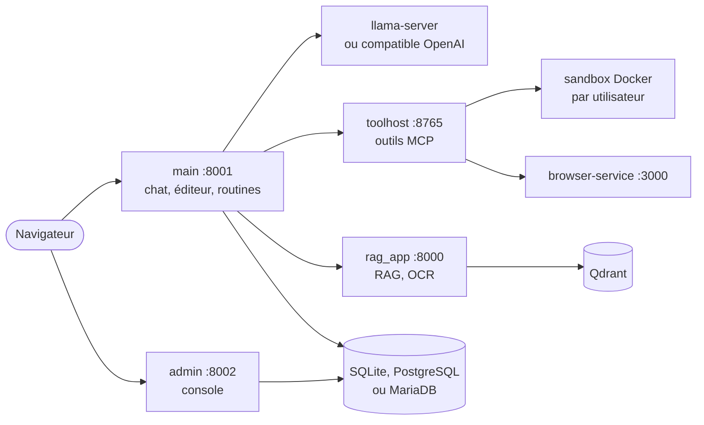

# Elpis

[](https://github.com/toto-fou/Elpis/actions/workflows/ci.yml)

> **Elpis is a self-hosted agentic engineering workspace for teams sharing
> local LLM infrastructure.** It combines an agentic chat
> (tools, sub-agents, long-term memory, skills), a code editor with a per-user
> Docker sandbox and terminal, scheduled routines, a RAG service and an admin
> console. It talks to `llama-server` (llama.cpp) or any OpenAI-compatible
> endpoint. Install on Debian 12/13 or Ubuntu 24.04 with two commands: clone,
> then `./install.sh`, which asks its questions and configures everything (below).
> The documentation is written in French. Licensed under the MIT License.

---

Elpis est un **atelier d'ingénierie agentique auto-hébergé**, pour les équipes
qui partagent une infrastructure LLM locale. Tout tourne sur votre serveur.

- **Chat agentique** : outils (fichiers, shell, Git, navigateur, graphiques),
  sous-agents, mémoire long terme, skills, serveurs MCP externes.
- **Éditeur de code** : Monaco, sandbox Docker par utilisateur, terminal,
  Git intégré, aperçus (HTML, PDF, Office).
- **Routines** : tâches planifiées ou déclenchées par webhook.
- **RAG** : indexation de documents (Qdrant), OCR.
- **Administration** : utilisateurs et groupes, connecteurs LLM, métriques.

## Pourquoi Elpis

- **Une sandbox Docker par utilisateur**, avec quotas : l'agent édite, lance
  les tests et versionne dans un vrai environnement, isolé des autres.
- **Un runtime agentique durable** : verrous entre workers, annulation,
  reprise d'une exécution détachée, enregistrement sans écrasement.
- **Une inférence locale partagée** : ordonnanceur llama.cpp (exclusivité de
  modèle, créneaux, disjoncteur) pour plusieurs utilisateurs sur les mêmes
  GPU.
- **Éditeur, Git et terminal dans la même sandbox** que l'agent : ce qu'il
  fait se relit, se teste et se corrige au même endroit.
- **Une console d'administration** : comptes, connecteurs, sandbox, base,
  sauvegardes, métriques.

Là où une interface de chat LLM généraliste s'arrête à la conversation,
Elpis vise le travail sur du code, avec un environnement d'exécution par
utilisateur et une inférence partagée. Suite prévue :
[ROADMAP.md](ROADMAP.md).

## Architecture



Détail : [ARCHITECTURE.md](ARCHITECTURE.md).

## Sécurité

Le conteneur de chaque utilisateur est la frontière de sécurité. Côté
serveur, les fichiers d'une sandbox ne sont lus ou écrits que par des
descripteurs qui ne suivent aucun lien, et Git tourne dans la sandbox de
l'utilisateur (son réseau passe par un relais de l'hôte qui y ajoute les
identifiants). Le compte de service pilote Docker : réservez à Elpis une
machine ou une VM dédiée. Modèle de menace et signalement :
[SECURITY.md](SECURITY.md).

## Prérequis

- Debian 12/13 ou Ubuntu 24.04 (amd64), avec `sudo`.
- **Docker** (sandbox des utilisateurs).
- Un moteur d'inférence : `llama-server` (llama.cpp) ou tout serveur
  **compatible OpenAI** (vLLM, Ollama, LM Studio…), ou un fournisseur distant.

## Installation

```bash
git clone https://github.com/toto-fou/Elpis.git elpis && cd elpis    # 1
./install.sh                                   # 2
```

`install.sh` demande sudo tout de suite (une fois, gardé actif pendant
l'installation), puis ouvre un **assistant par pages** dans le terminal :
toutes les questions d'abord, un résumé, et l'installation se déroule ensuite
sans autre question.

| Page | Contenu |
|---|---|
| Composants | navigateur piloté, LibreOffice, Caddy (HTTPS), moteur vocal local, extras AGPL (cases) ; image sandbox (construite, tirée d'un registre, aucune) |
| Base | SQLite, PostgreSQL ou MariaDB préparés sur la machine, ou serveur existant (hôte, port, identifiants, TLS) |
| LLM | type de serveur, adresse (sondée), modèle choisi parmi ceux annoncés, fournisseur cloud facultatif |
| Accès | HTTP direct, HTTPS certificat local ou Let's Encrypt ; écoute (ce serveur seulement, par défaut, ou réseau local) ; nom d'hôte |
| RAG · Voix · Admin | embeddings (sondés), reranker, OCR ; voix ; compte administrateur |
| Résumé | tout ce qui sera fait ; démarrage (services systemd, maintenant, plus tard) |

Clavier : ↑↓ pour se déplacer, Espace coche, Entrée valide et avance, Tab
change de page, Échap quitte sans rien modifier. Une réponse désactive ce
qu'elle rend inutile : sans Caddy, pas de HTTPS ; base locale, rien à saisir ;
moteur vocal local, adresses fixées ; sans droits administrateur, rien qui
en demande. La base de données est préparée et **testée** juste après
l'environnement Python : un échec arrête l'installation (ou propose
réessayer, modifier, SQLite). `sudo ./install.sh` fonctionne aussi :
l'application tourne alors sous le compte qui a lancé sudo, jamais en root.

Puis ouvrez `http://<serveur>:8001` (ou `https://<serveur>/` en HTTPS) et
connectez-vous avec le compte admin. Sans HTTPS, une installation neuve
n'écoute que sur `127.0.0.1` : `http://127.0.0.1:8001` depuis le serveur, ou
`./elpis configure --listen lan` pour ouvrir au réseau local (HTTP en clair).

Chaque étape reste disponible seule :

```bash
./elpis configure              # revoir la configuration (valeurs actuelles proposées)
sudo ./elpis service install   # services systemd
./elpis start | stop | status | logs [service] | doctor
./elpis backup | upgrade       # sauvegarde, mise à jour (docs/exploitation.md)
./elpis db info | check | transfer | use       # base de données
```

**Sans question** (automatisation, CI) : chaque question a son option.

```bash
./install.sh --yes --with-office --service -- \
    --llm-url http://gpu.example.lan:8080 --admin-user admin --embed-url http://gpu.example.lan:8081
# mot de passe admin : ELPIS_CFG_ADMIN_PASSWORD=… (sinon généré et affiché une fois)
```

| Option de `install.sh` | Effet |
|---|---|
| `--yes` | aucune question (réponses par défaut + options) |
| `--plain` | questions en lignes, sans l'assistant par pages |
| `--dry-run` | affiche le plan sans rien modifier |
| `--with-office` / `--no-office` | LibreOffice pour les aperçus docx/xlsx/pptx |
| `--with-caddy` / `--no-caddy` | frontal HTTPS Caddy |
| `--with-agpl` / `--no-agpl` | PyMuPDF et pdf2docx (licence AGPL, non installés par défaut) |
| `--with-voice` / `--no-voice` | moteur vocal sur cette machine (whisper.cpp + Piper, CPU) |
| `--no-browser` | sans le service navigateur |
| `--sandbox build\|pull\|none`, `--pull IMAGE` | image sandbox construite, tirée, ou aucune |
| `--db sqlite\|postgres-local\|mariadb-local\|external` | base de données : fichier SQLite (défaut), PostgreSQL ou MariaDB installés et préparés sur la machine (paquets de l'OS), ou serveur existant |
| `--offline <dir>` | sans réseau, depuis un paquet produit par `make_release.sh` |
| `--service` / `--start` / `--no-start` | démarrage après installation |
| `-- <options>` | transmises à `./elpis configure` (`./elpis configure --help`) |

## Documentation

- [ARCHITECTURE.md](ARCHITECTURE.md) — carte du code : process, paquets,
  invariants.
- [PRODUCT.md](PRODUCT.md) · [DESIGN.md](DESIGN.md) — public, principes,
  système visuel.
- [AGENTS.md](AGENTS.md) — consignes pour les agents de code (commandes,
  conventions, pièges).
- [CHANGELOG.md](CHANGELOG.md) — journal des modifications.
- [Guide utilisateur](docs/guide-utilisateur.md)
- [Installation et configuration](docs/configuration.md)
- [Exploitation](docs/exploitation.md) — mise à jour, retour arrière,
  sauvegardes, supervision.
- [Feuille de route](ROADMAP.md)
- [Architecture, API, sous-systèmes](docs/architecture.md)
- [Passerelle sandbox](docs/sandbox-gateway.md) ·
  [Compteurs de tokens](docs/token-counters.md)

## Contribuer, sécurité, licence

- [CONTRIBUTING.md](CONTRIBUTING.md)
- Faille de sécurité : signalement privé, voir [SECURITY.md](SECURITY.md).
- Licence **MIT** ([LICENSE](LICENSE), [NOTICE](NOTICE)). Composants
  tiers : [THIRD_PARTY_NOTICES.md](THIRD_PARTY_NOTICES.md).
