# Elpis — Documentation développeur

> Architecture, modules, API, extension.
> Installation et configuration : [configuration.md](configuration.md).
> Guide utilisateur : [guide-utilisateur.md](guide-utilisateur.md).

Les diagrammes sont en **Mermaid** (rendus inline par GitHub, GitLab, VS Code —
et par la modale d'aide de l'application, onglet *Développeur*).

---

## Sommaire

### Vue d'ensemble
- [Présentation technique](#présentation-technique)
- [Stack technique](#stack-technique)
- [Architecture globale](#architecture-globale)
- [Topologie de déploiement](#topologie-de-déploiement)
- [Arborescence du projet](#arborescence-du-projet)

### Installation et configuration
- Voir [configuration.md](configuration.md)

### Architecture interne
- [Organisation modulaire du backend](#organisation-modulaire-du-backend)
- [Base de données](#base-de-données)
- [État cross-worker : les quatre canaux](#état-cross-worker--les-quatre-canaux)
- [Le harnais de contexte](#le-harnais-de-contexte)
- [La boucle agentique](#la-boucle-agentique)
- [Le flux d'un tour de chat](#le-flux-dun-tour-de-chat)
- [Scheduling LLM et résilience](#scheduling-llm-et-résilience)
- [Cibles d'inférence et fournisseurs](#cibles-dinférence-et-fournisseurs)
- [Cascade de paramètres de sampling](#cascade-de-paramètres-de-sampling)
- [Moteur de métriques](#moteur-de-métriques)
- [Frontend](#frontend)

### Diagrammes de séquence
- [Chat simple avec streaming](#chat-simple-avec-streaming)
- [Chat avec outils (boucle agentique)](#chat-avec-outils-boucle-agentique)
- [Sous-agents (outil `task`)](#sous-agents-outil-task)
- [Mode RAG](#mode-rag)
- [Reprise de génération (Continue)](#reprise-de-génération-continue)
- [Authentification cross-process](#authentification-cross-process)
- [Exécution d'une routine](#exécution-dune-routine)

### Référence API
- [Conventions](#conventions-api)
- [Authentification](#authentification)
- [Conversations](#conversations)
- [Chat LLM streaming](#chat-llm-streaming)
- [Modèles et connecteurs LLM](#modèles-et-connecteurs-llm)
- [Configuration utilisateur](#configuration-utilisateur)
- [Prompts](#prompts)
- [Sandbox : fichiers, exécution, aperçu](#sandbox--fichiers-exécution-aperçu)
- [Sandbox Git et connecteurs Git](#sandbox-git-et-connecteurs-git)
- [Snapshots](#snapshots)
- [Terminal PTY](#terminal-pty)
- [Serveurs MCP](#serveurs-mcp-api)
- [Skills](#skills-api)
- [Mémoire](#mémoire-api)
- [Routines et webhooks](#routines-et-webhooks-api)
- [Studio et desktop](#studio-et-desktop-api)
- [Distribution CLI — OpenCode (LAN)](#distribution-cli--opencode-lan)
- [Page Remote code (`/api/code/*`)](#page-remote-code-apicode)
- [Moteur vocal](#moteur-vocal)
- [Notifications, usage, événements](#notifications-usage-événements)
- [Administration](#administration-api)

### Sous-systèmes
- [Outils MCP locaux](#outils-mcp-locaux)
  - [Fichiers (`fs_tools`)](#fichiers-fs_tools)
  - [Terminal (`shell_tools`)](#terminal-shell_tools)
  - [Git (`git_tools`)](#git-git_tools)
  - [Navigateur (`firefox_tools`)](#navigateur-firefox_tools)
  - [Contrôle d'écran (`desktop_tools`)](#contrôle-décran-desktop_tools)
  - [Graphiques, mémoire, skills, todo, RAG](#graphiques-mémoire-skills-todo-rag)
  - [Ajouter un module d'outils](#ajouter-un-module-doutils)
- [Sandbox Docker et profils réseau](#sandbox-docker-et-profils-réseau)
- [Sous-agents](#sous-agents)
- [Skills : le loader](#skills--le-loader)
- [Mémoire long terme](#mémoire-long-terme)
- [Routines : le scheduler](#routines--le-scheduler)
- [Studio et agent desktop](#studio-et-agent-desktop)
- [Service RAG (`rag_app`)](#service-rag-rag_app)
- [Maintenance périodique](#maintenance-périodique)
- [Sécurité transverse](#sécurité-transverse)

### Annexes
- [Tests](#tests)
- [Problèmes connus](#problèmes-connus)
- [Codes d'erreur HTTP](#codes-derreur-http)
- [Licences](#licences)

---

# Vue d'ensemble

## Présentation technique

Application multi-process :

| Process | Port | Rôle |
|---|---|---|
| **main** | 8001 | Chat, sandbox, éditeur, routines, Studio, Remote code, statiques. Gunicorn multi-worker, compte non privilégié |
| **admin** | 8002 | Uniquement `/api/admin/*` + la console. 1 worker, **même compte non privilégié** que main (jamais root) |
| **toolhost** | 8765 | Hôte des outils MCP locaux (`python -m toolhost`) : HTTP streamable `/mcp[/<famille>]` et SSE, API sandbox et terminal |
| **llama-server** | 8080 | Moteur d'inférence local, autonome |
| **browser-service** | 3000 | Node + Playwright (outils `pw_*`) — optionnel |
| **rag_app** | 8000 | FastAPI + Qdrant (6333) + OCR — optionnel |
| **Caddy** | 443/8443/8444/80 | Frontal TLS local — optionnel |
| **desktop-agent** | 8765 (sur la machine pilotée) | Contrôle d'écran Windows/Linux — optionnel |

Les process main et admin partagent le **même secret de session** (injecté avant
le fork), ce qui rend un cookie valide indifféremment sur les deux ports.

Le code Python est rangé en trois paquets : **`llm_core/`** (moteur LLM, outils,
contexte, mémoire, skills), **`shared_infra/`** (infrastructure rangée par
famille : routes, base, sandbox, observabilité, ordonnancement…) et
**`chatbot_app/`** (routes du chat et déroulé d'un tour, `turn/`).

---

## Stack technique

| Composant | Technologie |
|---|---|
| Backend | Python 3.10+, FastAPI, Uvicorn, Gunicorn |
| Base de données | SQLite 3 (WAL) par défaut ; PostgreSQL (pg8000) ou MariaDB/MySQL (PyMySQL) au choix |
| Client HTTP | httpx (appels LLM asynchrones) |
| Protocole outils | `fastmcp` (stdio + SSE + HTTP) |
| Chiffrement au repos | `cryptography` / Fernet (clés API, secrets MCP) |
| Monitoring | psutil |
| Frontend | Vue 3 (Composition API, vendoré), pas de build |
| Styles | Tailwind (vendoré) + `style.css` (tokens, skins) |
| Éditeur | Monaco (vendoré) |
| Terminal | xterm.js (vendoré) |
| Graphiques | Chart.js (vendoré) |
| Markdown | Marked + Highlight.js |
| Icônes | Phosphor |
| Navigateur | Node 18+, Playwright/Firefox (`browser-service`) |
| Contrôle d'écran | `desktop-agent` (pywinauto / AT-SPI) |
| RAG | FastAPI + Qdrant + embeddings locaux + OCR |
| Frontal TLS | Caddy + PKI openssl locale (10 ans) |

**Aucune étape de build** : le frontend est servi tel quel en fichiers
statiques, avec cache-busting par `BUILD_ID` (sentinel partagé entre workers).

---

## Architecture globale

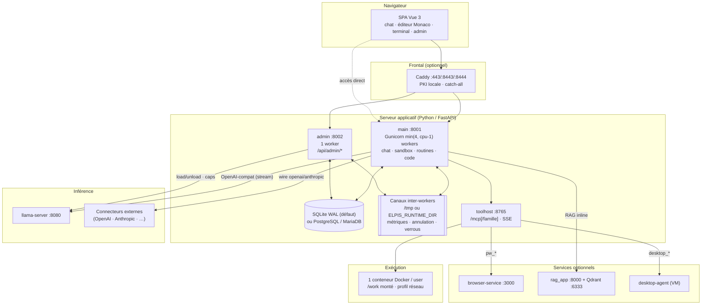

Quatre rôles distincts coexistent :

1. **Serveur applicatif** — sert l'UI, orchestre les outils, persiste en base.
2. **Moteur d'inférence** — `llama-server` local (idéalement en mode routeur),
   et/ou des connecteurs externes résolus par requête.
3. **Exécution** — un conteneur Docker par utilisateur ; c'est la frontière de
   sécurité du shell.
4. **Services satellites** — navigateur, RAG, contrôle d'écran : tous optionnels
   et découplés par HTTP.

---

## Topologie de déploiement

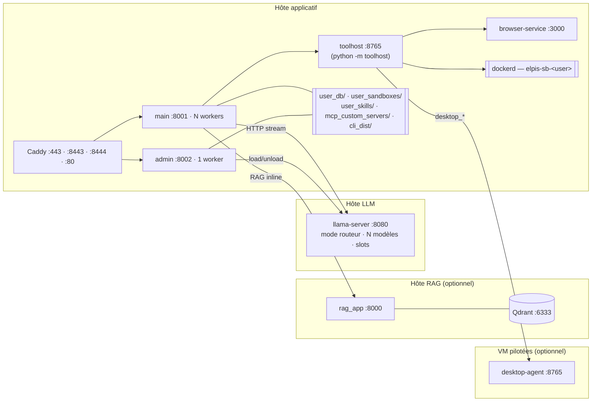

**Rôle de chaque process :**

- **main** (`server/app.py`) — cœur applicatif ; sert aussi les statiques.
  Workers Gunicorn = `min(4, cpu - 1)` au-delà de 2 vCPU (`server/gunicorn_conf.py`),
  surchargeable par `APP_WORKERS`.
- **admin** (`server/admin_app.py`) — isolation des endpoints sensibles, sous
  le même compte non privilégié que main (aucune opération admin n'exige root).
  `admin_router` n'est monté **qu'**en `APP_MODE in (admin, full)` : en mode
  `main`, les routes admin sont physiquement absentes de la table de routage,
  ce n'est pas un contrôle d'autorisation runtime.
- **toolhost** (`python -m toolhost`, `toolhost/`) — héberge une fois pour tous
  les workers le registre d'outils de `server/local_mcp_server.py`, en HTTP
  streamable (`/mcp[/<famille>]`) et SSE, plus l'API sandbox et terminal ;
  évite N cold-starts et N jeux de subprocess (repli : un subprocess stdio par
  worker). Le même service sert les clients **opencode** des utilisateurs
  (jeton elpis-remote en Bearer, familles fs/shell cachées pour eux).
- **llama-server** — `--jinja` **requis** pour le tool-calling natif.
- **Caddy** — catch-all, PKI locale stable ; le basculement HTTPS ↔ HTTP direct
  se pilote depuis la console admin (re-bind gunicorn au SIGHUP).

---

## Arborescence du projet

La carte détaillée du code (un paragraphe par paquet, une ligne par famille de
`shared_infra/`) est dans
[ARCHITECTURE.md › Carte du code](../ARCHITECTURE.md#carte-du-code). Vue
d'ensemble :

```
elpis/
├── server/          # points d'entrée : app.py, admin_app.py, gunicorn_*, local_mcp_server.py
├── toolhost/        # hôte d'outils MCP (python -m toolhost) : app, auth, config
├── llm_core/        # moteur LLM : _chat_with_tools.py + engine/ (boucle agentique), providers/,
│                    #   context/, _scheduling/, tools/, memory/
├── shared_infra/    # infra par famille : accounts, chat, db, llm, mcp, memory, observability,
│                    #   ops, routes, runtime, sandbox, scheduling, security, desktop, git,
│                    #   opencode, terminal, toolhost, voice…
├── chatbot_app/     # chat : routes/ (chats, chat_control, chat_compression, saved_chats),
│                    #   turn/ (préparation, exécution, enregistrement d'un tour)
├── frontend/        # SPA Vue 3 sans build : index.html, admin.html, js/, css/, includes/, vendor/
├── browser-service/ # Node + Playwright (:3000)
├── desktop-agent/   # agent de contrôle d'écran (Windows/Linux)
├── rag_app/         # service RAG : ingestion, requête, reranker, sparse, OCR
├── system_prompts/  # socle, FRAGMENT_*, AGENT_TASK_*…
├── skills/          # skills globaux livrés
├── deploy/          # caddy/, voice/, docker/sandbox/, qdrant/, toolhost/, assistant d'installation
├── tests/           # pytest + harnais frontend
├── user_db/         # données d'instance (base SQLite, secrets, logs) — hors git
├── user_sandboxes/  # un dossier par utilisateur, monté sur /work — hors git
└── install.sh · elpis · make_release.sh · config.example.json
```

[↑ Sommaire](#sommaire)

---

# Architecture interne

## Organisation modulaire du backend

Couches :

1. **Routes** (`shared_infra/*/routes*.py`, `shared_infra/routes/`,
   `chatbot_app/routes/`) — adaptation HTTP : validation, sérialisation, auth
   (`require_user_id`). Tout pend du `router` partagé
   (`shared_infra/routes/_state.py`) ; `admin_router` est monté
   conditionnellement.
2. **`llm_core/`** — moteur réutilisable, sans dépendance HTTP, découplé de
   `shared_infra` quand c'est possible (testable seul).
3. **`shared_infra/db/`** — persistance multi-moteurs (voir ci-dessous).
4. **`shared_infra/sandbox/`** (dont `executors/`) — exécution conteneurisée.
5. **`shared_infra/observability/`** — journal d'accès, `swallow()`,
   consommation, bus d'événements, moteur du dashboard (`metrics/`).

---

## Base de données

SQLite 3 en WAL (`user_db/app.db`) par défaut ; PostgreSQL et MariaDB/MySQL
au choix (section `database`, cf. [configuration](configuration.md#base-de-données)).
Pas d'ORM : le code écrit du SQL avec des `?` et lit les lignes par nom ou par
position, comme avec `sqlite3`.

| Module (`shared_infra/db/`) | Rôle |
|---|---|
| `_connection.py` | `db()` / `db_conn()` / `db_tx()` : connexion réentrante par thread, pool par process ; `init_db()` |
| `_schema.py` | schéma de référence déclaratif (tables, index, clés étrangères), rendu pour chaque moteur ; plein texte |
| `_dialect.py` | ce qui diffère d'un moteur à l'autre : `begin_write`, `insert_id`, `ci_like`, dates locales, JSON… |
| `_server.py`, `_pool.py`, `_pg.py`, `_mysql.py` | enveloppes façon `sqlite3` des pilotes pg8000 et PyMySQL (BEGIN différé, lignes `ElpisRow`, erreurs relevées en sous-classes de `sqlite3`), pool borné |
| `_migrations/` | migrations numérotées, runner transactionnel sous verrou (table `schema_migrations`) |
| `transfer.py`, `__main__.py` | copie entre moteurs et CLI `python -m shared_infra.db` |

Une base vide reçoit le schéma de référence d'un coup, et les migrations qu'il
couvre sont tamponnées ; une base existante reçoit ses tables et colonnes
manquantes, puis ses migrations en attente. Plein texte : FTS5 (SQLite),
`tsvector` + GIN avec `unaccent` (PostgreSQL), `FULLTEXT` (MariaDB/MySQL).
La suite de tests tourne sur chaque moteur
(`ELPIS_TEST_DB=1 APP_DB_BACKEND=postgres|mysql APP_DB_HOST=…`).

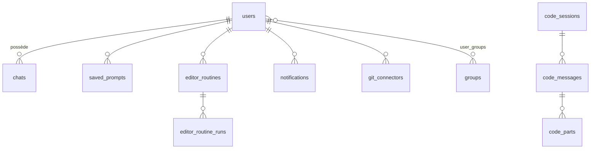

### Tables

| Domaine | Tables |
|---|---|
| **Comptes** | `users` (`settings_json`, `is_admin`, `must_change_pwd`, avatar), `groups`, `user_groups`, `revoked_sessions` |
| **Conversations** | `chats` (`messages_json`, `meta_json` = toggles d'outils, `archived`), `saved_prompts`, `shared_prompts`, `prompt_templates` |
| **Télémétrie** | `usage_events` (registre de conso, 1 ligne/tour), `metric_events` (compteurs), `tool_call_metrics`, `llm_calls`, `daily_usage_reports` |
| **Mémoire** | `session_messages` + `session_messages_fts*` (FTS5) |
| **Routines** | `editor_routines`, `editor_routine_runs`, `editor_webhook_deliveries` |
| **Studio** | `editor_action_cache` (mémoire des ancres du ciblage live) — les scripts d'automatisation sont des fichiers de la sandbox (`automations/`), pas des lignes en base |
| **Remote code** | `code_sessions`, `code_messages`, `code_parts`, `code_clients`, `code_commands`, `code_notes`, `code_permissions`, `code_questions`, `code_meta`, `code_remote_tokens`, `code_pairings` |
| **Connecteurs** | `git_connectors`, `llm_connectors`, `llm_engine_policies`, `mcp_shared_servers` |
| **Images** | `generated_images` (une ligne par image : compte, conversation, modèle, chemin relatif du fichier et de sa vignette, mesures de durée) |
| **Divers** | `notifications`, `terminal_sessions`, `sandbox_placements`, `ax_nodes` / `ax_selectors` / `ax_transitions` / `ax_credentials` |

Schémas de référence :

#### `users`

| Colonne | Type | Description |
|---|---|---|
| `id` | INTEGER PK | |
| `username` | TEXT UNIQUE | |
| `pass_salt` / `pass_hash` | TEXT | PBKDF2-HMAC-SHA256, 150 000 itérations, sel 16 o |
| `created_at` | REAL | Timestamp Unix |
| `is_admin` | INTEGER | |
| `must_change_pwd` | INTEGER | Posé par une réinitialisation admin |
| `avatar` | TEXT | |
| `settings_json` | TEXT | Réglages per-user (voir `_USER_SETTINGS_ALLOWED`) |

#### `chats`

| Colonne | Type | Description |
|---|---|---|
| `id` | TEXT PK | Token hex |
| `user_id` | INTEGER | Propriétaire |
| `title` | TEXT | |
| `messages_json` | TEXT | Historique complet (thinking **strippé** — live only) |
| `meta_json` | TEXT | Toggles d'outils du chat (catégories + `ext:<id>` + `shared:<n>`) |
| `updated_at` | REAL | Sert aussi de jeton de concurrence optimiste |
| `archived` / `archived_at` | INTEGER / REAL | |

#### `editor_routines` / `editor_routine_runs`

`editor_routines` : `cron_expr`, `model`, `connector_id` (serveur d'inférence,
NULL = intégré), `system_prompt`, `task_prompt`, `mcp_snapshot`,
`skills`, `thinking_mode`, `agents_enabled`, `enabled`, `last_fire_minute`,
`webhook_enabled`/`webhook_secret`/`webhook_filter`,
`trigger_after_id`/`trigger_after_on`.

`editor_routine_runs` : `status` (`running`/`ok`/`error`/`skipped`/`cancelled`),
`trigger`, tokens, `summary`, `error`, `tool_limit_reached`, `files`,
`worker_boot_id`, `heartbeat_at`.

### Conventions

- Timestamps en **secondes Unix** (REAL).
- Données structurées en **JSON sérialisé** dans des colonnes TEXT.
- Isolation tenant **applicative** : chaque requête porte `user_id`.
  Pas de filtrage côté base : une requête qui oublie `user_id` lit les données de tous les comptes.
  Les clés étrangères du schéma de référence sont actives (PRAGMA
  `foreign_keys=ON` sur le pool SQLite, natives en PostgreSQL et MySQL).
- SQL **portable** : identifiants réservés en MySQL cités (`"groups"`,
  `"key"`, `"trigger"`), dans un upsert les colonnes de la ligne existante
  qualifiées (`table.col`), identifiant d'insertion par `insert_id()`.
- Suppression d'un utilisateur = **cascade applicative** : chats, prompts,
  partages, sandbox, conteneur, connecteurs, routines, notifications, mémoire,
  images générées (lignes et fichiers).
- **Secrets chiffrés au repos** (Fernet, `shared_infra/security/encryption.py`) pour les
  clés API de connecteurs LLM, du moteur d'images et les secrets d'auth MCP partagés. Les fonctions
  exposées aux routes ne rendent jamais le secret — seulement `has_key` /
  `has_auth`. Seuls les résolveurs host-side lisent la valeur déchiffrée.

---

## État cross-worker : les quatre canaux

C'est **le** piège récurrent de cette base de code : un `threading.Lock`, un
`dict` ou un `set` module-level ne synchronise qu'**un** worker, et gunicorn
distribue les requêtes sans aucune affinité.

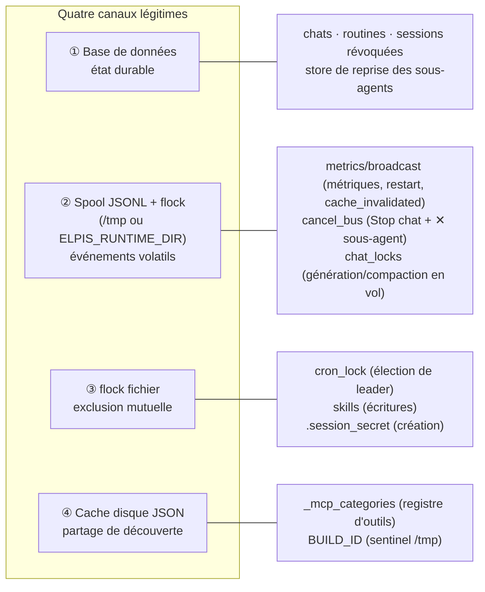

| Canal | Module | Ce qu'il résout |
|---|---|---|
| **Base de données** | `shared_infra/db/` | Tout état devant survivre au process |
| **Spool JSONL + flock** | `shared_infra/observability/metrics/broadcast.py`, `shared_infra/runtime/cancel_bus.py`, `shared_infra/runtime/chat_locks.py` | Un événement émis sur le worker A doit atteindre les workers B et C en ~100 ms |
| **flock** | `shared_infra/scheduling/cron_lock.py`, `llm_core/skills.py` | Un seul worker doit agir (leader), ou sérialiser une écriture |
| **Cache disque** | `llm_core/_mcp_categories.py` | Un worker a découvert les outils : les autres réutilisent sans re-connecter |

Cas d'école résolus par ces canaux :

- **Stop du chat** — la génération vit dans le worker qui tient le stream, mais
  `POST /api/chat/cancel` atterrit n'importe où. Sans `cancel_bus`, l'UI
  affichait « annulé » pendant que le tour continuait à consommer des tokens et
  finissait par se persister.
- **✕ sur un sous-agent** — même canal (`kind="child"`), aiguillé vers
  `task_tool.apply_child_cancel` : un enfant n'est pas un chat, la demande ne
  doit surtout pas tuer le tour parent.
- **Pré-vol 409** (`generation_running` / `compression_running`) — `chat_locks`
  rend l'activité d'un chat visible de tous les workers ; sinon un `/compact`
  lancé pendant une génération hébergée ailleurs passait, et le stream se
  terminait sur un conflit sans être persisté.
- **Élection du leader** — `cron_lock` est **re-sondé à chaque tick** : si le
  leader meurt ou est recyclé, le flock se libère et un autre worker reprend.

---

## Le harnais de contexte

Le paquet `llm_core/context/` est né du constat qu'« combien pèse ce prompt et
que doit-il contenir ? » était répondu par cinq chemins de code avec trois
ratios différents. Une responsabilité par module :

| Module | Responsabilité |
|---|---|
| `tokens.py` | **L'autorité de comptage.** Exact d'abord (`/tokenize` + `/apply-template` du llama-server, cache LRU), repli heuristique **unique** 3,3 c./token. Personne d'autre ne compte des tokens |
| `budget.py` | **Tous** les ratios et planchers (réserve de sortie, tiers de compaction, tail protégée) dans une dataclass gelée, surchargeable à froid |
| `pruning.py` | Pipeline ordonné de réduction : élagage des sorties d'outils → élagage vision → budget dur |
| `assembly.py` | Assemblage **byte-stable** de la tête système (invariant prefix-cache) |
| `compression/` | Porte + sérialiseur + résumeur + état persisté |

### La tête système, byte-stable

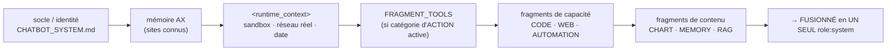

Règles à respecter absolument :

- **Un seul `role:system`.** Certains templates Jinja renvoient 400 au deuxième.
  `fold_operational_block` (`context/assembly.py`) fusionne ;
  `_coalesce_system_messages` (`_chat_classic.py`) coalesce à l'envoi.
- **Ordre figé** — un golden test vérifie que la tête système est byte-identique
  entre itérations. Un ordre variable détruit le prefix-cache KV.
- **Exception structurelle** : les messages portant un résumé de compression
  (`[COMPRESSED_SUMMARY_V1]`) ne sont **jamais** fusionnés dans le socle — un
  porteur avalé faisait perdre le socle entier à la recompression suivante.
- **Deux étages de fragments** : les catégories d'**action** (fs, shell, git,
  browser, desktop) tirent `FRAGMENT_TOOLS` + `<runtime_context>` + leur fragment
  de capacité ; les catégories de **contenu** (chart, memory, rag) tirent leur
  fragment seul, sans `FRAGMENT_TOOLS`.
- Le `<runtime_context>` est **véridique** : il porte l'état **réel** du réseau
  de la sandbox résolu à l'assemblage, pas une prose figée. Un littéral
  `<runtime_context>` écrit dans une persona **supprime** l'injection.

### Le pipeline de réduction

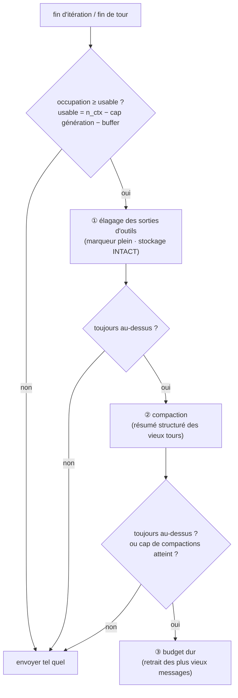

- L'élagage tourne aussi **pendant** un run (`PRUNE_EVERY_ITERS`, défaut 10) :
  un run de plusieurs centaines d'itérations n'élaguait rien auparavant et
  n'avait plus que le budget dur, qui **jette** des messages entiers au lieu
  d'effacer des sorties récupérables.
- Le **stockage reste complet** : le marqueur ne concerne que l'envoi. L'outil
  `session_search` retrouve le contenu.
- `COMPACTIONS_PER_RUN_MAX` (défaut 2) — l'historique n'en autorisait qu'une,
  tenable pour un tour court, absurde pour 200 itérations.
- Le résumé est produit par le modèle courant, un modèle dédié
  (`external_model`), ou un **endpoint dédié** (`endpoint_url`) — la meilleure
  configuration : le serveur principal garde ses slots libres pour les
  conversations.

---

## La boucle agentique

`run_chat_multi_mcp` (`llm_core/_chat_with_tools.py`) enchaîne LLM ↔ outils
jusqu'au budget d'itérations ; `run_chat_multi_mcp_v2` force le mode
`optimized` (créneau LLM rendu pendant les outils). Ce module est
l'**orchestrateur** : prélude (vision, catalogue d'outils, assemblage de la
tête système, rappel todo), boucle et compteurs, aiguillage de chaque tour,
point d'étape budget (`<harness_status>`, message éphémère en queue). Une
enveloppe (`_run_chat_multi_mcp_wrapper`) garantit, même sur annulation, la
purge de la dernière capture d'écran et l'enregistrement de l'usage consommé.

Le reste vit dans des sous-routines de `llm_core/engine/` (carte dans
`engine/__init__.py`). Aucune n'importe l'orchestrateur : c'est lui qui les
importe.

| Module (`llm_core/engine/`) | Rôle | Interface |
|---|---|---|
| `run.py` | état d'un run | `RunContext` (constantes du run, gelé), `RunRecord` (trace : événements, delta de `tool_history`, raisonnement, usage, lot en cours, fenêtre de contexte, marques d'élagage), `LoopDeps` (dépendances injectées), `llm_slot(ctx)` (créneau du mode `optimized`) |
| `tool_catalog.py` | outils du tour | `_collect_mcp_tools` : outils MCP et intégrés en une charge utile `tools[]`, puis filtres (refus, catégories cochées, mode plan, mémoire) |
| `llm_turn.py` | un tour LLM | `call_llm(…) → LLMTurn` ; état privé `LLMTurnState` (mesure du contexte, compactions, séries de récupération) |
| `llm_stream.py` | transport d'un appel | `_llama_chat_with_tools_stream` : flux SSE → réponse au format OpenAI, replis (sans flux, puis analyse du texte), reprise d'un flux coupé, arrêt côté moteur |
| `live_text.py` | émission directe | `LiveText` (`on_token`, `flush`, `emit_rest`) : fenêtre de retenue et portail anti-balisage |
| `resume.py` | reprises automatiques | `ResumeState` (`take`, `restore`, `reset_chain`, `plan`), `ResumeRequest` |
| `tool_dispatch.py` | exécution des appels d'outils | `open_native_round`, `classify_text_reply`, `relaunch_unparsed_call`, `open_text_round`, `run_tool_batch → BatchOutcome`, `ChannelSpec` (`NATIF`, `TEXTE`), `CycleGuard`, `TruncationGuard`, un appel isolé (`_execute_single_tool_call`) |
| `tool_exec.py` | ordonnancement d'un lot | `execute_tool_batch` : série pour les outils mutants, parallèle borné sinon, ordre du modèle préservé |
| `run_exit.py` | sorties du run | `finish_ok`, `finish_on_limit`, `finish_on_error` |
| `result_contract.py` | échecs d'outil | `result_is_error`, `result_is_tool_failure` |
| `stream_events.py` | registre du flux NDJSON | `STREAM_EVENTS`, `LOOP_EVENTS`, `NOT_DISPLAYED` |

Les appels écrits en texte se lisent dans `llm_core/_tool_parsing.py`
(`extract_tool_calls`, `_strip_tool_call_markup`).

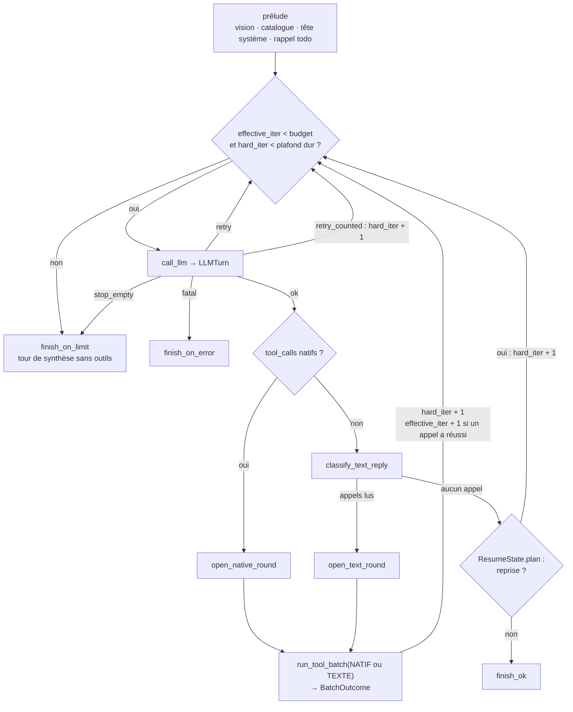

Deux détours ne figurent pas sur le schéma : un appel d'outil coupé par la
limite de génération (`finish=length`) n'est pas exécuté
(`TruncationGuard.cut`, `hard_iter + 1`) ; une tentative d'appel illisible ou
perdue dans le raisonnement est relancée, en nombre borné
(`relaunch_unparsed_call`, `hard_iter + 1`).

**Interfaces principales**

- **`call_llm` → `LLMTurn`.** Tout ce qui sépare la tête d'itération de la
  réponse décodée : porte de compaction, élagage intra-run, ajustement au
  budget (`fit_context`), consommation de la reprise en attente, créneau LLM,
  appel, récupération des échecs, usage et jauge (`kv_cache`), décodage.
  L'issue est explicite, et `LLMTurn.messages` est TOUJOURS la liste de
  travail à reprendre (la compaction et l'aplatissement la réaffectent) :

  | Issue | Cas | Ce que fait la boucle |
  |---|---|---|
  | `ok` | réponse décodée | appels natifs, appels écrits en texte, reprise ou réponse finale |
  | `retry` | contexte dépassé puis compacté, historique refusé puis aplati, hoquet du moteur | relance l'itération sans rien compter |
  | `retry_counted` | réponse sans `choices` (série bornée) | `hard_iter + 1`, puis relance |
  | `stop_empty` | réponses vides en série | sortie par `finish_on_limit` avec cette cause |
  | `fatal` | échec après les récupérations (`error`, `err_kind`) | `finish_on_error` |

- **`run_tool_batch` → `BatchOutcome`.** Le noyau commun aux deux canaux :
  annulation, événements `tool_call`, exécution du lot (`tool_exec`, série ou
  parallèle), post-traitement dans l'ordre du modèle, anti-boucle
  (`CycleGuard`). Il complète `working_messages` en place et rend
  `had_success` (au moins un appel a réussi) et `cycle_hard_stopped` (boucle
  d'action persistante).
- **`ChannelSpec` : `NATIF` et `TEXTE`.** Ce qui diffère volontairement entre
  les `tool_calls` de l'API et les appels écrits dans la prose : la vision
  (natif seulement : suivi des captures, injection différée de la capture
  après le dernier résultat du lot, élagage des vieilles trames), le gabarit
  `result_formatting.fallback_wrapper` (texte seulement), la consigne
  anti-boucle et les libellés de journal. La préparation du lot diffère
  aussi : `open_native_round` (prose nettoyée, arguments invalides non
  exécutés) et `open_text_round` (`tool_calls` synthétiques, identifiants
  `legacy_*` rendus uniques).
- **`ResumeState`.** Les reprises automatiques d'une génération coupée,
  raisonnement ou rédaction. `take` consomme la demande en attente juste
  avant l'appel, `restore` la rend si l'appel est relancé (sinon la partie
  déjà écrite serait perdue), `reset_chain` remet la série à zéro dès qu'un
  lot d'appels est lu, `plan` décide en fin de tour sans appel d'outil.
- **`finish_ok`, `finish_on_limit`, `finish_on_error`.** Les trois sorties
  d'un run. Chacune rend le triple de la boucle (texte, événements,
  métriques), dépose le delta de `tool_history` dans les métriques et
  enregistre l'usage du tour, une ligne par tour, ici et nulle part
  ailleurs. `finish_on_limit` rédige la synthèse par un dernier appel sans
  outils, avec une consigne propre à la cause réelle de l'arrêt.

**Compteurs tenus par l'orchestrateur.** Ce sont des entiers de la boucle,
jamais d'un objet partagé : les sous-routines rendent une décision, la boucle
l'applique.

| Compteur | Avance quand | Rôle |
|---|---|---|
| `effective_iter` | un lot compte au moins un appel réussi (`BatchOutcome.had_success`) | comparé au budget (`LLAMA_MAX_TOOL_ITERATIONS`, ou `sampling_override.max_tool_iterations`) ; affiché « tour n/max » |
| `hard_iter` | chaque lot exécuté, appel coupé, relance d'un appel illisible, reprise automatique, issue `retry_counted` | plafond dur `_hard_iter_cap` (le plus grand de 2 × budget et budget + 10) : arrête une cascade d'échecs |
| `_malformed_retry` | chaque relance d'un appel illisible ou perdu | budget de relances, réarmé par une itération productive ou un appel texte lisible |

Les arrêts volontaires (mur d'horloge `LLAMA_TOOL_LOOP_MAX_S`, appels coupés
en série — `TruncationGuard.stop` vaut `ctx_saturated` ou `gen_cap` —,
boucle d'action, réponses vides) sortent de la boucle sans toucher à
`effective_iter` : le compteur affiché reste vrai, et `finish_on_limit`
reçoit la cause réelle.

**Points de substitution des tests.** La fonction de flux
(`_llama_chat_with_tools_stream`) et la métrique d'appel d'outil
(`_record_tool_call_metric_safe`) sont lues dans les globales de
l'orchestrateur au début du run, puis injectées (`LoopDeps`) : elles se
patchent sur `llm_core._chat_with_tools`. Le reste (taille de contexte, pool
MCP, élagage, registre d'usage) se lit à l'appel dans son module propriétaire
(`_model_info`, `_mcp_pool`, `context.pruning`, `usage_ctx`), où on le
patche.

---

## Le flux d'un tour de chat

`POST /api/chat-saved-stream3` (`chatbot_app/routes/chats.py`) n'enchaîne que
des étapes. Le tour lui-même vit dans le paquet `chatbot_app/turn/`, qui
n'importe jamais les routes.

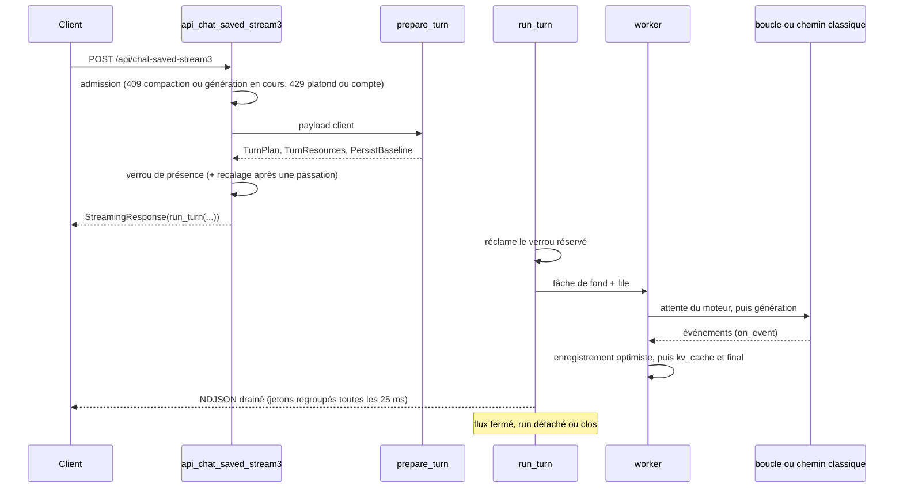

| Module (`chatbot_app/`) | Rôle |
|---|---|
| `routes/chats.py` | la route du flux ; son en-tête écrit les invariants et l'ordre des événements |
| `routes/chat_control.py` | « Répondre maintenant », Stop, Stop d'un sous-agent, état d'une génération, exécutions actives, rattachement (`/run/events`) |
| `routes/chat_compression.py` | compression manuelle et son état |
| `turn/admission.py` | verrou de présence (`_acquire_gen_presence`, réservation jusqu'à `run_turn`), compactions manuelles en vol |
| `turn/preparation.py` | `prepare_turn` |
| `turn/execution.py` | `run_turn` (générateur NDJSON) et son worker : attente du moteur, chemin classique ou boucle, titre, enregistrement, `final`, détachement |
| `turn/events.py` | pompe NDJSON (`_drain_coalesced`), filtre des événements après un Stop, suivi du chargement d'un modèle (`queue_status`) |
| `turn/persistence.py` | message du tour ou partiel (`_message_assistant`, `_message_partiel`), écriture optimiste (`_persist_turn`), écritures `meta_json` de fin de tour |
| `turn/history.py` | historique client ↔ base ↔ modèle (`_normalize_client_messages`, `_expand_history_for_llm`), « Continuer » (`_split_for_continue`) |
| `turn/tasks.py` | références fortes des tâches de fond (`keep`, `_BG_TASKS`, drainé à l'arrêt du worker) |
| `turn/image.py` | tour « Images » (corps avec `image_gen`) : après les mêmes gardes que le tour du modèle, confié au moteur d'images (`llm_core/imagegen/`) ; même verrou de présence, même journal reprenable, exécution `kind=image` ; événements `image_progress`, `image`, `image_prompt`, `image_error` |

**Interfaces principales**

- **`prepare_turn(request, data, user_id, chat_id)`** rend
  `(TurnPlan, TurnResources, PersistBaseline)`. Elle résout la cible et les
  serveurs MCP côté serveur, lit le chat, applique les interrupteurs du
  compte (outils, mémoire, sous-agents, compaction, mode plan), développe
  l'historique, branche le RAG et calcule le titre. Elle lève encore des
  `HTTPException` (400, 409) : rien n'est parti vers le client.
- **`TurnPlan`** (gelé) : tout ce que la préparation a décidé — identité,
  cible et modèle, outils et refus, compaction et marques d'élagage,
  historique (`messages`, `msgs`, `msgs_for_llm`), titre. Le gel est
  superficiel : listes et dictionnaires ne sont pas copiés.
- **`TurnResources`** (gelé) : fonction de persistance (vide en session
  éphémère), gestionnaire de mémoire, outils RAG intégrés.
- **`PersistBaseline`** : base de l'enregistrement optimiste (`updated_at`,
  `messages`, `title`) et état de compression précédent. Le handler la recale
  après une passation (Stop puis régénération) ; `run_turn` la déballe.
- **`run_turn(plan, res, base)`** : réclame le verrou de présence avant tout
  `await`, lance le worker, draine sa file vers le client ; à la fermeture du
  flux, détache le run ou le clôt (`_should_detach_run`, `_cloturer_run`).

Invariants (détail en tête de `chats.py`) : une génération à la fois par
conversation, tous workers confondus ; aucune instruction ne peut lever entre
la prise du verrou et le `StreamingResponse` ; adresses MCP résolues côté
serveur ; annulation publiée sur le bus d'annulation, partiel enregistré ;
enregistrement optimiste, qui précède `kv_cache` et `final`. L'ordre des
événements est recopié dans la
[référence API](#ordre-des-événements-dun-tour) et figé par
`tests/chatbot/test_flux_route.py`.

---

## Scheduling LLM et résilience

Tout appel de génération passe par le chokepoint unique
`llm_scheduling_guard(model, …)` :

| Composant | Fichier | Rôle |
|---|---|---|
| `MODEL_EXCLUSIVITY` | `llm_core/_scheduling/_locks.py` | Empêche un switch de modèle côté serveur pendant une génération. Priorité `high` (chats) vs `low` (compaction, routines) |
| `LLM_SEMAPHORE` | `llm_core/_scheduling/_concurrency.py` | Limite la concurrence par modèle (dérivée de `/props.total_slots`, repli `LLAMA_MAX_CONCURRENCY`) |
| Disjoncteur | `llm_core/_scheduling/_breaker.py` | ≥ `LLM_BREAKER_FAILS` échecs **transport** consécutifs → circuit ouvert `LLM_BREAKER_COOLDOWN_S` → fail-fast sans occuper de slot |

**Modes de scheduling** (`llm.scheduling_mode`) :

- `classic` — sémaphore autour de **toute** la boucle outillée. Pendant un
  `execute_shell` de 30 s, le slot est réservé côté backend même s'il est
  physiquement libre.
- `optimized` — sémaphore **inline** autour de chaque appel LLM. Le slot est
  libéré pendant les outils ; au retour, le serveur restaure le cache KV
  (`--cache-ram`). Requiert `/slots`.
- `auto` — sonde `/props` et `/slots` au démarrage et résout vers l'un des deux.

**Taxonomie d'erreur** (`_llm_retry.py`) : chaque échec est classé en
`context_overflow`, `invalid_request`, `rate_limited`, `loading`, `unreachable`,
`timeout`, `unknown`. Chaque genre a un message utilisateur dédié et une
politique de retry propre (backoff exponentiel full-jitter plafonné à
`LLAMA_RETRY_BACKOFF_CAP_S`). Un 503 « modèle en chargement » sur un serveur
local ne brûle pas les retries : on sonde `/health` jusqu'à
`LLAMA_LOADING_WAIT_S`.

> ⚠ `raise_for_status()` en streaming **perd le corps** de la réponse : sur le
> chemin streaming, lire le corps AVANT de lever, sinon le diagnostic disparaît.

---

## Cibles d'inférence et fournisseurs

`LlmTarget` (`llm_core/_target.py`) décrit le backend à utiliser **pour la
requête courante** : format wire, base_url, clé, modèle. Il est posé dans un
`contextvars.ContextVar` en tête de `run_chat_*` et lu par le transport — les
contextvars se propagent naturellement aux tâches asyncio, pas besoin de
threader N signatures.

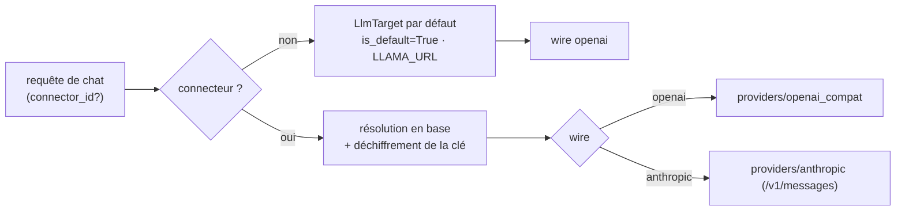

- **`is_default`** = moteur local (`LLAMA_URL`), quel que soit son type.
- **`is_local_llamacpp`** = local **ET** dialecte llama.cpp. Plus restrictive,
  elle garde les appels aux endpoints **spécifiques** au llama-server :
  `/props` (sampling + `n_ctx`), `/slots` (pinning), `/tokenize`, jauge KV live,
  auto-chargement routeur. Un moteur local vLLM/générique ne les expose pas → on
  les saute et on parle OpenAI-standard.
- **Connecteurs** (`shared_infra/llm/connectors.py`) : portée `user`
  (clé perso) ou `shared` (publié par l'admin). Types : `llamacpp`, `vllm`,
  `openai`, `anthropic`, `mistral`, `groq`, `openrouter`, `deepseek`,
  `moonshot`, `opencode`, `generic`. L'admin restreint les types autorisés
  (`llm.allowed_provider_types`). La `base_url` d'un connecteur utilisateur
  vient du preset (anti-SSRF) ; seul l'admin en saisit une libre.
- **OpenCode Zen** (`opencode`) : passerelle du projet opencode,
  compatible OpenAI, `https://opencode.ai/zen/v1`. `providers/discovery.py`
  repère les modèles gratuits (suffixe `-free`, convention du fournisseur —
  `GET /v1/models` ne porte aucun prix), les remonte en tête de liste et les
  renvoie dans `free`, que le sélecteur marque d'une pastille « gratuit ».
  ⚠ **Son offre gratuite est réservée au client opencode.** Vérifié avec une
  clé réelle : appelée depuis l'application, elle répond `400 MissingSessionID`
  — « OpenCode's free tier can only be used in OpenCode » — ou `500` sur les
  modèles « contributor » ; la même clé et le même modèle fonctionnent dans
  opencode lui-même. Une clé de palier gratuit ne liste d'ailleurs que ces 6
  modèles. **Aucun traitement particulier dans l'app** : c'est le message
  d'erreur du fournisseur, remonté tel quel, qui dit à l'utilisateur qu'il lui
  faut une clé ouvrant le modèle.
  La fenêtre de contexte de ces modèles ne correspondant à aucune famille connue,
  `_ctx_window._PROVIDER_DEFAULT_WINDOWS` donne un défaut conservateur
  (131 072) : sans lui la fenêtre resterait « inconnue » et compaction, élagage
  et budget dur seraient inactifs sur ces modèles.
- **Refus du fournisseur ≠ requête invalide** (`_llm_retry`) :
  `KIND_FORBIDDEN` couvre 401/403 et tout 4xx dont le corps parle d'accès
  (`_ACCESS_MARKERS`). Et `llm_error_user_message` fait suivre son conseil du
  message DU FOURNISSEUR quand il en donne un (`provider_message` : JSON
  `error.message`, une ligne, 220 caractères, jamais une page HTML). Sans ça,
  un refus précis arrivait en « la génération a échoué pour une raison
  inattendue ».
- **Console admin › Connexions › Moteur d'inférence** : les moteurs sont une
  LISTE de lignes (intégré + connecteurs partagés), pas un menu déroulant —
  chaque ligne montre l'adresse, l'état de la clé et porte ses actions
  (tester, supprimer). Même grammaire que la liste des archives de la modale
  Paramètres.
- Le couple **(connecteur, modèle) est atomique** — impossible de router par
  erreur un modèle Anthropic vers un endpoint OpenAI.

---

## Cascade de paramètres de sampling

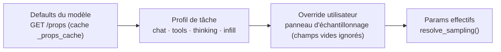

```python
from llm_core._llm_params import (
    resolve_sampling, get_model_context_size, get_model_total_slots, invalidate_caches,
)
params = resolve_sampling(model_id="GLM-4.7", task="chat", request_override={"temperature": 0.7})
n_ctx  = get_model_context_size(model_id="GLM-4.7")
slots  = get_model_total_slots(model_id="GLM-4.7")
```

1. **Defaults du modèle** — `GET /props?model=xxx`, mis en cache. Accessibles
   via `default_generation_settings.params.*` (mode routeur) ou
   `.default_generation_settings.*` (mono-modèle). Repli sur les valeurs de
   `shared_infra/config.py` si `/props` est indisponible.
2. **Profil de tâche** — chaque type de requête peut surcharger (le profil
   `tools` force une température basse pour des appels déterministes ; les
   profils vivent dans `context_config.json › model_profiles`).
3. **Override utilisateur** — panneau d'échantillonnage. Les champs vides sont ignorés.

> ⚠ **`GET /props?model=X` CHARGE le modèle X** côté routeur. Ne jamais sonder
> un modèle « pour voir » : c'est pourquoi le sélecteur de modèles n'auto-charge
> rien et pourquoi la config OpenCode générée propage les `n_ctx` **déjà connus**
> du cache au lieu de sonder.

**Invalidation des caches** : au `load_llm_model` / `unload_llm_model`, via
`POST /api/admin/cache/invalidate`, ou par le bouton admin (diffusé à tous les
workers par le spool).

---

## Moteur de métriques

### Deux sources, deux rôles

| Table | Ce qu'elle répond | Écrite par |
|---|---|---|
| **`usage_events`** | « Qui a consommé quoi, quand, par quel chemin ? » — **une ligne par tour LLM**, usage RÉEL du backend, avec `user_id`, `source`, `model`, `status` | `record_turn_usage()` (`shared_infra/observability/usage_ctx.py`), appelée **dans la boucle LLM** |
| `metric_events` | Compteurs non-LLM : connexions, écritures sandbox, RAG, latence, débit, `proc_*` | `log_metric()` |

**Pourquoi ce découpage.** La conso était mesurée *chez l'appelant* : la route
de chat journalisait les métriques du tour. Deux conséquences, toutes deux
visibles dans la console :

1. **Double comptage** — un tour outillé était journalisé par la boucle
   (`mode=mcp_native`) *et* par la route (`mode=mcp`) : les KPI de tokens
   valaient environ le double.
2. **Angle mort hors heures** — routines, webhooks et sous-agents ne passent
   jamais par la route : leur consommation n'était journalisée nulle part, et
   les vues d'activité (DAU, heatmap) lisaient `message_sent`, émis par la
   seule route interactive. Tout ce qui tournait sans navigateur affichait 0.

La responsabilité est donc inversée : **la boucle mesure, l'appelant se nomme**
via un `usage_scope(...)` (contextvar, même idiome que `LlmTarget`). Un chemin
qui oublie de se nommer n'est pas perdu — il apparaît en `source="unknown"`.

```python
from shared_infra.observability.usage_ctx import usage_scope
with usage_scope("routine", user_id=uid, origin_id=run_key):
    ...   # tout appel LLM sous ce bloc est enregistré une fois, attribué
```

### Providers

`GET /api/admin/stats-dynamic` retourne `layout` (liste ordonnée de widgets) +
`data` (indexée par id) ; `?ids=a,b` ne recalcule que les widgets demandés
(chemin de la boucle « live »). `MetricsRegistry.get_dashboard_config()`
exécute tous les providers **en parallèle** (`ThreadPoolExecutor`).

**Fenêtre d'observation** (`scope_hours` = 24 / 168 / 720, soit 1 j / 7 j /
30 j) : tout widget dont la valeur dépend d'une période la lit, via
`_scope_hours()` / `_scope_label()`. Le sélecteur ne touchait auparavant que
quatre providers sur soixante — un opérateur passé en « 30 j » lisait toujours
des chiffres à 24 h, et plusieurs titres annonçaient « (24h) » en dur. Les
jauges instantanées (RAM, disque, taille de base, état du moteur, charge live)
l'ignorent, à raison ; le test `test_la_fenetre_pilote_vraiment_les_widgets`
garde cette frontière.

Trois familles : `metrics/engine.py` (adoption, perf, système),
`_usage_providers.py` (conso, attribution, exploitation — lit `usage_events` et
`editor_routine_runs`), `_v17_providers.py` (outils). Chaque entrée de `layout`
porte `default` (appartenance au **set curé** affiché d'emblée, cf.
`DEFAULT_WIDGETS`) et `purge` (périmètre de réinitialisation, cf.
`MetricProvider.purge_spec`) — l'IHM n'a donc jamais à connaître le schéma.

| Type | Format `data` |
|---|---|
| `value` | `{"value": 42, "unit": "users", "color": "blue", "icon": "ph-users", "detail": "…"}` |
| `bar` / `line` / `doughnut` / `bar_stacked` | Format Chart.js (`labels` + `datasets` + `meta`) |
| `table` | `{"columns": [{"key","label","align"}], "rows": [...]}` |

### Séries temporelles

`metrics/series.py` construit d'abord **le calendrier** de la fenêtre, puis y
verse les agrégats : un seau sans données vaut `0` et chaque libellé porte sa
date (ISO). Les graphiques horaires groupaient auparavant par `strftime('%H:00')`
— une fenêtre à cheval sur minuit fusionnait hier-14 h avec aujourd'hui-14 h, et
les heures creuses (la nuit) disparaissaient au lieu de valoir zéro. Fuseau :
`metrics.timezone` (vide = serveur), annoncé dans `data.meta.timezone`.

La plage « heures de bureau » (`metrics.business_hours`, défaut 8 h–19 h
lun–ven) sépare ce qui tourne pendant qu'on regarde de ce qui tourne seul.

Ajouter un widget :

```python
from shared_infra.observability.metrics.engine import MetricProvider, registry

class MonProvider(MetricProvider):
    id = "mon_id"
    title = "Mon Widget"
    type = "bar"        # value | line | bar | doughnut
    width = "1/2"       # 1/4 | 1/2 | full
    def get_data(self):
        return {"labels": [...], "datasets": [...]}

registry.register(MonProvider())
```

---

## Frontend

SPA Vue 3 servie en statique. **Aucun bundler, aucune étape de build.**

| Fichier | Rôle |
|---|---|
| `app.js` | Orchestrateur : `createApp`, refs racines, chaîne `Échap`, piège de focus a11y, lifecycle, restauration de session |
| `app-auth.js` | Connexion, déconnexion, config publique |
| `app-chat.js` | Chat, streaming NDJSON, reconnexion, panneaux |
| `app-editor.js` | Monaco, arborescence, langages, aperçu, terminal |
| `app-admin.js` | Console d'administration : navigation, chargement des pages, sauvegarde unifiée |
| `admin/_registry.js` | Arborescence de la console (source unique : barre latérale, titres, liens profonds, chargeurs de chaque page) |
| `app-settings.js` | Paramètres, prompts, archives, serveurs MCP, connecteurs |
| `chat/*.js` | Sous-modules : composeur, menu « / », historique, sampling, rendu, segments d'outils, diff cards, Remote code, Studio d'automatisation, skills, routines, voix |
| `chat/_slash.js` | Menu « / » du composeur : registre de commandes, arguments, niveaux (commandes / valeurs / skills / prompts). Monté par `_compose.js` |
| `editor/*.js` | FIM, Git, langages, sandbox FS, aperçus Office, diffs, redimensionnement |

### Règles d'architecture

- **Un seul `ref` racine par concept partagé** (`user`, `settings`, `messages`,
  `liveLogs`…). Chaque module reçoit ces refs via `sharedRefs` et un `ctx` avec
  des **getters lazy** pour les références croisées.
- Le spread des exports dans le `return` est **ordonné** : modules de plus basse
  priorité d'abord, refs racines en dernier — la ref racine gagne toujours.
- **Chat entrelacé** : texte et outils alternent dans l'ordre réel (`segTexts` +
  `step.seg`) ; `tool_history` est envoyé en **delta**, pas en cumul.
- **Sérialisation unique** : un seul sérialiseur par payload complexe (ex.
  `execConfigPayload()` côté admin) — trois sérialiseurs divergents ont déjà
  causé des régressions silencieuses.
- **Messages figés** : `Object.freeze` sur les messages persistés, mutations via
  `setMsgUi` uniquement.

### Pièges connus (templates in-DOM)

- Un `@event` écrit en IIFE **plante** ; utiliser une méthode nommée.
- Les attributs SVG camelCase doivent passer par un `v-bind` objet.
- Ne jamais poser de classe de couleur sur `<body>` (le moteur de skins pose
  `body.elpis-skin-<id>`).
- Un `sr-only` focusable dans un conteneur scrollable crée un piège de scroll :
  `overflow: clip` + input en `absolute`.
- Le listener global `Échap` est en **capture** : un `stopPropagation` de
  composant ne suffit pas, il faut s'insérer dans la chaîne de `app.js`.

### Styles

`style.css` porte les tokens (AA vérifié), les blocs de code, les
onglets, les scrollbars, les animations (avec alternative
`prefers-reduced-motion`) et les styles prose Markdown. Accent bleu **unique** ;
les autres couleurs sont sémantiques (statut).

### Skins

- **Registre.** Les skins intégrés sont décrits par
  `frontend/css/skins/skins.json` (`id`, `label`, `desc`, `sw`, `darkBase`,
  `enabled_by_default`, `brand`, `mascot`) ; leur feuille
  `css/skins/<id>.css` est liée en statique par `index.html` et `admin.html`.
  Ardoise (`id` vide) est `style.css` sans classe.
- **Plugins.** Importés (zip) ou créés depuis la console, rangés dans
  `SKINS_DIR` (`APP_SKINS_DIR` ou `skins.dir`, défaut `user_skins/`) :
  `<id>/skin.json` (`id, label, description, version, author, license,
  darkBase, swatch, tokens: {light, dark}, css?, brand?`), `skin.css`
  facultatif, `assets/` (png, jpg, webp, gif). Validation stricte
  (`shared_infra/appearance/skins.py`) : jetons `--[a-z0-9-]`, valeurs sans
  `; { } < > \`, `url(` ni `@` ; feuille sans `@import`, sans URL externe (seuls
  `url(assets/…)` et `data:image/…`), images vérifiées par leurs octets. Le
  serveur génère la feuille (`body.elpis-skin-<id>{…}`, variante
  `.elpis-app-dark`, échelle `--radius-*`) ; le front ne lie que celle du skin
  actif (`<link id="elpis-plugin-skin">`).
- **État.** `config.json` › `skins` : `{"enabled": {id: bool}, "default": id}`,
  relu à chaque appel. Un plugin arrive désactivé ; Kiki est désactivé par
  défaut ; Ardoise et le défaut restent actifs. Le réglage utilisateur `skin`
  est ramené au défaut s'il désigne un skin désactivé (GET et PUT).
- **Routes.** `GET /api/skins` (skins activés, défaut, mascottes),
  `GET /api/skins/{id}/skin.css`, `GET /api/skins/{id}/assets/{nom}` (skin
  activé ou administrateur ; aussi montées sur le process admin) ;
  `/api/admin/skins` (`GET`, `PUT` état, `POST` formulaire, `POST /import`,
  `GET /{id}/export`, `DELETE /{id}`), page console *Système › Apparence*.
- **Mascottes.** Registre unique `frontend/assets/mascotte/mascottes.json`,
  lu par le serveur (validation de `welcome_mascot`) et servi à l'interface
  (`mascottes_catalogue`).

[↑ Sommaire](#sommaire)

---

# Diagrammes de séquence

## Chat simple avec streaming

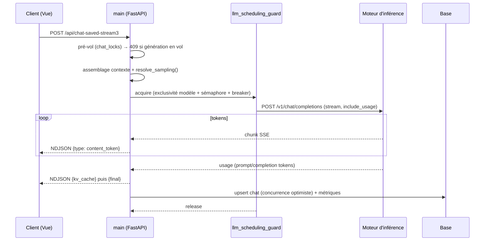

- Le backend ré-applique **son propre** budget de contexte : le client n'est pas
  autorité.
- Le streaming est en **NDJSON** (un objet JSON par ligne), lu au `getReader()`.
- `stream_options.include_usage: true` est obligatoire pour récupérer les tokens
  en streaming.
- La persistance utilise `expected_updated_at` — un conflit signifie qu'un autre
  onglet a écrit entre-temps.

---

## Chat avec outils (boucle agentique)

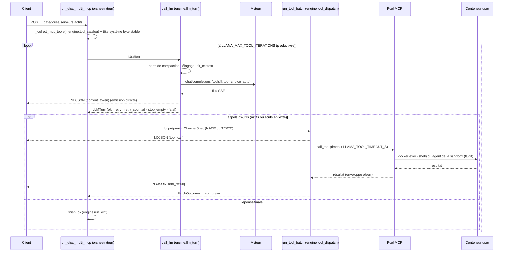

- Le pool MCP **réutilise** les connexions (pas de spawn par requête).
- Seules les itérations **productives** consomment le budget ; le plafond dur
  `_hard_iter_cap` (le plus grand de 2 × budget et budget + 10) arrête une
  cascade d'échecs. Compteurs et issues :
  [La boucle agentique](#la-boucle-agentique).
- Si le moteur ne produit pas de `tool_calls` natifs, le canal texte lit les
  appels écrits dans la réponse avec `extract_tool_calls()` (JSON natif,
  backticks, multi-objets, XML GLM ; `classify_text_reply`) ; le lot passe
  ensuite par le même noyau (`run_tool_batch`) que les appels natifs.
- Chaque appel est chronométré et journalisé dans `tool_call_metrics` (base des
  pages Observabilité).

---

## Sous-agents (outil `task`)

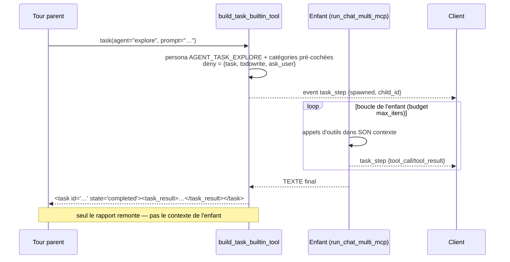

- **Isolation à deux couches** : `deny_tool_names` s'applique aussi aux
  catégories cachées et aux builtins (contrairement à `allowed_tool_names`).
- **Reprise** : re-passer le `task_id` continue le **même** enfant avec son
  historique (store partagé, TTL `TASK_RESUME_TTL_S`, cap `TASK_RESUME_MAX`).
  Vaut aussi pour les runs interrompus : le travail partiel est reconstruit
  depuis les events et l'enveloppe d'erreur porte le `task_id` à reprendre.
- **Annulation par-enfant** : `POST /api/chat/task-cancel` → application locale
  + diffusion sur `cancel_bus`. Sans la diffusion, le ✕ n'agissait qu'une fois
  sur N.
- **Récursion opt-in** : un enfant à profondeur *d* reçoit `task` ssi
  *d+1 < `TASK_SUBAGENT_DEPTH`*.

---

## Mode RAG

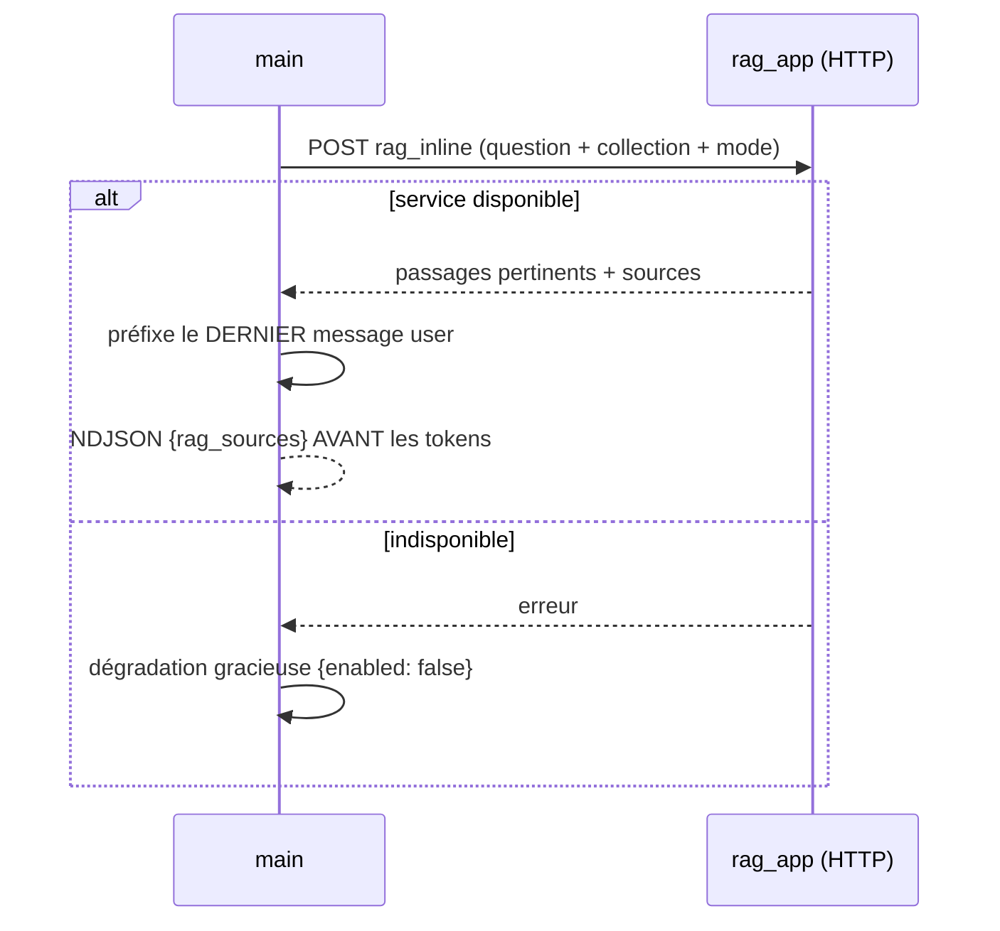

- Le RAG est un **service séparé** : aucun import direct de `rag_app.*` dans le
  chatbot, tout passe par HTTP.
- L'enrichissement **préfixe** le dernier message utilisateur.
- Les sources partent en NDJSON **avant** les tokens pour que l'UI puisse les
  afficher immédiatement.
- Le RAG est aussi exposé comme **outil** (`build_rag_builtin_tools`) pour que
  le modèle puisse interroger une collection de sa propre initiative.

---

## Reprise de génération (Continue)

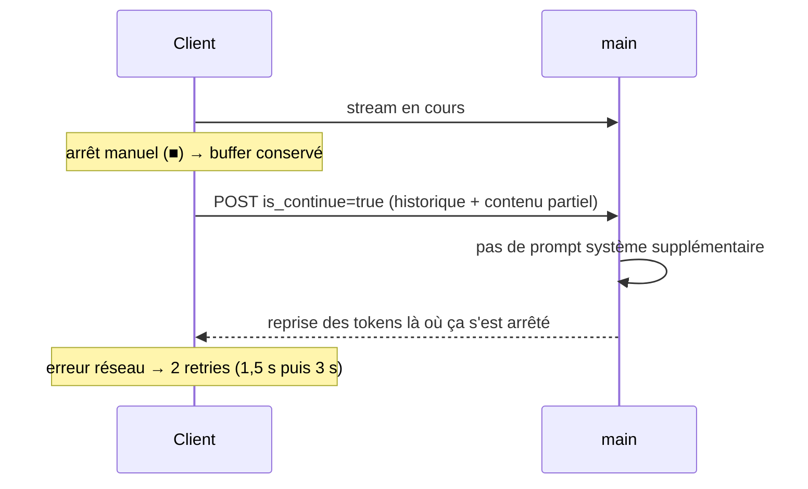

- L'arrêt manuel **conserve** le buffer côté client.
- « Continuer » envoie l'historique avec le contenu partiel **inclus** dans le
  dernier message `assistant` ; le backend détecte `is_continue` et n'ajoute
  rien — le modèle voit qu'il a commencé et poursuit.
- **Pas de bouton pour les modèles thinking** : reprendre une chaîne de pensée
  incomplète donne des résultats incohérents.
- ⚠ La régression « Génération interrompue » venait du calcul de la
  `tool_history` du run (`RunRecord.run_tool_history`, `llm_core/engine/run.py`) :
  elle doit être un **delta**, pas un cumul.

---

## Authentification cross-process

```mermaid
sequenceDiagram
    participant C as Navigateur
    participant M as main :8001
    participant Adm as admin :8002
    C->>M: POST /api/login-lite
    M->>M: verify_user ; sinon bootstrap admin (1er compte "admin" seulement)
    M->>M: session.clear() — anti-fixation
    M-->>C: Set-Cookie session (scope HOST)
    C->>Adm: clic bouclier → :8002 (même cookie)
    Note over M,Adm: même APP_SESSION_SECRET → cookies interopérables
    Adm-->>C: console admin
```

- **Pas d'auto-création de compte.** Seule exception : sur une base vide, le
  premier login avec le nom `admin` crée ce compte administrateur (sous verrou,
  avec re-vérification). Mot de passe libre seulement
  depuis la machine elle-même (boucle locale, sans en-tête de proxy) ; ailleurs,
  il faut le mot de passe initial de `user_db/.bootstrap_admin` (0600, créé au
  premier besoin, à changer à la connexion). Tout le reste → 401, avec un audit
  distinguant `bootstrap_locked`, `bootstrap_denied` et `bad_password`.
- **Anti-fixation de session** : `request.session.clear()` **avant** d'associer
  le compte.
- **Révocation** : `revoked_sessions` + `security.session.global_min_ts`
  permettent de couper toutes les sessions d'un utilisateur, ou toutes.
- Les attributs du cookie viennent d'une **source unique**
  (`session_cookie_attrs()`) — sans quoi le middleware émettait des cookies avec
  d'anciens attributs pendant que le logout tentait de les supprimer avec les
  nouveaux, et Chrome/Safari refusaient la suppression.

---

## Exécution d'une routine

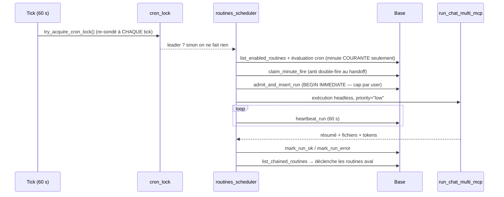

- **Skip-catch-up** : seule la minute courante est évaluée — un leader qui
  reprend après une coupure ne rejoue pas les heures manquées.
- **Admission atomique** en `BEGIN IMMEDIATE` : correcte même cross-worker et
  même mêlée aux « run-now » servis par d'autres workers.
- **Réconciliation** : un run dont le heartbeat est figé > 5 min est marqué
  orphelin.
- **Reprise bornée** : une exception qui s'échappe de la boucle est presque
  toujours un échec **précoce** (moteur injoignable) avant tout effet de bord —
  une reprise est donc sûre. On ne retente **jamais** une annulation.
- **Enchaînement** : profondeur bornée (`CHAIN_MAX_DEPTH`) pour couper les
  cycles.
- **Drain au shutdown** : `drain_running_runs()` est appelé dans le lifespan
  **avant** la fermeture du pool MCP et du client LLM.

[↑ Sommaire](#sommaire)

---

# Référence API

## Conventions API

- Toutes les routes exigent une session valide, sauf `/api/login-lite`,
  `/api/public-config`, `/api/health`, les routes de distribution CLI
  (publiques, usage LAN) et `/api/webhooks/*` (authentifiées par secret).
- Cookie géré automatiquement côté frontend (`credentials: include`).
- **Défense CSRF globale** : middleware sur toutes les requêtes mutantes,
  fondé sur `Sec-Fetch-Site` (non falsifiable) avec repli sur `Origin`. Une
  requête **sans cookie de session** passe (rien d'ambiant à rejouer) — c'est ce
  qui préserve les clients non-navigateur. Préfixes exemptés :
  `/api/sandbox/preview/`, `/api/webhooks/`.
- Les exemples `curl` utilisent `cookies.txt` pour persister la session.

---

## Authentification

**`POST /api/login-lite`**

```bash
curl -X POST http://localhost:8001/api/login-lite \
  -H "Content-Type: application/json" -b cookies.txt -c cookies.txt \
  -d '{"username": "alice", "password": "secret123"}'
```

Réponse : `{"ok": true, "is_admin": false, "must_change_pwd": false}`

| Endpoint | Description |
|---|---|
| `POST /api/logout-lite` | Déconnexion (révocation serveur + suppression du cookie avec les bons attributs) |
| `GET /api/me-lite` | Infos de l'utilisateur connecté |
| `GET /api/auth/check` | Sonde légère (`auth_request` pour un service proxifié) |
| `POST /api/users/change-password` | Changement de mot de passe (garde cross-site stricte) |

---

## Conversations

| Endpoint | Description |
|---|---|
| `GET /api/saved/chats?archived=0\|1` | Lister |
| `POST /api/saved/chats/new` | Créer — corps optionnel `{"plan_mode": bool}` : scelle la **lecture seule à la création** (`/plan` tapé sur un chat vierge, 422 si non booléen) |
| `GET /api/saved/chats/{id}` | Récupérer (expose `tools` depuis `meta_json`) |
| `PATCH /api/saved/chats/{id}` | Renommer |
| `DELETE /api/saved/chats/{id}` | Supprimer |
| `POST /api/saved/chats/{id}/archive` · `/unarchive` | (Dés)archiver |
| `PUT /api/saved/chats/{id}/save-messages` | Persistance explicite (concurrence optimiste) |
| `PUT /api/saved/chats/{id}/tools` | Toggles d'outils du chat |
| `POST /api/saved/chats/delete-batch` · `/clear-all` | Suppression en masse |
| `GET /api/saved/chats/search?q=` | Recherche titres + contenu |

**Plafond des conversations actives** — `app.max_recent_chats` (défaut `100`,
champ admin « Conversations récentes », surchargeable par `APP_MAX_RECENT_CHATS`)
borne la liste `archived=0` **et** le nombre de résultats de recherche. Ce n'est
pas qu'un plafond d'affichage : `enforce_recent_chats_cap` (`shared_infra/chat/store.py`)
**SUPPRIME** les conversations au-delà, les plus anciennes d'abord, à chaque
création / (dés)archivage / fin de tour. Baisser ce réglage détruit donc des
conversations — l'archivage est le seul moyen de sortir un chat du décompte sans
le perdre. La valeur est relue à chaud (`shared_infra.config.max_recent_chats()`,
même patron que `feature_enabled`) : un changement admin s'applique sans
redémarrage et sur tous les workers.

---

## Chat LLM streaming

**`POST /api/chat-saved-stream3`** — réponse NDJSON.

```json
{
  "chat_id": "a1b2c3d4e5f6",
  "messages": [{"role": "user", "content": "Bonjour"}],
  "active_mcp_servers": [],
  "use_rag": false,
  "rag_collection": "", "rag_search_mode": "hybrid", "rag_top_k": 8, "rag_use_mmr": true,
  "model": null, "connector_id": null,
  "thinking_mode": false,
  "is_continue": false,
  "ephemeral": false,
  "pinned_skills": [],
  "sampling_override": {},
  "resumable": true
}
```

| Champ | Type | Description |
|---|---|---|
| `chat_id` | string | Vide → création |
| `messages` | array | Historique `[{role, content}]` — rôles acceptés : `user`, `assistant`, `system`, `tool`, `notice` (`_CLIENT_ROLES`, `chatbot_app/turn/history.py`) |
| `active_mcp_servers` | array | Catégories locales + `ext:<id>` + `shared:<n>` |
| `use_rag` + `rag_*` | — | Mode RAG et ses réglages |
| `model` / `connector_id` | string / int | Couple atomique (modèle, connecteur) |
| `thinking_mode` | bool | Phase de réflexion |
| `is_continue` | bool | Reprise d'une réponse tronquée |
| `ephemeral` | bool | Ne pas persister le tour |
| `pinned_skills` | array | Skills épinglés via `/skills` |
| `sampling_override` | object | Panneau d'échantillonnage (dont `max_tool_iterations`) |
| `resumable` | bool | Run **reprenable** (posé par le chat principal) : événements journalisés, déconnexion = **détachement** (le tour se termine côté serveur, outils ou non) — cf. ci-dessous |

> La **lecture seule** (`/plan`) n'est volontairement PAS dans ce tableau : elle
> est relue en base (`meta_json["plan_mode"]`) par la préparation du tour
> (`prepare_turn`), jamais reçue du client. Un onglet resté ouvert ne doit pas
> pouvoir récupérer les outils d'écriture en envoyant un état périmé. La seule
> entrée côté client est le corps du `POST /api/saved/chats/new` (mode
> **armé** sur un chat vierge, scellé à la création — le pré-vol de
> `sendMessage` est fail-FERMÉ : pas de chat créé ⇒ pas d'envoi). Le rappel système vient de
> `system_prompts/PLAN_MODE.md` (repli en dur si absent).
>
> Le mode est **ONE-SHOT** : le plan rendu, le serveur coupe lui-même
> `meta_json["plan_mode"]` en fin de tour abouti (`_plan_mode_should_end`,
> `chatbot_app/turn/persistence.py`) et le signale au front par
> `plan_mode_done` dans l'event `final`. Une
> **troncature** (plafond tokens / limite d'outils) ne coupe PAS : le
> « Continuer » doit reprendre EN mode plan. Annulation, erreur, persist en
> échec, session éphémère : le mode reste posé.
>
> Le rôle **`notice`** est un marqueur d'INTERFACE (« conversation compactée »)
> qui doit traverser le round-trip client pour rester dans le fil, mais qui
> n'atteint **jamais** le modèle (`_expand_history_for_llm`,
> `chatbot_app/turn/history.py`, l'exclut ; un rôle inconnu vaut un 400 côté
> template). Corollaire à ne pas oublier : `msgs` peut se terminer par une
> notice — la fusion « Continue » passe donc par `_split_for_continue`, pas
> par `msgs[-1]`.

### Types d'événements NDJSON

Registre de référence : `llm_core/engine/stream_events.py` (un test vérifie
que l'interface ne lit et que la route n'émet aucun type hors registre).

| `type` | Description |
|---|---|
| `mode` | Mode du tour (classique, avec outils) |
| `iteration` | Début d'une itération de la boucle (`n`, `max` : budget affiché) |
| `thinking` | Indicateur « réflexion en cours » (queued, started, compacting…) |
| `thinking_token` / `thinking_content` | Réflexion (jeton à jeton, puis bloc réconcilié) |
| `content_token` / `content_replace` | Réponse (jeton à jeton ; texte affiché remplacé au nettoyage de fin) |
| `tool_call` / `tool_call_delta` | Appel d'outil décidé ; arguments en cours de génération |
| `tool_result` | Résultat d'un outil, avec `duration_ms` (durée de l'appel, affichée en direct ; non conservée au rechargement) |
| `tool_progress` / `tool_log` / `shell_output` | Progression, journal, sortie en direct d'une commande |
| `tool_limit` | Plafond d'itérations atteint |
| `tool_history_partial` | **Delta** de l'historique d'outils (jamais un cumul) |
| `task_step` | Cycle de vie d'un sous-agent (spawned, étapes, final) |
| `todo_updated` | Liste de tâches mise à jour |
| `annotation_frame` | Capture annotée (vision, bureau) |
| `prompt_progress` | Progression du pré-remplissage du prompt |
| `kv_cache` | Occupation du cache KV |
| `compression_start` / `compression_done` / `compression_capped` | Compaction du contexte ; `compression_start` porte `threshold` (seuil en jetons) et `reason` (`manual`, `overflow`, `threshold`) |
| `compression_state` / `prune_state` | État de compaction (persisté par la route) ; état de l'élagage |
| `llm_user_suffix` | Suffixe ajouté au message de l'utilisateur |
| `queue_status` / `queue_cleared` | Attente d'un créneau du moteur ; créneau obtenu |
| `rag_sources` | Sources RAG du tour |
| `notice` / `info` / `warning` / `log` | Messages d'état |
| `final` | Réponse finale `{assistant, chat_id, metrics}` |
| `error` | Erreur (avec le genre de la taxonomie) |
| `ping` | Maintien de la connexion |
| `session_expired` | Session expirée pendant le flux |
| `run_started` / `replay_done` / `run_end` / `run_lost` | Flux de **rattachement** uniquement (`/run/events`) |
| `journal_truncated` | Rattachement : journal plein, seuls les événements structurants suivent |

### Ordre des événements d'un tour

Recopié de l'en-tête de `chatbot_app/routes/chats.py`, qui fait foi ; figé
par `tests/chatbot/test_flux_route.py` :

1. avec RAG : `mode`, puis `rag_sources` ou `info` (service en panne) ;
2. `mode` (« Génération en cours… » ou serveurs MCP actifs) ;
3. `queue_status` si le moteur n'est pas prêt, puis éventuellement
   `thinking` « En attente… » et d'autres `queue_status` pendant l'attente
   d'un créneau ;
4. `queue_cleared` (seulement si un `queue_status` est parti) ;
5. chemin classique : jetons (`thinking_token`, `content_token`), puis
   `thinking_content` / `content_replace` si le raisonnement est
   réattribué ; chemin outils : `mode` « Outils prêts… » puis les événements
   de la boucle (`tool_call`, `tool_result`, jetons…) ;
6. `kv_cache`, seulement si l'occupation du contexte a pu être mesurée ;
7. `final` (réponse, métriques, `persisted`), puis fin du flux.

Variantes : panne → `queue_cleared` si besoin, `error`, puis `final`
partiel ; Stop pendant l'attente du moteur → `queue_cleared` puis `final`
partiel ; Stop pendant la génération → plus aucun événement sauf le `final`
partiel. `ping` peut s'intercaler à tout moment (flux inactif).

### Contrôle

Routes de `chatbot_app/routes/chat_control.py`, sauf la compression manuelle
(`chat_compression.py`) et la lecture seule (`saved_chats.py`).

| Endpoint | Description |
|---|---|
| `POST /api/chat/cancel` | Annule la génération (diffusé sur `cancel_bus`) |
| `POST /api/chat/reasoning-end` | « Répondre maintenant » : coupe le raisonnement en cours |
| `POST /api/chat/task-cancel` | Annule **un** sous-agent sans tuer le tour |
| `POST /api/chat/{id}/compress` | Compaction manuelle (`/compact`) ; `POST /api/chat/compress` (sans identifiant) est obsolète et sans effet |
| `PUT /api/saved/chats/{id}/plan-mode` | Bascule la **lecture seule** du chat (`/plan`) — booléen strict, 422 sinon |
| `GET /api/chat/{id}/compression-state` | État de compaction |
| `GET /api/chat/{id}/generation-status` | Génération en vol ? (visible cross-worker) + de quoi s'y rattacher : `run_id`, `resumable`, `base_count`, `user_message`, `is_continue`, `engine_key`. Un journal clos (`final` émis) vaut « fini » même si le worker tient encore le verrou |
| `GET /api/chat/{id}/run/events?run_id=&from=` | **Rattachement** : rejoue le journal du run puis suit le direct (NDJSON, même format que le flux d'envoi). `replay_done` marque le passage au direct ; `run_end` / `run_lost` terminent |
| `GET /api/chats/active-runs` | Conversations de l'utilisateur dont un run tourne (pastilles de la barre latérale) |

### Runs en arrière-plan et reprise de l'affichage

Quitter une conversation qui génère **arrête la lecture** de son flux ; le run
continue côté serveur (`resumable` ⇒ détachement) et journalise ses événements
dans `shared_infra/runtime/run_journal.py` :

```
<RUNTIME_DIR>/chat_runs/u<uid>-<sha(chat)>/current.json    pointeur (run_id, base_count, user_message, engine_key…)
<RUNTIME_DIR>/chat_runs/u<uid>-<sha(chat)>/<run_id>.jsonl  {"s": n, "e": {…}} — tokens fusionnés
<RUNTIME_DIR>/chat_runs/u<uid>-<sha(chat)>/<run_id>.end    marque de fin
```

Un seul écrivain (le worker du run, lots de 100 ms en thread) ; n'importe quel
worker relit. Plafond `llm.run_journal_max_mb` (64 Mo, puis seuls les
événements structurants), rétention 10 min après la fin (24 h pour un
orphelin), racine refusée si elle n'est pas privée au compte. Revenir sur la
conversation (`loadChat`), recharger la page ou ouvrir le chat sur un autre
appareil **rejoue** le journal dans une bulle neuve puis suit le direct, avec
le même `handleStreamEvent` que l'envoi : étapes d'outils, sous-agents, texte
et bouton Stop reviennent. Pendant le rejeu, pas de toasts ni d'ouverture de
l'éditeur (les écritures sont faites). Repli sans journal : suivi par sondage
(`followRun`), désormais visible (bulle + Stop).

⚠ L'ancien parcage en mémoire (`_bgStream`, `_saveBgPartial`) a disparu : il
perdait les événements arrivés pendant le chargement du chat de destination,
pouvait écrire les messages d'un chat dans un autre, et sa sauvegarde partielle
(`PUT /save-messages`) faisait échouer la persistance finale du run (conflit
optimiste). `save-messages` est désormais ignoré tant qu'un run tient le chat,
et un conflit dû à un simple renommage est rattrapé (`_persist_turn`).

---

## Modèles et connecteurs LLM

| Endpoint | Description |
|---|---|
| `GET /api/llm/models[?engine=conn:<id>]` | Modèles et états (chargé / déchargé) du serveur intégré, ou d'un connecteur llama.cpp (`router`, `can_manage`) |
| `GET /api/llm/models/{id}/props[?engine=]` | Propriétés (intégré : ⚠ charge le modèle côté routeur ; connecteur : `autoload=false`) |
| `GET /api/llm/models/{id}/effective-params[?engine=]` | Params après cascade (connecteur llama.cpp : son `/props`) |
| `GET /api/llm/health` | État du moteur intégré |
| `POST /api/llm/models/load` · `/unload` (`engine` dans le corps) · `GET /api/llm/models/load-progress` | Cycle de vie — droit « gérer les modèles » (politique par utilisateur / groupe), exclusivité du serveur visé |
| `POST /api/llm/infill` | Fill-in-the-middle (éditeur) |
| `GET /api/llm/queue-status` · `/stream` | File d'attente (poll + SSE) |
| `GET/POST/PUT/DELETE /api/llm/connectors[/{id}]` | Connecteurs perso |
| `POST /api/llm/connectors/{id}/test` | Test de connexion |
| `GET /api/llm/connectors/{id}/models[?fresh=1]` | Découverte des modèles ; connecteur llama.cpp routeur : `statuses`, `router`, `can_manage`. `ok:false` = injoignable (jamais mis en cache côté sélecteur) |

### Plusieurs serveurs d'inférence

`llm_core/engines.py` — `EngineRef` (`builtin` | `conn:<id>`) : les appels propres
à llama.cpp (`/props`, `/tokenize`, `/apply-template`, `/slots`, `/models`,
`/models/load|unload|sse`, contrôle du raisonnement, arrêt de flux) visent le
serveur de la **cible courante** (`current_engine()`, dérivée du contextvar de
`_target`), avec son en-tête d'authentification ; hors tour de chat, l'intégré.
Un fournisseur qui n'est pas llama.cpp ne reçoit aucune de ces sondes. Les
caches par modèle sont indexés par serveur (`EngineRef.cache_key` : clé
inchangée pour l'intégré, `conn:<id>|<modèle>` sinon). Chaque connecteur
llama.cpp a son ordonnanceur (`llm_core/_scheduling/_engines.py` › `scheduling_for` : verrou
d'exclusivité dans son espace Redis, gestionnaire dimensionné par
`max_models` / `max_concurrency`, migration 0019) et son disjoncteur.

⚠ Avant : un tour destiné à un second serveur envoyait `/tokenize` et
`/props?model=` à l'**intégré** avec le nom du modèle distant — sur un routeur
llama.cpp, nommer un modèle le charge (autoload) : deux serveurs aux mêmes noms
de modèles, et l'intégré chargeait le modèle homonyme à chaque tour. Test de
non-régression : `tests/llm_core/test_moteurs_sans_fuite_2026_09_16.py`.

La route de chat résout la cible en **strict** : connecteur supprimé, désactivé,
illisible, d'un fournisseur retiré de `llm.allowed_provider_types` (connecteurs
PERSO) ou refusé par la politique d'accès ⇒ `409 {code: engine_unavailable}`,
jamais de repli silencieux sur l'intégré.

**Qui porte le serveur choisi** : le chat (`connector_id` du POST),
la compaction manuelle, le mini-chat et l'aide IA du Studio (ils reprennent le
serveur du chat), et les **routines** via leur colonne `connector_id` — validée
à l'enregistrement (existence, activation, politique d'accès du propriétaire) et
posée dans le contexte de la tâche à l'exécution, donc suivie par les sondes,
l'ordonnanceur, le disjoncteur et les appels.

Politiques d'accès (`engine_access`) : cache par process de 3 s, **plus** une
empreinte partagée (mtime d'un témoin du répertoire d'exécution) touchée à
chaque écriture de politique ou changement de groupes — les autres workers
rechargent à la lecture suivante au lieu d'attendre le TTL.

---

## Configuration utilisateur

| Endpoint | Description |
|---|---|
| `GET /api/settings` · `PUT /api/settings` | Réglages per-user (whitelist `_USER_SETTINGS_ALLOWED`) |
| `GET /api/config` · `PUT /api/config` | Copie personnelle de la config d'application |
| `POST /api/settings/avatar` · `DELETE` | Avatar utilisateur (max 5 Mo) |
| `POST /api/settings/assistant-avatar` | Avatar de l'assistant |
| `GET /avatars/{filename}` | Service des avatars (garde cross-site) |
| `GET /api/users/lite` | Annuaire léger (partages) |
| `GET /api/skins` | Skins activés par l'administrateur, défaut d'instance, mascottes (voir [Skins](#skins)) |
| `GET /api/usage/me?days=7\|30\|90` | Consommation personnelle |

Le `PUT /api/settings` applique une **fusion atomique** (`merge_user_settings`
sous `BEGIN IMMEDIATE`) : un PUT partiel n'efface jamais les autres réglages, et
il n'y a pas de course lecture-modification-écriture. `sandbox_mode` et
`network_profile_id` sont **retirés du payload** (ils ne se modifient que par
`/api/sandbox/me`). `custom_agents` est validé par la **source de vérité unique**
`llm_core.tools.task_tool.validate_custom_agents`.

---

## Prompts

| Endpoint | Description |
|---|---|
| `GET/POST /api/prompts` · `DELETE /api/prompts/{id}` | CRUD personnel |
| `POST /api/prompts/share` | Partager (`{prompt_id, user_ids}`) |
| `GET /api/prompts/shared` · `DELETE /api/prompts/shared/{id}` · `/all` · `POST /delete-batch` | Reçus |
| `GET /api/inbox/count` | Compteur de partages en attente |

---

## Sandbox : fichiers, exécution, aperçu

| Endpoint | Description |
|---|---|
| `GET /api/sandbox/tree` | Arborescence |
| `GET /api/sandbox/download?path=` · `POST /api/sandbox/download-multi` | Téléchargement |
| `POST /api/sandbox/save` · `/mkdir` · `/rename` · `DELETE /api/sandbox/delete` | Mutations |
| `POST /api/sandbox/upload` · `/upload-chunk` | Upload (par morceaux pour les gros volumes, `upload_id` isole le `.part` de chaque import) |
| `POST /api/sandbox/upload-precheck` | Pré-contrôle AVANT envoi : refus si l'import dépasse `app.sandbox_import_max_pct` (60 %) de la capacité ou l'espace restant |
| `DELETE /api/sandbox/upload-chunk` | Annulation : supprime le `.part` d'un import interrompu |
| `GET /api/sandbox/search` · `POST /api/sandbox/grep` | Recherche nom / contenu |
| `POST /api/sandbox/check-mtimes` | Détection de modifications externes |
| `POST /api/sandbox/lint` | Lint |
| `GET /api/sandbox/quota` | Quota disque (Mo arrondis + octets, `remaining_bytes`) |
| `GET /api/sandbox/read-docx` | Extraction docx |
| `GET /api/sandbox/serve/{path}` | Lecture d'un fichier (session ; document actif servi en `CSP: sandbox`) |
| `GET /api/sandbox/preview-token` | Jeton d'URL de l'aperçu (1 h) |
| `GET /api/sandbox/pv/{jeton}/{path}` | **Aperçu** d'un fichier : origine opaque, identité par jeton, refs `/x` réécrites vers le résolveur `~r/d<dossier>/` |
| `ANY /api/sandbox/pvs/{jeton}/{port}/{path}` | **Proxy** d'aperçu (iframe) vers un serveur qui tourne dans la sandbox |
| `ANY /api/sandbox/preview/{port}/{path}` | Même proxy, identité par session (ouverture directe) |
| `POST /api/sandbox/clear` | Purge |
| `GET/POST/DELETE /api/sandbox/me` · `POST /api/sandbox/me/restart` | Conteneur : état, profil réseau, redémarrage |

> **Toutes les mutations passent par le conteneur.** `shared_infra/sandbox/exec_bridge.py`
> route les écritures/suppressions/renommages via `UserSandbox.exec()`
> (`docker exec --user 10001:10001`), pour que **tout** fichier appartienne au
> même UID que ce que crée le terminal. Sans ça : « je crée le dossier dans le
> terminal, je ne peux pas le supprimer depuis l'éditeur » (et inversement). Les
> **lectures** restent host-side (elles n'ont pas besoin de droits d'écriture) ;
> repli `docker exec cat` pour un fichier en 0600.
>
> `fs_tools` et `git_tools` passent par l'agent de la
> sandbox (`shared_infra/sandbox/agent/`) : fichiers et commandes Git
> s'exécutent dans le conteneur, sous son UID ; le réseau Git passe par le
> relais de l'hôte (`git_relay`).

---

## Sandbox Git et connecteurs Git

**Opérations** (`/api/sandbox/git/*`) : `repos`, `status`, `log`, `diff`,
`commit-diff`, `show-file`, `branches`, `tree`, `merge-preview` (GET) ;
`init`, `clone`, `fetch`, `pull`, `push`, `checkout`, `stage`, `unstage`,
`discard`, `commit`, `stash`, `merge`, `merge-abort`, `merge-resolve`, `rebase`,
`remote`, `config`, `revert-last`, `restore-commit` (POST).

**Connecteurs** (`/api/git/connectors`) : CRUD, `POST /parse` (détection du
service depuis une URL), `POST /{id}/test`, `GET /{id}/repos`.

- Store **host-only**, keyé par `(owner_user_id, host[, label])` → self-hosted +
  multi-comptes.
- Le token n'est **jamais** renvoyé par le listing ; seuls `find_for_host` /
  `find_for_provider` (résolveur host-side) le déchiffrent.
- Providers : `github`, `gitlab`, `bitbucket-cloud`, `bitbucket-server`,
  `gitea`, `generic`. Chacun sait ouvrir une PR/MR.
- **Anti-SSRF** (`shared_infra/git/ssrf.py`) sur les URLs distantes.
- L'authentification est ajoutée par le relais Git de l'hôte
  (`shared_infra/sandbox/git_relay.py`) — aucun identifiant n'entre dans la
  sandbox.

---

## Snapshots

| Endpoint | Description |
|---|---|
| `GET /api/sandbox/snapshots` | Lister |
| `POST /api/sandbox/snapshots/create` | Créer (progression exposée) |
| `POST /api/sandbox/snapshots/{id}/restore` | Restaurer |
| `DELETE /api/sandbox/snapshots/{id}` | Supprimer |

---

## Terminal PTY

| Endpoint | Description |
|---|---|
| `POST /api/terminal/sessions` · `GET` · `PATCH /{sid}` · `DELETE /{sid}` | Sessions nommées |
| `WS /ws/terminal` · `WS /ws/terminal/{sid}` | Flux bidirectionnel |
| `GET /api/terminal/stream` | Repli SSE (stdout base64, keepalive 15 s) |
| `POST /api/terminal/input` · `/resize` · `/kill` | Session par défaut (legacy) |
| `GET /api/admin/terminal/stats` | Statistiques (admin) |

`pty.fork()` côté serveur, `umask 0022` (fichiers 0644, dossiers 0755, comme
l'agent et les commandes), quota vérifié pendant l'exécution (le PTY est tué si le
quota explose), reaper des sessions inactives par worker.

---

## Serveurs MCP (API)

| Endpoint | Description |
|---|---|
| `GET /api/mcp/custom-servers` · `POST /api/mcp/upload` · `DELETE /{name}` | Serveurs uploadés (détection automatique de la commande : `package.json`, `start.txt`, `main.py`, `server.py`, `index.js`…) |
| `GET /api/mcp/categories` | Catégories + descripteurs d'affichage |
| `GET /api/mcp/shared-servers` · `POST` · `PUT /{id}` · `DELETE /{id}` | Bibliothèque partagée (admin en écriture) |

- **Bibliothèque partagée** (`mcp_shared_servers`) : ids publics `shared:<n>`,
  cohabitant avec les ids perso (`server_<timestamp>`) dans le même panneau. Le
  préfixe dit à la route de chat « résous celui-là en base ». Le secret d'auth
  ne repart **jamais** vers le navigateur ; seul `resolve_config` (host-side)
  reconstruit la config complète au moment du tour.
- `settings.shared_mcp_visible` est un simple **choix d'affichage** (vide =
  rien n'apparaît sans geste explicite).
- ⚠ `settings.active_mcp_ids` est **legacy et ignoré** : les toggles vivent
  dans `chats.meta_json`.

## Outils externes et jetons (API)

| Endpoint | Description |
|---|---|
| `GET/POST/DELETE /api/mcp-bridge[/<famille>]` | Relais MCP public (HTTP streamable) vers le service d'outils : jeton personnel `ept_`/`pcr_` ou jeton OAuth, contrôle d'`Origin`, délégation signée vers le service |
| `GET /api/tools/<famille>/openapi.json` · `POST /api/tools/<famille>/<outil>` | Façade OpenAPI 3.1 des mêmes outils (jeton `ept_`) |
| `GET /api/tokens` · `POST /api/tokens` · `POST /api/tokens/{id}/regenerate` · `DELETE /api/tokens/{id}` | Jetons personnels du compte (Paramètres › Connexions), jeton montré une seule fois |
| `GET /api/tokens/schema/{famille}` | `tools/list` d'une famille (blocs et schémas de Connexions) |
| `GET /api/oauth/grants` · `DELETE /api/oauth/grants/{id}` | Applications OAuth autorisées par le compte |
| `/.well-known/oauth-protected-resource[/…]` · `/.well-known/oauth-authorization-server` · `/oauth/register` · `/oauth/authorize` · `/oauth/token` · `/oauth/revoke` | Serveur d'autorisation OAuth 2.1 des clients MCP (RFC 9728, 8414, 7591, 8707, 7009) |
| `GET /api/admin/users/{id}/access` · `POST /api/admin/users/{id}/access/revoke` | Admin : accès par jeton d'un compte, révocation en bloc |

## Exécutions (API)

| Endpoint | Description |
|---|---|
| `GET /api/runs/{id}` · `/timeline` · `/export` | Exécution du compte : agrégats, chronologie, export JSON aux secrets masqués (404 hors propriétaire) |
| `GET /api/admin/runs/accounts` · `GET /api/admin/runs` | Staff : coût en ressources par compte, liste filtrable |
| `GET /api/admin/runs/{id}/timeline` · `/export` | Admin : chronologie de n'importe quel compte |

---

## Skills (API)

| Endpoint | Description |
|---|---|
| `GET /api/skills` · `GET /api/skills/{name}` | Lister / détail (scope `user`/`learned`/`global`) |
| `POST /api/skills` · `PUT /{name}` · `DELETE /{name}` | CRUD (learned/global ⇒ admin) — check+write atomiques (RLock + `flock`) |
| `GET /api/skills/file` · `GET /api/skills/{name}/export` | Ressources bundlées / export |
| `POST /api/skills/import` · `/import-folder` | Import (`?overwrite=1` pour écraser) |
| `POST /api/skills/promote` | `learned` → `global` (curation admin) |

---

## Mémoire (API)

| Endpoint | Description |
|---|---|
| `GET /api/memory/state` | Contenu courant de MEMORY.md / USER.md + télémétrie |
| `PUT /api/memory/state/{user\|memory}` | Réécrit les entrées d'un magasin (`{entries:[…]}`) — édition manuelle depuis Réglages → Mémoire ; liste vide ⇒ fichier supprimé |
| `DELETE /api/memory/state` | Purge |
| `GET /api/memory/audit` | Journal des écritures (succès/échecs par code) |
| `/api/ax/*` | Mémoire d'accessibilité web : sites, arbres, statistiques, purges, credentials |

---

## Routines et webhooks (API)

| Endpoint | Description |
|---|---|
| `GET/POST /api/routines` · `GET/PUT/DELETE /{id}` | CRUD |
| `POST /{id}/enable` · `/disable` | Activation |
| `POST /{id}/run-now` | Exécution manuelle |
| `GET /{id}/runs` | Journal |
| `POST /{id}/runs/{run_id}/stop` | Arrêt (statut `cancelled`) |
| `POST /{id}/webhook/rotate` · `/filter` · `/disable` | Déclencheur webhook |
| `POST /api/webhooks/routines/{id}` | **Point d'entrée public** (secret + dédup + filtre) |

Le secret webhook est généré côté serveur, montré **une seule fois**, et
strippé de toutes les lectures. La dédup des livraisons est en base (un dict
in-process serait faux en multi-worker) avec purge TTL.

> Le webhook applique un rate-limit grossier par IP et par worker
> (120 requêtes / 60 s, 429 au-delà) ; une borne globale relève du frontal.

---

## Studio et desktop (API)

Le Studio est un éditeur de **code d'automatisation** : un script Python pour le
runtime `elpis_auto` de l'agent, enregistré en fichier dans la sandbox
(`automations/`), pas en base (les anciens scénarios rejouables ont été
retirés par la migration `0017_drop_scenarios`).

| Endpoint | Description |
|---|---|
| `POST /api/desktop/run-automation` · `GET /run-automation/status` · `POST /run-automation/stop` | Exécution d'un script sur la cible (script + `lib/` + `assets/` poussés à l'agent) |
| `POST /api/desktop/run-automation-matrix` | Même script sur plusieurs cibles, en séquence |
| `GET /api/desktop/run-file` | Fichier d'un rapport d'exécution (capture, étape) relayé depuis la cible |
| `POST /api/desktop/locate` | Localisation visuelle d'un élément décrit, pour un script en cours |
| `POST /api/desktop/automation-bundle` | Zip autonome d'un script (script + runtime) |
| `GET /api/desktop/targets` · `/monitors` · `/active-target` (+ POST) | Cibles et écrans |
| `POST /api/desktop/capture` · `/read` · `/act` · `/launch` · `/wait-window` · `/select-monitor` | Pilotage |
| `GET /api/desktop/frame/{token}` | Capture (propriété stricte du jeton) |
| `GET /agent` · `/agent.ps1` · `/api/desktop/install.{sh,ps1}` · `/api/desktop/agent-bundle` | Installation de l'agent |

---

## Distribution CLI — OpenCode (LAN)

Permet de télécharger OpenCode depuis n'importe quel poste du réseau (offline).
L'admin dépose les binaires dans `cli_dist/`. Gardé par `features.opencode`
(404 si désactivé) ; routes **publiques** (pas d'auth, usage LAN).

| Endpoint | Description |
|---|---|
| `GET /opencode` · `GET /opencode.ps1` | Alias courts (chemin affiché par l'app) |
| `GET /api/cli/install.sh` · `/install.ps1` | Scripts rendus avec l'URL LAN réellement contactée |
| `GET /api/cli/opencode.json` | Config générée à chaud (endpoint + modèles live) ; authentifié (session ou `x-elpis-token`) → + bloc `mcp` des outils ELPIS avec le jeton du compte |
| `GET /api/cli/bundle/{os}` | Artefact `linux` / `macos` / `windows` (opencode **1.18.16**) |
| `GET /api/cli/ca.crt` | CA locale (PEM) — **hors** gate `features.opencode` |

> Sécurité : l'URL de base interpolée dans les scripts est **validée** contre
> `^https?://[A-Za-z0-9.\-]+(:\d+)?$` avant rendu — empêche l'injection
> shell/PowerShell via l'en-tête `Host`.

**Amorçage en clair (:80).** Derrière Caddy, la machine cible ne connaît pas
encore la CA : une commande en https devrait désactiver la vérification du
certificat **avant même** de télécharger le script (préambule PowerShell d'~400
caractères, cassant selon la version de .NET). Caddy relaie donc ces routes en
clair sur `:80` (matcher `@bootstrap`) ; tout le reste redirige en https. Deux
URL sont bakées dans le script :

- `BASE` = origine réellement contactée = base des **téléchargements** ;
- `APP_URL` = URL de l'**app** pour ce qui lui parle ensuite (greffon
  `elpis-remote`) = https si `security.https.enabled`, quel que soit le schéma
  d'amorçage.

**Certificat auto-signé : amorçage en clair, puis la CA sur le POSTE.** C'est le
modèle assumé pour un LAN sans Internet — le certificat garde son rôle, et il n'y
a de `-k` nulle part. Trois temps :

1. **Récupération**, deux sources : `http://<hôte>/ca.crt` (Caddy `:80`) **puis**
   `GET /api/cli/ca.crt` (servi par l'app). La seconde couvre les déploiements
   sans frontal `:80`, où l'installeur ne trouvait rien et restait en `-k`. Le
   script refuse d'épingler ce qui n'est pas un PEM (portail captif) et distingue
   « aucune CA joignable » de « CA récupérée qui ne signe pas ce certificat ».
   Elle est déposée tout de suite à un emplacement **durable**
   (`~/.config/opencode/elpis-ca.crt`), indépendamment du choix greffon.
2. **Installation sur le poste — PAR DÉFAUT** (`update-ca-certificates` /
   `update-ca-trust` / `Cert:\CurrentUser\Root`), opt-out `ELPIS_TRUST_CA=n`.
   Si le certificat est déjà reconnu, le script ne retouche rien et le dit. Sans
   droits, il n'échoue pas : il affiche la commande exacte à rejouer. `sudo`
   n'est jamais lancé sur le tube du `curl` (`sudo -n`, sinon `/dev/tty`) —
   sinon il lirait son mot de passe dans le script.
3. **Épinglage** (`ca_file`) conservé dans tous les cas : ⚠ **Bun n'utilise pas
   le magasin de l'OS**, donc le greffon a besoin du chemin explicite même sur un
   poste où la CA est installée.

Contrat verrouillé par `tests/shared_infra/test_install_bootstrap_contract.py`
et `test_cli_route.py` ; l'installeur desktop partage les deux mêmes sources.

**Démarrage instantané hors ligne (correctif des 30 s – 1 min 30).** Dès qu'un
greffon est présent, opencode lance un `npm install @opencode-ai/plugin` dans
chaque dossier de config et **bloque le chargement des greffons** dessus
(`config.ts › waitForDependencies`) : mesuré 30 s (1.17.7) / 71 s (1.18.16)
*avec* Internet, et **jamais terminé** sans (réseau qui drop). Les installeurs
posent donc `node_modules/` (vide) + `package.json` + `package-lock.json`
déclarant la dépendance : opencode considère ses dépendances satisfaites et ne
touche plus au réseau (**11 s** réseau coupé, contre un TUI qui ne s'affichait
jamais). Un `node_modules` déjà peuplé n'est jamais écrasé. ⚠ Un projet ayant
son propre `.opencode/` paie le coût une fois (opencode y installe aussi).

---

## Page Remote code (`/api/code/*`)

Sessions opencode **remontées et pilotables** depuis la page « Remote code ».
L'utilisateur lance `opencode` où il veut avec le greffon `elpis-remote` (déposé
par l'installeur, servi par `GET /api/code/plugin.js`) ; la commande
`/remote <jeton>` active la remontée. Gaté par `features.opencode`.
Backend : `shared_infra/opencode/routes_code.py` + store `shared_infra/opencode/store.py`.

### Architecture (multi-worker safe)

- Le greffon **pousse** les events opencode bruts (`session.*`,
  `message.updated`, `message.part.updated` avec coalescing 150 ms,
  `permission.asked/replied`, `question.asked/replied/rejected`) vers `POST /api/code/ingest` (header
  `x-elpis-token`, jeton per-user en base `code_remote_tokens`) et **tire** les
  commandes via `GET /api/code/pull` (long-poll 25 s).
- **Store SQLite** : `code_sessions` (méta dénormalisées `last_model`/`preview`),
  `code_messages`, `code_parts`, `code_clients` (tombstone `bye`),
  `code_commands`, `code_meta`, `code_notes` (traces de commandes),
  `code_permissions`, `code_questions`. Transactions courtes ; le **claim** des commandes est
  atomique (`BEGIN IMMEDIATE`) avec routage par propriétaire de session → deux
  pulls concurrents ne consomment jamais deux fois la même commande. Le
  long-poll fait du polling DB court (0,4 s) — les `asyncio.Event` ne traversent
  pas les workers. Pruning throttlé.
- **Déconnexion propre** : à la fermeture, le greffon envoie
  `POST /api/code/bye`. ⚠ En mode serve, le hook `dispose` n'est **pas** invoqué
  sur SIGINT/SIGTERM → le greffon écoute les signaux et lance un **curl
  détaché** (un fetch async ne survivrait pas). Tombstone `bye=1` : un `/pull`
  encore en vol ne ressuscite pas le client ; un ingest lève le tombstone. Filet :
  TTL 40 s.
- ⚠ **Un signal peut être ABSORBÉ** (v12). Selon le mode du terminal, un Ctrl-C
  arrive au TUI comme une *touche* ou au process comme un *signal*, et le
  gestionnaire natif d'opentui peut l'avaler sans quitter. Le greffon annonçait
  alors sa mort puis continuait de tourner : page « déconnecté », CLI qui se
  croit active, commandes de la page dans le vide — le « remote reste actif mais
  session inaccessible ». Désormais : `bye` immédiat, puis **garde-fou de
  survie** — encore vivant après 2,5 s ⇒ ré-annonce (`announce()` lève le
  tombstone) et reprise de la remontée. Le handler est réarmé en `once` (jamais
  `on` : rester listener casserait le `listenerCount === 0` du re-raise, donc la
  fermeture par signal). On ne **force** jamais `process.exit` : tuer un opencode
  qui a délibérément intercepté le signal détruirait un travail en cours.
- **Commande non délivrable** : une CLI qui meurt sans dire au revoir laissait la
  page accepter un prompt (client vivant pendant le TTL) qui expirait ensuite en
  silence. `sweep_undeliverable()` (appelé par `/api/code/health`, battement de
  15 s de la page) purge toute commande dépassant le TTL client dont le
  destinataire possible est mort, et pose une **note d'erreur** dans le
  transcript. Une commande qu'une CLI vivante peut encore prendre n'est jamais
  annulée.
- **Permissions interactives** : shape v2 (`{id, permission, patterns[],
  metadata, tool}`) et v1 acceptés, normalisés une seule fois
  (`normalize_permission`). La page répond via
  `POST /api/code/sessions/{sid}/permissions/{pid}` (`once|always|reject`) →
  kind `permission` du pull → le greffon appelle l'API opencode.
  `permission.replied` retire la demande, qu'elle vienne de la page ou du TUI.
- **Questions de l'outil `question`** (greffon **v14**) : l'outil BLOQUE le tour
  jusqu'à la réponse — sans remontée, la page voyait une session « occupée »
  sans fin et la question n'existait que dans le terminal. Shape 1.18.16 (lue
  dans le binaire) : `question.asked` = `{id "que_…", sessionID, questions[{question,
  header, options[{label, description}], multiple?, custom?}], tool?}` ;
  `question.replied` = `{sessionID, requestID, answers: string[][]}` ;
  `question.rejected` = `{sessionID, requestID}`. Normalisée et **bornée** au
  store (`normalize_question` : 20 questions, 30 options, 4000 car. — le payload
  est piloté par le modèle). La page répond via
  `POST /api/code/sessions/{sid}/questions/{qid}` — `{"answers": [["Postgres"],
  ["tests", "docs"]]}` (un tableau de libellés PAR question, la saisie libre est
  un libellé comme un autre) ou `{"reject": true}` — → kind `question` du pull
  (`{questionID, answers}` | `{questionID, response: "reject"}`) → le greffon
  appelle `POST /question/{requestID}/reply|reject`. 409 explicite si le greffon
  actif est ≤ v13 (il ignorerait le kind en silence : faux succès, CLI bloquée).
  ⚠ **Le SDK v1 reçu par les plugins (1.17.7 ET 1.18.16) n'a PAS de ressource
  `question`** (classe générée : `session`, `tui`, `command`, `config`, `app`…,
  `postSessionIdPermissionsPermissionId`) alors que le serveur expose la route.
  Le greffon passe donc par le client HTTP interne des méthodes générées
  (`client._client.post({url, path, body})` — hey-api), qui fonctionne aussi
  quand opencode tourne sans port (fetch in-process) ; `client.question.reply`
  d'un SDK futur est préféré s'il existe, fetch brut sur `serverUrl` en dernier
  recours. Un client hey-api ne throw pas sur 4xx : `{error}` est traduit en
  échec + toast TUI. Vérifié E2E sur le binaire 1.18.16 (mock LLM appelant
  l'outil `question`) ; Bun smoke `tests/opencode_plugin/smoke.ts` § 5b.
- **SSE** : `GET /api/code/stream` filtre les events `code.event` du bus
  multi-worker — l'ingest peut arriver sur n'importe quel worker.
- **Epoch persisté** (`code_meta`) : stable entre workers et redéploiements — le
  greffon ne re-snapshotte que si la base a réellement été réinitialisée.
- **Sessions VIDES** (v13) : le greffon publie aussi les sessions sans message.
  Les versions ≤ v12 les retenaient pour éviter des entrées fantômes au
  redémarrage, mais l'effet de bord était pire — une session fraîche restait
  invisible pendant que la page affichait « CLI connectée », et il fallait
  envoyer un message pour la voir. Le fantôme se traite désormais à la source,
  côté app : `_prune_empty_siblings()` ne garde **qu'une** session vide par CLI
  (une session vide n'a aucun contenu à perdre ; celle qui reçoit un message ou
  une note cesse d'être candidate).
- ⚠ **Cas irréductible** : opencode ne matérialise la session qu'au **premier
  message** — un TUI fraîchement ouvert n'a AUCUNE session côté serveur (mesuré
  1.17.7 et 1.18.16 : ni `session.created`, ni entrée dans `session.list`, et
  `/remote` n'y change rien). Il n'y a donc rien à publier. La landing le dit
  explicitement (« CLI connectée, aucune session ouverte », via
  `GET /api/code/clients` filtré des CLI déjà porteuses d'une session) et propose
  d'en créer une.
- **« Nouvelle session » crée vraiment** (v13) : `session.new` du TUI ne
  matérialise rien, d'où le « /new ne fait rien ». Le greffon crée la session par
  l'API (`session.create`) — donc elle existe et se publie — puis bascule le TUI
  dessus via `tui.selectSession` (⚠ cette API **existe** : l'affirmation inverse
  des versions ≤ v12 était fausse, vérifiée sur l'OpenAPI des deux binaires).
  `POST /api/code/new` exige donc le greffon **v13** (409 explicite sinon).
- **Versionnement** : `GET /api/code/health` renvoie `plugin_version` (min des
  clients actifs) + `plugin_current` → pastille « greffon à mettre à jour ».
  Version courante du greffon : **v14** (source unique : `const PLUGIN_VERSION`
  parsé du `.ts` ; le shim de migration doit répliquer le même nombre, sinon
  `routes_code.py` refuse de s'importer).
- **`/remote status` dit la vérité** (v12) : il fait un vrai aller-retour
  `/hello` et affiche l'état local **et** celui du lien (app injoignable, jeton
  refusé, identité). Auparavant il ne rapportait que `enabled`, qui reste vrai
  quand plus rien ne fonctionne.

### Frontend

Deux vues. **Landing** = liste centrée groupée *Connectées / Historique*
(badge par session, temps relatif, méta enrichies, dismiss, renommage inline).
**Session** = transcript plein écran + composeur en parité visuelle avec la
barre de prompt du chat, largeur = réglage `chat_width`.

- **Jauge de contexte** : tokens du dernier message assistant vs `limit.context`
  du modèle (remonté par le greffon ; `_generate_opencode_config` propage aussi
  les `n_ctx` **déjà connus** du cache — jamais de sonde, `/props?model=X`
  chargerait le modèle). Limite inconnue → chip « N tk » sans %.
- **Rendu riche** (`js/chat/_code_render.js`) : markdown, thinking **replié par
  défaut**, erreurs en tokens de danger, et une **ligne par appel d'outil** —
  celle du TUI : état, nom, *sujet* et *métrique* tirés des métadonnées que
  l'outil publie réellement (`filepath`/`filediff`, `command`+`exitCode`,
  `pattern`+`matches`, `todos`, `preview`, `truncated`). Ce que l'outil a fait
  se lit sans rien ouvrir ; le repli ne sert qu'aux paramètres et à la sortie
  brute. Un outil inconnu (serveur MCP branché sur la CLI) garde la ligne
  générique — `state.title` puis les paramètres d'appel.
- **Types de parts** (schémas du binaire livré, `cli_dist/`) : `text`,
  `reasoning`, `tool`, `file`, `patch`, `step-start`/`step-finish`, et pour
  opencode ≥ 1.18 `subtask` (encadré sous-agent), `compaction` (« Contexte
  compacté » — c'est ce qui explique qu'un historique « disparaisse »), `retry`
  (« Tentative N »). `snapshot` (restauration du `/undo`) et `agent` (la mention
  `@nom`, déjà dans le texte) sont volontairement **masqués** : les afficher
  produisait deux pastilles muettes par tour. Un type inattendu reste une pill
  grise, jamais un crash.
- **Un seul signal d'activité**, dans la colonne du message que la CLI écrit —
  donc aligné sur son texte, sans padding à régler. Il annonce la **phase
  réelle** (réflexion / outil *nom* / rédaction) et sa durée. Le drapeau `busy`
  du store est doublé d'un garde-fou côté page (dernier message assistant
  `time.completed` ⇒ plus rien ne tourne) : opencode 1.18 publie surtout
  `session.status`, que le greffon v13 ne remonte pas, et l'indicateur restait
  allumé. L'horloge (1 s) n'est armée que pendant la génération.
- **Erreur de tour** (`info.error`) et **message de résumé** (`info.summary`)
  rendus dans le transcript : l'erreur n'était qu'une toast fugace.
- **Modes `plan` / `build`** (greffon v12) : ce sont les *agents primaires*
  d'opencode (touche `tab` du TUI). Le greffon pousse `client.agents`
  (`client.app.agents()`, filtré `mode === "primary"` et `!hidden` — donc ni les
  sous-agents `explore`/`general`, ni les internes `title`/`summary`/`compaction`),
  l'app les sert sur `GET /api/code/agents`, et le champ `agent` du prompt est
  relayé jusqu'à `promptAsync` (accepté par l'OpenAPI 1.17 **et** 1.18 — les
  postes non mis à jour continuent donc de fonctionner, sans le sélecteur).
  Côté page, on change de mode avec les **commandes `/plan` et `/build`** — une
  commande *app* par agent primaire, générée depuis ce que la CLI a remonté (donc
  aussi les agents primaires personnalisés), jamais en dur. Elles apparaissent
  dans le dropdown « / » comme `/model` ou `/compact`, et sont interceptées par
  l'interface (`codeAppCmds` — pas la liste statique `APP_CMDS`, sinon un
  `/plan` tapé à la main partirait au modèle comme un prompt).
  **Indicateur permanent** à deux endroits : pastille dans la barre de saisie (là
  où l'on écrit) et dans l'en-tête de session ; cliquer la pastille passe au mode
  suivant — le raccourci de `tab` du TUI, même chemin de code que la commande.
  L'agent affiché suit d'abord le choix explicite, sinon celui du **dernier
  message assistant** (si l'utilisateur a basculé avec `tab` côté TUI), sinon le
  défaut de la CLI — la page reflète la CLI au lieu de la contredire. Aucun
  `agent` n'est envoyé tant que l'utilisateur n'a pas choisi, et le changement ne
  vaut qu'**à partir du prochain message** (c'est ce que dit le toast).
- **Diffs « comme opencode »** partout, en cartes colorisées repliées au-delà de
  12 lignes : `metadata.diff` des outils (**toujours visible, jamais derrière un
  clic** — c'est le résultat du tour), blocs de code `diff` **fermés** du
  markdown (une fence encore ouverte en stream reste du texte), sorties qui *sont* un
  diff (heuristique `diff --git` / `---`+`+++`+`@@`, ≤ 200 k), part `patch`
  dépliable. Un `write` ne produit aucun diff côté opencode (il n'y a pas
  d'avant) : la carte « tout en ajouts » est fabriquée depuis `input.content`,
  bornée à 200 k. Les quatre surfaces partagent **un seul composant**
  (`code-diff`, template in-DOM `#code-diff-template`, enregistré dans `app.js`
  — enregistrement conditionnel : `admin.html` charge `app.js` sans les modules
  du chat).
- **Traces de commandes** : chaque slash command laisse une pill persistante
  (table `code_notes`, rôle synthétique `note`, survit aux re-snapshots).
- **Commandes `/`** : celles du CLI + les actions app — `/model` (validé contre
  `config/providers` **avant** attachement : un modèle inconnu partait en
  `ProviderModelNotFoundError` et pouvait tuer le TUI), `/session`, et les
  actions natives `/undo` `/redo` `/compact` `/share` `/unshare` `/init` `/new`.
- Chaîne `Échap` : renommage → picker session → picker modèle → slash → drawer →
  session → liste → chat (`codeEscape()`).

Tests : `tests/shared_infra/test_code_route.py` (dont cross-worker à deux
`TestClient` sur la même base) ; harnais Playwright `tests/frontend/code-*.mjs`.

---

## Moteur vocal

Dictée (voix → texte) et lecture des réponses (texte → voix). L'hôte applicatif
ne calcule **rien** : il valide, borne et relaie vers deux services déportés,
décrits dans `deploy/voice/`.

| Endpoint | Description |
|---|---|
| `GET /api/voice/status` | Disponibilité (instance + réglages du compte), langue, plafonds, voix |
| `POST /api/voice/transcribe` | Un énoncé en **WAV 16 kHz mono PCM 16 bits** → `{text}`. Un texte vide n'est pas une erreur : c'est le cas normal quand l'énoncé ne portait que du souffle |
| `POST /api/voice/speak` | `{text, auto?}` → `audio/wav`. `auto: true` signale une lecture automatique et exige le réglage « Réponse vocale » |
| `POST /api/admin/voice/test` | Sonde les deux services, **toujours HTTP 200** (`{ok, stt, tts}`), accepte des surcharges d'URL pour tester avant d'enregistrer |

Codes d'erreur de `/transcribe` : `403` désactivée (instance ou compte) ·
`413` trop gros · `415` pas un WAV 16 kHz mono · `502` injoignable · `504` timeout.

**Ce qui vit où.** Le navigateur capture, détecte la parole et produit le WAV —
c'est exactement le format attendu par whisper, donc aucun transcodage côté
serveur. Le découpage de la réponse en phrases vit lui aussi dans le navigateur :
il travaille sur un flux en cours de génération. Le serveur, lui, nettoie le
markdown de chaque morceau (`shared_infra/voice/text.py`) et filtre les
hallucinations de whisper (`filtre.py`) — deux garanties d'exécution valables
pour tout appelant.

**Lecture d'un tour outillé.** Dès qu'un `tool_call` est passé, le front route
**tout** le contenu vers le tampon de pré-contenu (`_preContentBuf`), narration
d'étapes ET réponse finale — il ne sait pas les distinguer. Le réglage
`voice_reply_tools_enabled` ouvre ce canal à la voix ; sans lui, un tour outillé
reste muet jusqu'au `final`. En fin de tour, `data.assistant` porte le texte
COMPLET : le module aligne par **préfixe** (et non par longueur) ce qu'il a déjà
prononcé, et se tait plutôt que de relire toute la réponse quand l'alignement
échoue.

**Anti-écho** (`frontend/js/chat/_voice.js`) : semi-duplex d'abord (le micro est
suspendu pendant une lecture, repris 400 ms après), annulation d'écho du
navigateur ensuite, et enfin une garde textuelle qui jette toute transcription
arrivée moins de 800 ms après une lecture et contenue dans ce qui venait d'être
prononcé.

---

## Notifications, usage, événements

| Endpoint | Description |
|---|---|
| `GET /api/notifications?before=&limit=` | Liste + non-lus |
| `GET /api/notifications/unread-count` | Badge |
| `PATCH /{id}/read` · `/unread` · `POST /read-all` · `DELETE /{id}` · `POST /clear` | Gestion |
| `GET /api/usage/me?days=` | Usage personnel (chats, tokens + origines, messages, routines) |
| `GET /api/system-events` | Flux SSE consolidé |
| `GET /api/health` · `GET /api/public-config` | Sondes publiques |
| `GET /api/help/readme?doc=user\|dev` | Sert ce document et le guide utilisateur à la modale d'aide |
| `POST /api/tools/extract-text` | Extraction texte d'un upload (**max 2 Mo**) |
| `POST /api/tools/parse-file` | Parsing binaire (`.pcap`, `.pcapng`, `.cap`) |
| `GET /api/rag/collections` | Collections Qdrant (repli `[]`) |
| `GET /api/playwright/screenshot/{filename}` | Capture, avec contrôle de propriété et suppression anti-rejeu |
| `GET /api/charts/{chart_id}` | Graphique généré |

Événements SSE émis :

```
data: {"type": "log", "message": "12:00:00 - INFO - ...", "level": "INFO"}
data: {"type": "restart", "message": "Le serveur redémarre..."}
data: {"type": "cache_invalidated", "by": "alice"}
data: {"type": "worker_recycling"}
data: {"type": "code.event", ...}
```

> ⚠ En headless, la boucle `events` peut renvoyer un flux **vide** : ne pas en
> conclure que le bus est cassé.

---

## Administration (API)

> Tous ces endpoints exigent `is_admin`. Servis exclusivement par le process
> admin sauf en `APP_MODE=full`.

### Métriques et observabilité

| Endpoint | Description |
|---|---|
| `GET /api/admin/stats-dynamic[?ids=]` | Layout + data du dashboard (parallèle ; `ids` = rafraîchissement sélectif) |
| `GET /api/admin/metrics/prometheus` | Export Prometheus — session admin **ou** jeton de scrape (`Authorization: Bearer` / `?token=`). Séries de conso sur **trois fenêtres** (`window="1d\|7d\|30d"`) : un collecteur ne peut pas reconstituer 30 jours depuis une jauge à 24 h |
| `GET/POST /api/admin/metrics/scrape-token` | Jeton de scrape révocable (admin strict) |
| `POST /api/admin/metrics/purge` | Purge sélective/totale, `dry_run` d'abord, journalisée à l'audit (admin strict) |
| `GET /api/admin/export-metrics?target=` | Export CSV (`metric_events` ou `usage_events`) |
| `GET /api/admin/logs/recent` | Ring buffer (300 dernières entrées) |
| `GET /api/admin/report/daily[/list\|/auto]` · `POST /generate` · `POST /auto` | Digest quotidien |
| `GET /api/admin/observability/tool-summary` · `/tool-failures` · `/audit-recent` | Santé des outils, audit |
| `GET /api/admin/llm-traffic[/{call_id}]` · `DELETE` | Viewer du trafic LLM |

### Utilisateurs et groupes

| Endpoint | Description |
|---|---|
| `GET /api/admin/users-with-groups` | Liste + membership + profils réseau + accès serveurs (`llm_*` : réglage propre et effectif) |
| `POST /api/admin/users/new` · `DELETE /{id}` | Créer / supprimer (cascade) |
| `POST /api/admin/users/{id}/role` · `/sandbox-quota` · `/network-profile` | Rôle, quota, profil réseau **imposé** |
| `POST /api/admin/reset-password` | Réinitialisation (pose `must_change_pwd`) |
| `GET/POST/PUT/DELETE /api/admin/groups[/{id}]` · `PUT /api/admin/users/{id}/groups` | Groupes |
| `GET/PUT /api/admin/users/{id}/llm-access` · `GET/PUT /api/admin/groups/{id}/llm-access` | Serveurs utilisables (`engine_keys` : `null` = hérité/sans règle, `["*"]` = tous, sinon `builtin` / `conn:<id>`) et droit de gérer les modèles (`can_manage_models`) ; compte > union des groupes > tous, admin = tout |
| `GET /api/admin/llm/engine-options` | Serveurs proposables (intégré + connecteurs partagés) |

### Configuration et système

| Endpoint | Description |
|---|---|
| `GET/POST /api/admin/config-file?type=main\|rag` | Édition JSON (backup `.bak` automatique) |
| `GET/POST /api/admin/compression-config` | Règles de compaction |
| `GET /api/admin/system-prompts[/{category}\|/_template\|/_preview]` · `PUT /{category}` | Prompts système |
| `POST /api/admin/restart` · `/cache/invalidate` | Redémarrage, caches |
| `GET /api/admin/backup?scope=` · `POST /api/admin/restore` | Sauvegarde / restauration |
| `GET/POST /api/admin/backup/remote[/key\|/password\|/send\|/test]` | Sauvegarde distante (SFTP par clé, rsync par mot de passe, dossier monté) + planification « toutes les N heures/jours » (`shared_infra/ops/backup_scheduler.py`, worker leader) |
| `GET/POST /api/admin/executors` · `GET /healthcheck` | Config sandbox |
| `GET /api/admin/sandbox/containers` · `POST /{id}/stop` · `DELETE /{id}` · `POST /api/admin/sandbox/gc` | Conteneurs |
| `GET /api/admin/llm-capabilities` · `POST /probe` · `POST /api/admin/llm-scheduling-mode` | Capacités et planification |
| `GET/POST/PUT/DELETE /api/admin/llm/connectors[/{id}]` · `POST /{id}/test` | Connecteurs partagés |
| `GET/PUT /api/admin/llm/allowed-providers` | Types de fournisseurs autorisés aux utilisateurs |
| `GET/POST /api/admin/security/https` | Toggle HTTPS (avec garde anti-lockout) |
| `GET /api/admin/security/sessions` · `POST /revoke-all` · `/revoke-user/{id}` · `/clear-user-revocation/{id}` | Sessions |
| `POST /api/admin/rag-service/test` | Santé du service RAG |
| `POST /api/admin/internal/restart-self` | Contrôle interne (loopback) |

[↑ Sommaire](#sommaire)

---

# Sous-systèmes

## Outils MCP locaux

`server/local_mcp_server.py` assemble les modules d'outils ; le toolhost
(`python -m toolhost`) le sert à tous les workers. Chaque module tague ses
outils (`@mcp.tool(tags={"fs"}, meta={"category": …})`) : la correspondance
catégorie → outils voyage **dans le protocole** et le backend la lit
directement sur `list_tools()`.

**Middlewares serveur** (ordre) : `ServerLoopCapture` (enregistre la loop
asyncio pour les notifications live shell) → `ToolRateLimit` → `OkFalseAsIsError`
(arme `isError: true` sur `{ok: false}` en conservant l'enveloppe) →
`TitleFiller`.

**Contrat unique** (`tools/_toolkit.py`) — une seule enveloppe de résultat, une
seule forme d'erreur, une seule règle de troncature, un seul jeu de coercitions
d'entrée :

```python
ok(todos=[...], total=3)
# → {"ok": True, "todos": [...], "total": 3}

err("bad_path", "path is outside the sandbox",
    fix="pass a path relative to the project root",
    next_action="call list_files to see what's available")
```

Une erreur doit **enseigner comment se corriger** : `code` machine-lisible,
`message` humain, `fix` (comment corriger *cet* appel), `next_action` (quoi
faire d'autre), `retryable`, plus du contexte structuré
(`valid_choices`, `did_you_mean`…). Le wording est surchargeable à froid via
`context_config.json › errors.<code>`.

**Budgets de sortie** (env) : `TOOL_TEXT_BUDGET` (6000 c.), `TOOL_LINES_BUDGET`
(400 lignes), `TOOL_LIST_BUDGET` (50 items). Toute troncature laisse un marqueur
parsable indiquant ce qui a été omis et comment obtenir le reste — un résultat
d'outil est du contexte **permanent** pour le reste du run.

**Catalogue** (~55 outils exposés) :

| Module | Catégorie | Outils |
|---|---|---|
| `fs_tools` | `fs` | `read_file`, `write_file`, `edit_file`, `list_files`, `manage_files`, `code` |
| `shell_tools` | `shell` | `execute_shell` |
| `git_tools` | `git` | `git_query`, `git_write`, `git_action`, `git_rf`, `git_inspect`, `git_start_work`, `git_commit`, `git_submit`, `git_abandon`, `git_clone`, `git_set_credential` |
| `firefox_tools` | `browser` | `pw_session`, `pw_find`, `pw_act`, `pw_page`, `pw_wait`, `pw_expect`, `pw_chain`, `pw_mock`, `pw_recorder`, `pw_observe`, `pw_a11y`, `pw_visual`, `pw_memory` |
| `desktop_tools` | `desktop` | `desktop_session`, `desktop_observe`, `desktop_read`, `desktop_clipboard`, `desktop_act`, `desktop_wait`, `desktop_launch`, `desktop_shell`, `desktop_windows`, `desktop_focus` (+ `desktop_screenshot`/`_inspect` en opt-in) |
| `chart_tools` | `chart` | `chart_trend`, `chart_proportion`, `chart_distribution`, `chart_financial`, `generate_table` |
| `memory_tools` | `memory` | `memory`, `session_search` |
| `skill_tools` | `skill` | `skill_save`, `skill_add_file`, `skill_get`, `skill_read_file`, `skill_run_script`, `ask_user` |
| `todo_tools` | `task` (cachée) | `todowrite` |
| `task_tool` | builtin | `task` (construit **par tour**, pas enregistré sur le serveur MCP) |
| `rag_tools` | builtin | Recherche RAG (construit par tour si le mode est actif) |

### Fichiers (`fs_tools`)

Six outils volontairement larges plutôt que quinze étroits : `read_file`,
`write_file`, `edit_file` (remplacement de chaîne tolérant CRLF/BOM),
`list_files`, `manage_files` (copier/déplacer/supprimer/mkdir/chmod), et `code`
(intelligence de code — définitions, références, symboles — via
`FileSystemLib/code_intel*` avec tree-sitter quand disponible).

Toutes les opérations s'exécutent dans la sandbox de l'utilisateur, par
l'agent de son conteneur (`llm_core/tools/_espace.py`) ; les chemins sont
ramenés sous `/work` par `shared_infra/sandbox/paths.py` › `lexical_rel`,
les liens résolus par l'agent.

### Terminal (`shell_tools`)

`execute_shell(command, cwd?, timeout_sec?, stdin?, env?, save_stdout?)` —
exécution **dans le conteneur Docker de l'utilisateur** via `bash -c`.

**Aucune policy applicative.** La gate de validation shell a été **retirée** :
le conteneur *est* la frontière (`docker exec -u 10001:10001`, réseau selon profil,
seules les capacités nécessaires, limites mémoire/CPU/PIDs).
Un registre in-process d'autorisations serait de toute façon faux en
multi-worker. Toutes les fonctionnalités bash sont disponibles.

**Terminal en direct** : la sortie est diffusée au fil de l'eau via `ctx.info`
(events `stdio`). ⚠ Le batcher doit être fermé (`batcher.close()`) **avant** de
retourner le résultat de l'outil, sinon les derniers chunks sont perdus.

### Git (`git_tools`)

Dépôts dans la sandbox de l'utilisateur. Outils regroupés par intention plutôt
que par commande : interrogation (`git_query`, `git_inspect`), écriture
(`git_write`, `git_rf`), flux de travail (`git_start_work` → `git_commit` →
`git_submit` / `git_abandon`), et `git_clone` / `git_set_credential`.

`git_submit` ouvre la PR/MR via le provider résolu depuis le connecteur Git.
Timeout des commandes locales : `APP_GIT_TOOL_TIMEOUT_S` (60 s) ; les commandes
réseau ont leur propre budget (120 s).

> Git tourne dans le conteneur, par l'agent (`git_ops`) : les dépôts sont
> créés sous l'UID de la sandbox, sans élargissement de droits côté hôte.

### Navigateur (`firefox_tools`)

Playwright/Firefox via `browser-service` (Node, port 3000).

**DSL de ciblage unifié** — un seul paramètre `target` au lieu de dizaines de
signatures :

```
target="role=button|name=Login|nth=0|max=20"
```

Clés : `role`, `name`, `text`, `label`, `placeholder`, `test_id`, `css`,
`xpath`, `nth`, `ref`, `max`.

**Noms d'arguments unifiés** — le geste s'appelle `action=` sur
TOUS les `pw_*`, la valeur `value=`, la cible `target=`. Les anciens noms
(`op=`, `do=`, `assertion=`, `mode=`, `v=`, `selector=`) restent acceptés et
convergent vers le même appel ; `firefox_tools.pw_verb()` est l'unique
résolveur (les hooks du harnais l'utilisent aussi, cf. « Gotchas »).

```python
pw_find(session_id="abc", target="role=button|name=Login")
pw_act(session_id="abc", action="click", target="text=Plus d'infos|nth=1")
pw_act(session_id="abc", action="fill", target="label=Email", value="alice@example.com")
pw_act(session_id="abc", action="goto", url="https://example.com")
pw_page(session_id="abc", action="screenshot")
pw_page(session_id="abc", action="eval", value="document.title")
```

Le prompt `FRAGMENT_WEB` impose un ordre d'appel : `pw_session(action="list")`
**d'abord**, réutiliser une session existante si possible, puis inspecter,
trouver, agir, et arrêter en fin de travail.

Gotchas :

- Ne pas passer `role=`/`name=`/`nth=` en arguments séparés — tout dans
  `target`.
- Les valeurs peuvent contenir `=` sans échappement ; pour un `|` littéral,
  écrire `\|`.
- **Une instance de navigateur PAR UTILISATEUR**, réutilisée. Les sessions
  `pw_*` sont per-user : **jamais** de teardown depuis un sous-agent. Ne pas
  promettre « un navigateur neuf » dans une persona.
- Reaper côté Node après 15 min d'inactivité.
- `pw_memory` s'appuie sur la mémoire AX (arbre d'accessibilité persistant par
  site) pour éviter de re-explorer une page déjà cartographiée.
- **Tout hook qui lit les arguments BRUTS d'un `pw_*` doit passer par
  `pw_verb()`**, jamais par une clé en dur : `_track_pw_session_ownership`
  (propriété de session, multi-user) et l'injection de capture vision de la
  boucle (`run_tool_batch`, canal natif) lisaient `action`/`op` en dur — avec
  les synonymes, ça les rendait aveugles à la moitié des appels.
- `pw_page(action="extract")` n'extrait que des **tableaux** (`target=` pour
  viser lequel). Pour du texte courant, c'est `action="text"`.

#### Précision : listes déroulantes, GWT, iframes

Six écarts mesurés sur banc réel, tous corrigés — voir
`tests/llm_core/test_pw_gwt_dropdowns_2026_08_08.py` :

| Symptôme | Cause | Correctif |
|---|---|---|
| `<select>` par libellé → timeout 10 s | `selectOption({value})` d'abord, timeout PLEIN avant repli | `selectOptionSmart()` lit les `<option>` puis choisit — 0,22 s |
| Le modèle devine le libellé | `options` seulement en `level="full"` | jointes à **tous** les niveaux |
| Dropdown non natif impilotable | `/handle_dropdown` relié à rien | `pw_act(action="pick")` |
| Widgets GWT/GXT invisibles | `[onclick]` ne matche que l'ATTRIBUT | passe heuristique `cursor:pointer` + classe de widget, marquée `detected_by` |
| `#gwt-uid-7` rendu comme ancre « stable » | filtre d'ids auto-générés incomplet | `isGeneratedId()` (⚠ garder `gwt-debug-*`, lui est stable) |
| Aucun défilement de page | `scroll` mappé sur `scroll_into_view`, non traité sans cible | `scroll` = page / conteneur / mise à l'écran selon les arguments |

⚠ **`OFFICIAL_TRY_MS` (2,5 s)** — quand la couche outil joint un `selector` de
repli, la tentative « locator officiel » doit échouer VITE, sinon elle mange le
budget du client et `smartResolveLocator` (remontée par texte, iframes, replis
par attribut) ne tourne jamais. Le repli est lui-même plafonné à 5 s.

⚠ **Dialogues natifs** : un seul `attachDialogHandler`, politique armable par
session (`pw_dialog`). Ne pas re-poser de `page.on('dialog', … accept())` sur
une nouvelle page — c'est ce qui rendait impossible de refuser un confirm.

### Contrôle d'écran (`desktop_tools`)

Pilote un `desktop-agent` installé sur une VM (Windows pywinauto / Linux
AT-SPI). Cycle : `desktop_session` → `desktop_observe` → `desktop_act` →
`desktop_wait`.

- **Scope d'observation** par défaut : `focus` (seule la fenêtre au premier
  plan) — le moins bruité pour des modèles 30-120B. Élargissable par appel
  (`monitor`, `desktop`).
- **Liste d'éléments complète par défaut** (`DESKTOP_MAX_ELEMENTS = 0`) :
  tronquer masquait des éléments dont le modèle avait besoin. Le plafond
  importance-aware est **opt-in**.
- **Gating vision** : si l'arbre a11y expose ≥ `VISION_A11Y_SKIP_MIN` éléments
  et qu'aucun grounding explicite n'est demandé, on **saute** la détection
  visuelle (coûteuse). Elle reste le filet des surfaces sans a11y (canvas, jeux).
- **`desktop_shell`** exécute sur la VM cible, qui n'a **aucune isolation** et
  dont l'agent est sans auth (LAN) → privilège complet. Kill-switch opérateur :
  `APP_DESKTOP_DISABLE_SHELL=1` côté app (masque l'outil) **et**
  `DESKTOP_DISABLE_SHELL=1` dans l'env de l'agent (bloque l'exécution, 501).
- Les endpoints **mutants** ne sont jamais rejoués sur erreur réseau (risque de
  double action) ; seuls les endpoints idempotents le sont
  (`DESKTOP_TRANSPORT_RETRIES`).

### Graphiques, mémoire, skills, todo, RAG

- **`chart_tools`** — 4 familles de graphiques + `generate_table`. Chart.js
  vendoré, rendu inline dans le chat.
- **`memory_tools`** — `memory` (add/replace/remove/rewrite avec ciblage par id
  court ou sous-chaîne normalisée) et `session_search` (FTS5 sur l'historique).
- **`skill_tools`** — `skill_save`, `skill_add_file`, `skill_get`,
  `skill_read_file`, `skill_run_script` (cwd `/work`, env propagé), plus
  `ask_user` (question non bloquante ; **refusée** aux sous-agents).
- **`todo_tools`** — `todowrite` : todo-list de session, catégorie **cachée**,
  incluse d'office dès qu'un serveur d'outils est actif. Un
  `<todo_status>` éphémère est réinjecté par tour tant que des tâches sont
  ouvertes.
- **`rag_tools`** — recherche dans les collections, construite par tour.

### Ajouter un module d'outils

```python
from __future__ import annotations
from fastmcp import FastMCP
from llm_core.tools._toolkit import (
    ok, err, tool_kw_readonly, tool_kw_mutating, tool_kw_destructive,
)

CATEGORY = {
    "name":  "mon_domaine",     # ← le tag protocolaire (= la catégorie)
    "label": "Mon domaine",
    "icon":  "ph-package",
    "color": "slate",
    # PAS de liste "tools" : la carte voyage dans le protocole.
}

_TOOL_KW_RO  = tool_kw_readonly(CATEGORY)
_TOOL_KW_MUT = tool_kw_mutating(CATEGORY)

def register(mcp: FastMCP, sandbox_root=None) -> None:
    @mcp.tool(**_TOOL_KW_RO, name="my_tool_example")
    def my_tool_example(x: str, _username: str = "") -> dict:
        """Retourne x en majuscules.

        QUAND : … / QUAND PAS : … (vs. l'outil frère Y)
        EXEMPLE : my_tool_example(x="abc")
        """
        if not x:
            return err("empty_input", "x est vide", fix="passe une chaîne non vide")
        return ok(result=x.upper())
```

1. Créer `llm_core/tools/mon_module_tools.py` avec un `register(mcp, …)`.
2. L'importer et l'appeler dans `server/local_mcp_server.py`.
3. Optionnel : ajouter un `system_prompts/FRAGMENT_<X>.md` et le câbler dans
   `_system_prompts._CAPABILITY_FRAGMENTS` ou `_CONTENT_FRAGMENTS`.

**Annotations de comportement.** Chaque outil choisit le jeu de kwargs qui
décrit ce qu'il fait — les hints MCP (`readOnlyHint`, `destructiveHint`,
`idempotentHint`, `openWorldHint`) atterrissent dans le schéma JSON et
permettent aux clients de sauter une confirmation, d'avertir sur un outil
destructeur, ou de rejouer un échec idempotent :

| Jeu | Sémantique |
|---|---|
| `tool_kw_readonly` | Lecture pure |
| `tool_kw_idempotent` | Mutant mais idempotent (mêmes arguments → même résultat) |
| `tool_kw_mutating` | Mutant, non idempotent |
| `tool_kw_destructive` | Destructeur (suppression, force-push) — l'UI le signale |
| `tool_kw_openworld` | Touche un réseau / service externe |

Les paramètres `_username` et `_chat_id` sont **injectés automatiquement** par
le backend pour tout outil dont le préfixe est reconnu comme local.

**Convention de docstring** (c'est la seule chose que le modèle voit) : ligne 1
= une phrase impérative ; puis quand l'utiliser et quand **ne pas** l'utiliser
(vs. les outils frères) ; puis un exemple concret ; puis les paramètres avec
leurs contraintes et limites.

> ⚠ **Gotcha FastMCP.** Une closure annotée peut lever un `NameError` à
> l'enregistrement avec le vrai FastMCP (résolution des annotations). Les tests
> utilisent un `FakeMCP` — vérifier avec le vrai serveur avant de livrer.

---

## Sandbox Docker et profils réseau

Un conteneur persistant par utilisateur (`elpis-sb-<nom>`), volume
`user_sandboxes/<nom>/work` monté sur `/work`.

```
--user 10001:10001            # exec_user configurable ("0:0" = root)
--network none | bridge | <profil allowlist>
--memory --cpus --pids-limit  # limites admin
-v <sandbox>:/work:rw
# PAS de /var/run/docker.sock  → pas d'évasion DinD
# seccomp + AppArmor Docker par défaut actifs
```

Modèle « permissif mais cloisonné » : **dans** son conteneur l'utilisateur (et
le modèle) a les pleins pouvoirs (sudo NOPASSWD, apt/pip, toolchain) ; ce qui
protège l'hôte et les autres reste en place.

### Profils réseau

Définis par l'admin dans `executors.network_profiles` :

| Champ | Rôle |
|---|---|
| `id` / `name` / `description` | Identité |
| `mode` | `none` \| `bridge` \| `allowlist_ip` |
| `ips` | IP ou CIDR autorisés (mode allowlist) |
| `domains` | Domaines résolus et autorisés |
| `ports` | Ports autorisés |
| `dns` | Résolveurs |

- **Résolution** : **toujours** passer par `resolve_network_profile_id()` —
  l'admin peut **imposer** un profil (`forced_network_profile_id`), qui prime
  sur le choix de l'utilisateur. Repli fail-closed : `isolated`.
- Le profil `isolated` est ré-ancré sur `mode: none`.
- Le filtrage `allowlist_ip` est appliqué par iptables dans le namespace du
  conteneur.
- ⚠ Le filtrage par **ports** exige l'image de sandbox ≥ 1.6.0 (image par défaut ;
  un conteneur plus ancien doit être recréé).
- `elpis.netcfg` sert de marqueur de dérive : si la config du profil change, le
  conteneur est reconfiguré.

### Droits de `/work`

Racine `<racine>/user_sandboxes` (ou `APP_SANDBOX_DIR`). Un seul UID écrit
dans `/work`, celui du conteneur : l'agent, les commandes (`sb.exec`) et le
terminal travaillent en umask 0022 (fichiers 0644, dossiers 0755). Au
démarrage, le root du conteneur rend `/work` à cet UID en 0755 ; une fois
par compte (marqueur `.work-modes-v1` à `P`), il reprend tout l'arbre
hérité de l'ancien élargissement 0666 / 0777 (`chown -R`, `chmod -R go-w`,
`UserSandbox._reconcile_work_modes`).

---

## Sous-agents

Voir [le diagramme](#sous-agents-outil-task) pour le flux. Points de conception :

- **Un sous-agent est un chat dont les toggles du panneau Outils sont
  pré-cochés.** Il reçoit des **catégories entières** (`allowed_tool_names=None`
  partout). Les allowlists par outil ont été supprimées : le casting précédent
  donnait 6 à 9 outils nommés à la main, et c'était **la** cause des enfants qui
  n'arrivaient à rien — il manquait toujours le geste suivant (un `explore` qui
  ne peut pas lire l'historique d'un fichier renommé, un `implement` qui ne peut
  pas supprimer le module qu'il remplace).
- La spécialisation vit dans **(1)** les catégories pré-cochées, **(2)** la
  **persona** (`system_prompts/AGENT_TASK_*.md`, procédure numérotée et rapport à
  titres imposés) et **(3)** le budget d'itérations.
- Une persona en lecture seule **nomme explicitement** les outils d'écriture
  qu'elle s'interdit — sinon elle contredirait le manifeste `# Active tools`,
  qui liste ce que l'agent a *vraiment*.
- `_DENY_BASE = {task, todowrite, ask_user}` est la seule barrière dure.
- **Corollaire assumé** : aucun enfant intégré n'hérite des builtins du parent →
  pas de RAG ni de MCP externes en sous-agent intégré. Les agents **custom** ont
  `mcp_server_ids` pour ça.
- **Agents custom** : validés par `validate_custom_agents` (source unique,
  importée par `PUT /api/settings`). Max 10 ; nom `^[a-z0-9][a-z0-9_-]{0,30}[a-z0-9]$`
  hors noms réservés ; description ≤ 200 c. ; prompt ≤ 16 000 c. ; ≤ 12
  catégories ; ≤ 8 serveurs MCP. Un agent invalide ne fait **plus** rejeter tout
  le blob de réglages. Un agent custom sans catégorie reçoit le socle
  d'`implement`, **écrit** dans l'agent (donc visible et modifiable), jamais
  appliqué en douce au lancement.
- **Registres in-process** : `_ACTIVE_CHILDREN` et `_CANCELLED_CHILDREN` sont
  par worker ; tout état inter-requêtes passe par `cancel_bus` (annulation) ou
  le store partagé `_task_resume` (reprise).
- **Opt-in** : per-user `settings.agents_enabled` (défaut OFF), per-routine
  `agents_enabled` (défaut OFF, **jamais** hérité du chat), interrupteur maître
  d'instance `llm.task.enabled` exposé au front comme `features.agents`.

---

## Skills : le loader

`llm_core/skills.py` — trois sources fusionnées par précédence **user >
learned > global** ; matching **lexical déterministe** contre les `description`
du frontmatter ; injection des top-N corps dans le prompt système.

| Réglage | Défaut | Rôle |
|---|---|---|
| `skills.top_n` | 3 | Corps complets injectés |
| `skills.min_score` | 1.0 | Score lexical minimal |
| `skills.char_budget` | 12000 | Budget du bloc assemblé |
| `skills.index_max` | 100 | Entrées de l'index injecté (0 = illimité) |

Un skill est un **dossier** : `[<domaine>/]<name>/SKILL.md` + `scripts/`,
`references/`, `assets/`. Les **packages** peuvent contenir des sous-skills
(`parent/enfant`) : seuls les skills de niveau 0 figurent dans l'index, les
corps des sous-skills se chargent à la demande via `skill_get`.

**Store perso hors sandbox** : `USER_SKILLS_DIR/<user>/` est la source de
vérité ; la sandbox n'en contient qu'une **copie de travail**, re-synchronisée à
chaque écriture et auto-réparée par `skill_get`. Auparavant les skills vivaient
dans `<sandbox>/skills/`, montés RW dans le conteneur — un `rm -rf` du modèle
détruisait la bibliothèque.

**Écritures atomiques** : `RLock` in-process + `fcntl.flock` cross-worker
(`SKILLS_FILELOCK=1`). Le check et l'écriture sont dans la même section
critique.

Bibliothèque livrée : `ansible`, `python`, `robotframework` (packages), plus
`creer-un-skill`. ⚠ Ne pas bundler de `.md` orphelin ; purger les
`__pycache__` avant packaging.

---

## Mémoire long terme

`llm_core/memory/` — un `MarkdownStore` est une vue fichier sur une liste
d'**entrées** séparées par `§` (seul sur sa ligne). Deux magasins :
`MEMORY.md` (environnement/projets) et `USER.md` (profil).

- **Limite stricte de caractères** : un `add` qui ferait dépasser renvoie une
  erreur explicite — **jamais** de troncature silencieuse. C'est ce qui force
  l'agent à consolider. Défauts : 2200 c. (MEMORY) et 1375 c. (USER).
- **Ciblage v2** : chaque entrée a un **id court stable** dérivé du contenu,
  affiché `[a1f4]` en tête. Une cible se résout par id ou par sous-chaîne
  **normalisée** (casse/espaces/retours tolérés) ; en cas d'échec, le résultat
  porte le candidat le plus proche pour que l'agent se corrige au coup suivant.
  Les ids ne sont **jamais** persistés — recalculés à chaque lecture.
- `rewrite` accepte `---` ou `§` comme séparateur d'entrées. ⚠ Il redécoupe donc
  un DOCUMENT : une entrée contenant un trait horizontal Markdown y serait
  coupée en deux. Les appelants qui tiennent déjà les entrées une par une
  (`PUT /api/memory/state/{kind}`) passent par **`set_entries(list)`**, même
  transaction et mêmes garde-fous, frontières préservées.
- **Édition manuelle** (Réglages → Mémoire, bouton « Éditer ») : la curation
  reste le travail de l'assistant, mais une entrée fausse doit pouvoir se
  corriger sans tout effacer. Elle emprunte le même store (donc le même verrou
  et la même limite) et laisse une ligne d'audit `source:"settings"` — sinon le
  journal laisserait croire que tout le contenu vient de l'assistant.
- Verrou `flock` avec délai (`StoreBusyError` si contention).
- Store **host-owned**, hors sandbox.
- **Opt-in** per-user (`settings.memory_enabled`, défaut OFF) ; interrupteur
  d'instance `memory.enabled`.
- **`session_search`** interroge `session_messages` + FTS5 — c'est ce qui rend
  l'élagage des sorties d'outils sans perte.

---

## Routines : le scheduler

Voir [le diagramme](#exécution-dune-routine). Compléments :

| Réglage | Défaut |
|---|---|
| `ROUTINES_PER_USER_CAP` | 5 runs simultanés |
| `TICK_SECONDS` | 60 |
| `HEARTBEAT_SECONDS` | 60 |
| `ORPHAN_STALE_AFTER_S` | 300 |
| `RUN_MAX_ATTEMPTS` / `RUN_RETRY_BACKOFF_S` | 2 / 3,0 s |
| `CHAIN_MAX_DEPTH` | 5 |

- Le scheduler démarre sur **chaque** worker du chatbot, mais seul le **leader**
  agit. Il n'est **pas** démarré en mode admin (le process admin exécuterait des
  runs LLM d'utilisateurs chez lui, avec 1 worker et sans prewarm MCP).
- **Watchdog** : `scheduler_alive()` détecte un leader dont la boucle est morte
  mais qui garde le flock.
- Le **snapshot MCP** d'une routine est dépouillé de tout secret
  (`_MCP_SECRET_KEYS` : `auth`, `authorization`, `headers`, `token`, `api_key`,
  `password`, `secret`…) **avant persistance**. À l'exécution,
  `_rehydrate_mcp_secrets` reconstruit la configuration complète depuis les
  réglages de l'utilisateur et, pour un id `shared:<n>`, depuis
  `mcp_servers.resolve_config`.
- Les **skills** ne sont snapshottés que par **id** : une mise à jour d'un skill
  profite immédiatement aux routines existantes.

---

## Banque d'agents : les intégrés sont des modèles


- Les cinq intégrés (`_AGENTS` dans `llm_core/tools/task_tool.py`) sont des
  **modèles**. Une entrée de `settings.custom_agents` qui porte le nom de l'un
  d'eux est une **surcharge** champ par champ (prompt, catégories, budget,
  serveurs MCP, `enabled`), jamais une collision : `RESERVED_AGENT_NAMES` ne
  contient plus que `task`. ⚠ Une surcharge ne stocke **que les écarts** —
  prompt vide = persona livrée (qui suit ses mises à jour), catégories vides =
  celles du modèle — et une surcharge sans écart n'est pas écrite du tout
  (`validate_custom_agents` la retire ; le front aussi, `_overrideIsEmpty`).
- `enabled: false` retire l'agent (intégré ou perso) de l'enum et du roster du
  tool `task` : le modèle ne peut plus le demander.
- Roster effectif : `_agents_roster(custom_agents)` = `_AGENTS` surchargés EN
  PLACE (l'ordre ne bouge pas, définition byte-stable par compte ; sans entrée,
  strictement `_AGENTS` → zéro-arg byte-identique) puis les personnalisés.
- `GET /api/settings/agent-templates` sert les modèles tels que livrés
  (persona entière) : c'est ce que le formulaire pré-remplit.
- Onglet Paramètres › Agents : **une** liste (`agentBank`, modèles puis
  personnalisés), badge « modèle » / « modifié », interrupteur Actif, Modifier
  (nom verrouillé pour un modèle), Dupliquer (variante `verify-2`),
  Réinitialiser (modèle modifié seulement), Supprimer (personnalisés seulement).
  Le catalogue se charge à l'ouverture de l'onglet (`loadAgentTemplates`,
  repli sur `ELPIS_BUILTIN_AGENTS` si l'API ne répond pas).
- Harnais : `tests/frontend/agents-verify.mjs` (S5).

---

## Studio et agent desktop

- **Le code est le document** (`frontend/js/chat/_studio_automation.js`) :
  l'éditeur contient un script Python pour le runtime `elpis_auto`
  (`desktop-agent/elpis_auto/`) ; chaque action faite sur la capture (mode
  REC) ou depuis le mini-chat y insère sa ligne au curseur. Les scripts sont des
  fichiers de la sandbox (`automations/`).
- **Exécution** (`shared_infra/desktop/routes.py`) : le script, ses `lib/` et
  `assets/` sont poussés à l'agent de la cible et lancés dans la session
  interactive ; le rapport (captures, étapes) se relit par
  `/api/desktop/run-file`.
- **Garde de fraîcheur** : un acte Studio par coordonnées est refusé
  (`stale_frame`) si l'écran a changé de ≥ `DESKTOP_STALE_FRAME_HAM` bits (dHash
  64 bits) depuis la capture cliquée. N'affecte **que** le chemin Studio.
- `desktop-agent/` — serveur Python sur la VM cible (port 8765 par défaut, sans authentification) ; backends pywinauto
  (Windows, IUIAutomation en MTA via comtypes) et AT-SPI (Linux). Bundle offline
  + installeurs `.sh`/`.ps1`/`.bat`.
- ⚠ Le code COM n'est **pas** testable hors VM Windows.

---

## Service RAG (`rag_app`)

Service FastAPI autonome (port 8000) + Qdrant (6333).

| Module | Rôle |
|---|---|
| `app.py` | API HTTP |
| `rag_engine.py` | Ingestion, chunking, embeddings |
| `rag_query.py` | Requête (dense, sparse, hybride) |
| `sparse.py` · `reranker.py` | BM25 et reranking |
| `contextual.py` | Enrichissement contextuel des chunks |
| `ocr/` | Pipeline OCR : upload, conversion, file d'attente, jobs, événements, indexation |

Le chatbot ne l'importe **jamais** : tout passe par HTTP
(`rag.service_url` + `service_token`). Indisponible → dégradation gracieuse
(`{"enabled": false}`).

> `pdf2docx` et PyMuPDF (AGPL) sont optionnels (`./install.sh --with-agpl`) :
> sans eux, la rastérisation et l'extraction de texte passent par `pypdfium2`.

---

## Maintenance périodique

`shared_infra/ops/maintenance.py` — l'application est faite pour tourner **des
mois** sans redémarrage, or l'entretien de la base n'était fait qu'**au boot**
(donc jamais). Une passe quotidienne tourne sur le worker leader :

1. Purge `metric_events` (90 j), `usage_events` (180 j — plus léger, c'est
   l'historique de conso), `tool_call_metrics` (90 j),
   `editor_routine_runs` (180 j), `daily_usage_reports` (400 j) — rétentions
   configurables, `0` désactive. La passe dépose un marqueur
   `maintenance_pass` : sans lui, un exploitant n'avait aucun moyen de savoir
   si l'entretien tournait encore (`_last_run_date` est une variable de
   process, invisible aux autres workers et perdue au redémarrage).
2. Purge des dédups webhook périmées.
3. `wal_checkpoint(TRUNCATE)` **en dernier** — fusionne les DELETE dans le `.db`
   et remet le `-wal` à zéro (sans quoi il grossit indéfiniment).
4. Digest quotidien d'usage (notification admin + snapshot persisté).

La boucle survit à toute exception. Démarrée inconditionnellement dans le
lifespan — indépendante de l'état de la feature Routines.

---

## Sécurité transverse

| Mécanisme | Module | Note |
|---|---|---|
| **CSRF** | `shared_infra/security/csrf.py` | Middleware **ASGI pur** (pas `BaseHTTPMiddleware`) sur les mutantes ; `Sec-Fetch-Site` primaire, `Origin` en repli ; sans cookie ⇒ toléré ; exemptions `/api/sandbox/preview/`, `/api/webhooks/`. Scope `http` seul — les handshakes WS passent par `ws_is_cross_site()` |
| **Erreurs avalées** | `shared_infra/observability/tracing.py` | `swallow(tag)` = `except Exception: pass` + compteur + log DEBUG avec pile. `BaseException` remonte (ne jamais avaler une `CancelledError`) |
| **Sessions** | `shared_infra/config.py` › `session_cookie_attrs()` | Source **unique** des attributs de cookie ; `max_age` aligné sur l'expiration logique (sinon Starlette applique 14 j glissants) |
| **Révocation** | `revoked_sessions` + `security.session.global_min_ts` | Le logout révoque réellement côté serveur |
| **Anti-fixation** | `shared_infra/accounts/routes_auth.py` | `session.clear()` avant association du compte |
| **Audit** | `shared_infra/security/audit.py` | Toute tentative de login (succès/échec, IP réelle derrière proxies de confiance, motif) |
| **Chiffrement au repos** | `shared_infra/security/encryption.py` | Fernet pour clés API LLM et secrets MCP partagés |
| **En-têtes de sécurité** | `shared_infra/security/headers.py` | `nosniff`, `Referrer-Policy`, `frame-ancestors` posés s'ils sont absents |
| **Anti-SSRF** | `shared_infra/git/ssrf.py`, `shared_infra/routes/tools.py` | URLs Git distantes, diagnostic AX |
| **Uploads bornés** | `shared_infra/files/uploads.py` | Lecture par chunks avec interruption au dépassement |
| **Path traversal** | `shared_infra/sandbox/paths.py` › `lexical_rel` ; liens résolus par l'agent du conteneur | Point de passage unique |
| **Toolhost** | `toolhost/auth.py` | Hors `/health`, deux preuves : jeton de service en Bearer (`user_db/.local_mcp_token`) et identité signée (`X-Elpis-Identity`, HMAC du jeton, horodatage borné, `shared_infra/accounts/identity.py`). `/mcp*` exige le Bearer |
| **Frontière shell** | conteneur Docker | Le sandbox **est** la frontière ; pas de policy applicative |

> ⚠ **Agent desktop non authentifié.** `desktop-agent` n'a aucune couche
> d'authentification : il suppose un réseau de confiance. Sa frontière est le
> réseau (et le kill-switch `DESKTOP_DISABLE_SHELL`) ; ne pas l'exposer hors LAN.

[↑ Sommaire](#sommaire)

---

# Annexes

## Tests

```bash
venv/bin/pytest                      # suite complète (pytest du venv)
venv/bin/pytest tests/llm_core -x    # un paquet
node tests/frontend/<fichier>.js     # tests unitaires front
```

> `tests/conftest.py` isole la suite de l'instance : configuration absente
> (`APP_CONFIG_PATH` vers un fichier inexistant) et moteur injoignable
> (`LLAMA_IP=127.0.0.1`, `LLAMA_PORT=1`), sauf si ces variables sont déjà
> posées. Le `config.json` réel ne fausse donc pas les tests, et aucun test ne
> joint le vrai moteur.

| Répertoire | Portée |
|---|---|
| `tests/llm_core/` | Moteur, contexte, outils, scheduling, sous-agents |
| `tests/shared_infra/` | Routes, sécurité, schedulers, connecteurs, code remote |
| `tests/rag_app/` | RAG, OCR |
| `tests/memory/` | Magasins Markdown, FTS5 |
| `tests/db/` · `tests/sandbox/` · `tests/chatbot/` · `tests/desktop_agent/` · `tests/toolhost/` | Persistance, sandbox, chat, agent, hôte d'outils |
| `tests/frontend/` | Harnais Playwright (route-mock) et tests unitaires front |
| `tests/perf/` · `tests/load/` | Perf, jank, charge |
| `tests/goldens/` | Golden files : tête système byte-stable, contrats, scénarios complets de la boucle (`boucle_*`) et du flux de chat (`flux_route_*`) |

Pièges connus des tests :

- `merge_user_settings` doit être **mocké** dans les tests de settings.
- `sqlite3.Row` n'a **pas** de `.get()`.
- Le harnais frontend repose sur une recette **route-mock** (`@include` +
  `/static`) : il ne demande **pas** de llama-server.
- Le sélecteur de modèle mocké exige `enable_model_selector: true`.
- Deux liaisons doivent être patchées pour simuler un `n_ctx` donné :
  `llm_core._model_info.get_model_context_size` (boucle, fonction de flux,
  charge utile) et la copie de façade `llm_core.get_model_context_size`
  (compresseur) — cf. `tests/llm_core/ctx_scale_harness.py`.
- Une substitution vise le module qui **lit** le nom
  (`tests/llm_core/test_seams_effectifs.py` refuse un patch sans effet) ;
  seules la fonction de flux et la métrique d'outil de la boucle se patchent
  sur `llm_core._chat_with_tools` (`LoopDeps`).
- Un test structurel lit le code d'un sujet entier par `tests/_sources.py`
  (`source_boucle()`, `source_flux_chat()`), jamais un seul fichier.
- Tester l'UI **aussi** avec `reducedMotion: 'reduce'`.
- Les balayages FS sont sautés sous pytest.

---

## Problèmes connus

### Parser tool-calls avec GLM-4.x

**Symptôme** : `parse error at line 1, column 34` dans les logs du moteur, ou
tool-calls non extraits.
**Cause** : GLM émet ses tool-calls en XML propriétaire
(`<tool_call>NAME<arg_key>K</arg_key><arg_value>V</arg_value></tool_call>`) ; les
anciennes versions de llama.cpp le parsaient comme du JSON.
**Solution** : mettre à jour llama.cpp.
**Contournement** : repli Python `extract_tool_calls()` + seconde requête sans
tools — fonctionne mais double les appels.

### Slot `id_slot` non exposé

Certains builds ne propagent pas l'identifiant de slot dans les chunks SSE : le
log `SLOT=N` n'apparaît jamais. Aucun impact fonctionnel.

### Routeur avec `-np > 1`

Certaines quantifications ne supportent pas la parallélisation du cache KV →
instabilité quand plusieurs instances partagent le GPU. Réduire `max_instances`
à 1 pour le modèle concerné, ou changer de quantification.

### Cache `/props` par worker

Le log `Props caches` apparaît une fois par worker : normal, chaque worker a son
process Python.

### Template GLM : warning upstream

`Template supports tool calls but does not natively describe tools.` — informatif :
llama.cpp détecte la logique tools mais ne reconnaît pas le XML comme « natif ».
Les tool-calls sont correctement parsés avec une version récente.

### browser-service : sessions orphelines

Accumulation de processus Firefox si le modèle oublie d'arrêter ses sessions.
Reaper automatique côté Node (TTL 15 min).

### Streaming : « shorter than Content-Length »

Ce message masque presque toujours une **exception levée dans le générateur**
de réponse. Chercher la vraie erreur dans `run_turn`
(`chatbot_app/turn/execution.py`), pas dans le middleware.

### Markup de tool-call dans la bulle

Voir [Prérequis](configuration.md#prérequis) : `--jinja` manquant. Le backend nettoie le markup
à l'affichage (`_strip_tool_call_markup`) — ⚠ le serveur consomme les balises
**ouvrantes**, le nettoyage doit en tenir compte.

### Réponse piégée dans le bloc thinking

Certains modèles laissent leur conclusion dans la phase de réflexion.
`_thinking_reconcile` la promeut en réponse — sauf si `finish_reason == length`
(la promotion est alors **inhibée** : le bloc est tronqué, pas terminé).

---

## Codes d'erreur HTTP

| Code | Signification |
|---|---|
| 200 / 201 / 204 | OK / créé / sans contenu |
| 400 | Requête invalide (champ manquant, JSON non-objet) |
| 401 | Non authentifié |
| 403 | Refusé (admin requis, path traversal, cross-site) |
| 404 | Introuvable — **ou feature globale désactivée** |
| 409 | Conflit : username pris, `generation_running`, `compression_running`, conflit de version, profil réseau isolé (aperçu) |
| 413 | Payload trop volumineux |
| 429 | Trop de requêtes (rate limit) ou trop d'exécutions en cours pour l'utilisateur (`too_many_runs`, `llm.max_runs_per_user`) |
| 500 | Erreur serveur |
| 502 | LLM ou RAG indisponible |
| 503 | Service indisponible (redémarrage, sandbox pas encore prête → **retry client**) |
| 504 | Timeout LLM |

---

## Licences

Elpis est distribué sous licence **MIT** (voir [`LICENSE`](../LICENSE)
et [`NOTICE`](../NOTICE)). L'inventaire des composants tiers vendorisés et des
dépendances installées se trouve dans
[`THIRD_PARTY_NOTICES.md`](../THIRD_PARTY_NOTICES.md).

Les dépendances sous licence AGPL (PyMuPDF, pdf2docx) ne sont **pas
installées par défaut** : elles ne s'ajoutent qu'avec `./install.sh --with-agpl`
(`requirements-agpl-optional.txt`). Sans elles, le RAG utilise `pypdfium2`.

Inventaire des dépendances installées :

```bash
mkdir -p licenses        # dossier de sortie au choix
pip install pip-licenses && pip-licenses --format=markdown --with-urls > licenses/licenses-python.md
(cd browser-service && npx license-checker --csv > ../licenses/licenses-node.csv)
```

[↑ Sommaire](#sommaire)

---

*Documentation développeur Elpis.*
