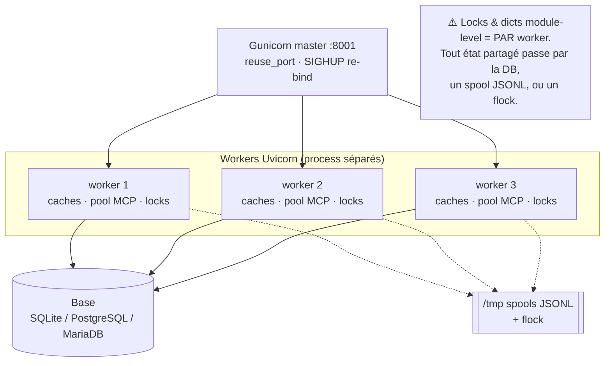

# Elpis — Installation et configuration

> Architecture interne : [architecture.md](architecture.md).
> Guide utilisateur : [guide-utilisateur.md](guide-utilisateur.md).

## Sommaire

- [Prérequis](#prérequis)
- [Installation](#installation)
- [Démarrage](#démarrage)
- [Configuration](#configuration)
  - [Fichier `config.json`](#fichier-configjson)
  - [Variables d'environnement](#variables-denvironnement)
  - [`context_config.json` — textes injectés au LLM](#context_configjson--textes-injectés-au-llm)
  - [Priorité de résolution et hot-reload](#priorité-de-résolution-et-hot-reload)
- [Multi-process : séparation main / admin](#multi-process--séparation-main--admin)
- [Multi-worker Gunicorn](#multi-worker-gunicorn)
- [HTTPS : frontal Caddy](#https--frontal-caddy)
- [Tracing et debug multi-utilisateur](#tracing-et-debug-multi-utilisateur)

---

## Prérequis

- **Système** : Debian 12/13 ou Ubuntu 24.04 (amd64).
- **Docker** : la sandbox par utilisateur (outils shell, terminal, éditeur)
  tourne dans un conteneur.
- **Un moteur d'inférence** : `llama-server` (llama.cpp) ou tout serveur
  compatible OpenAI (vLLM, TGI, Ollama, LM Studio), ou un fournisseur distant
  (connecteurs OpenAI-compatibles, Anthropic).
- `install.sh` installe le reste : Python 3 + venv, Node.js (service
  navigateur), Qdrant (RAG), image sandbox.

### Moteur d'inférence

Conçu pour `llama-server` en **mode routeur** (plusieurs modèles, plusieurs
slots). D'autres moteurs OpenAI-compatibles (vLLM, TGI, Ollama, LM Studio)
fonctionnent via `llama.engine` — voir
[Cibles d'inférence](architecture.md#cibles-dinférence-et-fournisseurs).

> **Version minimale recommandée** : une version incluant le parser tool-calls
> XML GLM (chercher `arg_key` / `arg_value` dans `common/chat-auto-parser.h`).

> **`--jinja` est requis pour le tool-calling natif.** Sans ce flag, le modèle
> ne peut pas émettre de `tool_calls` structurés et « free-forme » ses appels en
> texte. Symptôme : du markup (`<tool_call>`, `<function=write_file>`) apparaît
> dans la bulle de réponse. Le backend nettoie ce markup à l'affichage
> (`_strip_tool_call_markup`), donc il ne fuit plus visuellement, mais le
> tool-calling **reste dégradé**. Diagnostic : la ligne `markup d'appel d'outil
> nettoyé du flux final` dans les logs backend.

```bash
git clone https://github.com/ggml-org/llama.cpp && cd llama.cpp
cmake -B build                     # CPU
cmake -B build -DGGML_CUDA=ON      # CUDA
cmake --build build --config Release -j$(nproc)
```

### Aperçus Office de l'éditeur (optionnel)

docx et pptx s'affichent dans l'éditeur après conversion par LibreOffice
**sur l'hôte**, dans une prison `bubblewrap` sans réseau ni fichiers de l'hôte.
Les PDF n'ont besoin de rien, et les xlsx sont lus directement en flux
(`shared_infra/sandbox/office_xlsx.py`) : LibreOffice ne sert qu'à la vue
« Pages » d'un tableur. Un document lourd affiche ses premières pages tout de
suite, puis le document complet quand la conversion est terminée.

Installation : `./install.sh --with-office`.

- Ubuntu 24.04 restreint les user namespaces non privilégiés
  (`kernel.apparmor_restrict_unprivileged_userns`) : si `bwrap` est bloqué,
  l'installeur pose le profil AppArmor `/etc/apparmor.d/elpis-bwrap` ; sinon
  l'aperçu répond « Isolation indisponible ».
- Réglages : `config.json › office_preview` (`isolation` `auto`|`none`,
  `timeout_s`, `slots`, `max_mb`, `max_pages`, `xlsx_max_rows`, `cache_mb`…) ;
  interrupteur admin « Aperçu Office » (`features.office_preview`). Cache :
  `user_sandboxes/.office-cache` (élagué par la maintenance).

### Git côté serveur

Les commandes Git que le serveur lance sur un dépôt de sandbox (outils Git de
l'agent, panneau Git de l'éditeur) tournent dans la même prison `bubblewrap` :
elles ne voient que la zone de travail de l'utilisateur, `/usr` et `/etc` en
lecture, et le réseau seulement pour `clone`, `fetch`, `pull`, `push`. Sans
`bwrap` utilisable, ces commandes sont refusées ;
`executors.git_isolation = "none"` rétablit l'ancien comportement, sans
isolation (`shared_infra/sandbox/git_env.py`).

---

## Installation

```bash
git clone https://github.com/toto-fou/Elpis.git elpis && cd elpis    # 1
./install.sh                                   # 2 : questions, installation, configuration, démarrage
```

`install.sh` est **guidé** : il détecte le système (Debian 12/13, Ubuntu
24.04), vérifie les droits AVANT toute question, ouvre l'assistant par pages
(`deploy/wizard.py`, bibliothèque standard Python seule : il tourne avant le
venv), installe, configure avec les réponses de l'assistant, puis démarre
(services systemd ou `./elpis start`). Il est idempotent : le relancer ne
refait que ce qui manque, et l'assistant reprend alors la configuration en
place. Tout est journalisé dans `logs/install.log`, sauf les écrans de
l'assistant et les mots de passe (écrits sur le terminal seulement).
`./install.sh --dry-run` affiche le plan sans rien faire.

**Droits.** Depuis un compte normal : `sudo -v` au lancement (une seule
saisie), jeton entretenu pendant toute l'installation. Sans sudo : on arrête,
ou on continue sans rien de ce qui demande root (paquets système,
LibreOffice, Caddy, voix, base locale, services). Par `sudo ./install.sh` : les
étapes système en root, l'application (venv, Chromium, configuration,
démarrage) sous le compte qui a lancé sudo (`SUDO_USER`, ou `ELPIS_USER`, ou
le propriétaire du dépôt) — jamais en root.

**Assistant.** ↑↓ se déplacer, Espace cocher ou choisir, Entrée valider et
avancer, 1-9 choix direct, Tab / Maj+Tab changer de page, Échap quitter sans
rien modifier. Une réponse désactive les saisies qu'elle rend inutiles (avec
la raison affichée) ; une valeur devenue impossible reprend la première
valeur possible (Caddy décoché : HTTPS repasse à « HTTP direct »). Les
adresses LLM et d'embeddings sont sondées (`GET /v1/models`) et le modèle se
choisit dans la liste annoncée. Réponses dans `user_db/run/install-answers.json`
(0600, secrets compris), supprimé à la fin. `--plain` garde les questions en
lignes ; sans terminal (ou `TERM=dumb`), elles aussi.

**Base de données.** Préparée (serveur local) et testée juste après le venv,
avant les étapes longues. Échec : `--yes` s'arrête (rien n'est configuré sur
une base injoignable) ; en interactif, choix entre réessayer, modifier les
réglages (retour à la page Base), passer à SQLite ou abandonner.

| Question (option qui y répond) | Défaut | Effet |
|---|---|---|
| Service navigateur (`--with-browser`, `--no-browser`) | oui | `npm ci` + Chromium (Playwright) |
| Image sandbox (`--sandbox build\|pull\|none`, `--pull IMAGE`) | build | `docker build` de `deploy/docker/sandbox/`, ou `docker pull` + étiquette |
| Base de données (`--db sqlite\|postgres-local\|mariadb-local\|external`) | sqlite (1re fois ; inchangée ensuite) | voir [Base de données](#base-de-données) |
| LibreOffice (`--with-office`, `--no-office`) | oui | aperçus docx/xlsx/pptx (LibreOffice nogui + bubblewrap) |
| Caddy (`--with-caddy`, `--no-caddy`) | non | frontal HTTPS (voir [HTTPS](#https--frontal-caddy)) |
| Extras AGPL (`--with-agpl`, `--no-agpl`) | non | PyMuPDF et pdf2docx |
| Moteur vocal local (`--with-voice`, `--no-voice`) | non | whisper.cpp (:8090) + Piper (:8091), CPU, unités `elpis-whisper`/`elpis-tts`, écoute `127.0.0.1` |
| Configuration (`--configure`, `--no-configure`) | oui (1re fois) | `./elpis configure` |
| Démarrage (`--service`, `--start`, `--no-start`) | service | `sudo ./elpis service install` ou `./elpis start` |

`--yes` supprime toutes les questions (défauts + options) ; les options de
`./elpis configure` se passent après `--` (en mode assistant, elles
pré-remplissent les pages) :

```bash
ELPIS_CFG_ADMIN_PASSWORD='…' ./install.sh --yes --with-caddy --service -- \
    --llm-url http://gpu.example.lan:8080 --https local --embed-url http://gpu.example.lan:8081
```

Dépendances Python : `requirements.txt` (cœur), `requirements-rag.txt` (service
RAG), `requirements-agpl-optional.txt` (optionnel, AGPL),
`requirements-dev.txt` (tests). Hors-ligne : `./install.sh --offline <dir>`
avec le paquet produit par `make_release.sh`.

### `./elpis configure`

Sans option, dans un terminal : le même assistant par pages (sans la page
Composants), pré-rempli avec la configuration en place, puis application
sans question. Avec des options (`--yes`, `--llm-url`…) ou sans terminal :
`deploy/configure.py` directement, questions en lignes. Relancer `configure`
ne régénère aucun secret (`--force` repart de `config.example.json`).
`--answers FICHIER` applique les réponses de l'assistant ; `--check-db` teste
seulement la connexion à la base retenue.

| Étape | Questions | Écrit dans |
|---|---|---|
| 1. LLM | type (llama.cpp, vLLM, autre OpenAI-compatible), URL — sondée par `GET /v1/models`, jamais `/props?model=` qui chargerait un modèle —, modèle choisi dans la liste annoncée | `config.json › llama` |
| 2. Cloud | fournisseur (Anthropic, OpenAI, Mistral, Groq, OpenRouter, DeepSeek, Moonshot), clé API masquée, modèle | connecteur **partagé** en base, clé chiffrée (Fernet) |
| 3. Accès | HTTPS : non / certificat local (`install_caddy.sh`) / domaine public Let's Encrypt (`Caddyfile.acme.template`) ; sans HTTPS, écoute (`--listen local\|lan` : ce serveur seulement ou réseau local, voir [Écoute](#écoute-securitylisten)) ; nom d'hôte d'accès ; ports déjà occupés signalés | `security.https`, `security.listen`, `.env` (`MAIN_PUBLIC_URL`, `ADMIN_PUBLIC_URL`) |
| 4. RAG | activation, serveur d'embeddings (sondé) et modèle, reranker, OCR vision | `rag`, `rag_app/rag_config.json` |
| 5. Sandbox | image Docker (présence vérifiée), mémoire par sandbox | `executors` |
| 6. Voix | activation, URL whisper-server et elpis-tts (locales si installées, jeton repris) | `voice` |
| 7. Base de données | moteur (SQLite, PostgreSQL, MariaDB/MySQL), hôte, port, base, utilisateur, mot de passe (masqué), TLS ; connexion testée ; copie des données d'une base SQLite existante vers une base vide | `config.json › database`, `user_db/.db_password` (0600) |
| 8. Admin | nom et mot de passe (masqué, confirmé, 8 caractères min. ; vide = généré, à changer à la 1re connexion) ; si des comptes existent : changement de mot de passe proposé | base `user_db/app.db` |

Secrets générés (fichiers 0600) : `app.session_secret`,
`user_db/.local_mcp_token` (hôte d'outils, référencé par `mcp.json`),
`user_db/.rag_service_token`. Chaque réponse peut être donnée par option
(`./elpis configure --help`) ou variable `ELPIS_CFG_*` (`ELPIS_CFG_LLM_URL`,
`ELPIS_CFG_CLOUD_API_KEY`, `ELPIS_CFG_ADMIN_PASSWORD`…) ; `--yes` ne pose
aucune question.

### Base de données

SQLite (fichier `user_db/app.db`) reste le défaut et suffit jusqu'à quelques
dizaines d'utilisateurs. PostgreSQL ou MariaDB/MySQL se justifient pour une
base managée existante, des sauvegardes point-in-time, de la réplication ou de
la BI sur les tables de télémétrie. Pilotes Python pur, sous licence
permissive : pg8000 (BSD-3) et PyMySQL (MIT) ; les serveurs viennent des
dépôts de l'OS et ne sont jamais livrés avec Elpis.

| Choix d'`install.sh` | Ce qui est fait |
|---|---|
| `sqlite` | rien à installer |
| `postgres-local` | paquet `postgresql`, rôle et base `elpis` (UTF-8, `template0`), extension `unaccent`, mot de passe aléatoire dans `user_db/.db_password` |
| `mariadb-local` | paquet `mariadb-server`, `/etc/mysql/mariadb.conf.d/60-elpis.cnf` (`max_allowed_packet = 256M`, `innodb_ft_min_token_size = 2`), utilisateur et base `elpis` (`utf8mb4_bin`), mot de passe aléatoire |
| `external` | questions de `./elpis configure` : moteur, hôte, port, base, utilisateur, mot de passe, TLS |

Hors ligne (`--offline`), aucun serveur de base n'est dans le paquet : seuls
`sqlite`, `external` ou un serveur déjà installé sont possibles.

Section `database` de `config.json` (chaque clé peut être imposée par une
variable, qui prime) :

| Clé | Variable | Défaut |
|---|---|---|
| `backend` | `APP_DB_BACKEND` | `sqlite` (`postgres`, `mysql` = MariaDB ou MySQL) |
| `host`, `port` | `APP_DB_HOST`, `APP_DB_PORT` | `127.0.0.1`, 5432 / 3306 |
| `name`, `user` | `APP_DB_NAME`, `APP_DB_USER` | `elpis` |
| `tls` | `APP_DB_TLS` | `off` (`require`, `verify`) |
| `pool_max`, `timeout` | `APP_DB_POOL_MAX`, `APP_DB_TIMEOUT` | 8 connexions par process, 60 s |
| — (mot de passe) | `APP_DB_PASSWORD` | fichier `user_db/.db_password` (0600), jamais dans `config.json` |
| `generation` | — | écrite par la bascule depuis l'administration |

Au premier démarrage, une base vide reçoit le schéma complet ; une base
existante reçoit ses tables et colonnes manquantes puis ses migrations en
attente. Un seul process à la fois pose le schéma (verrou fichier), les
workers peuvent donc démarrer ensemble.

Exploitation (`./elpis db …` = `python -m shared_infra.db …`) :

```bash
./elpis db info                                   # moteur, version, taille, schéma, pool
./elpis db check postgres://elpis@db.lan:5432/elpis
./elpis db transfer --to postgres://elpis@db.lan:5432/elpis --dry-run
./elpis db transfer --to postgres://elpis@db.lan:5432/elpis   # copie vers une base VIDE
./elpis db use sqlite                             # porte de sortie si le serveur tombe
```

Mot de passe : `--password-env NOM_DE_VARIABLE` ou saisie masquée. Le
transfert copie les tables dans l'ordre des clés étrangères, écarte et compte
les lignes orphelines, recale les identités, vérifie comptes et empreintes et
écrit un rapport JSON. Depuis la console, la page **Base de données** fait la
même chose en « Migrer et basculer » (écritures suspendues pendant la copie,
redémarrage automatique) et propose « Revenir à SQLite ».

Sauvegarde : hors SQLite, la sauvegarde « base » produit un instantané SQLite
(restaurable partout). `.db_password` n'est ni sauvegardé ni restauré. Pour
restaurer la base d'un moteur serveur : revenir à SQLite, restaurer, puis
migrer.

`configure` est, avec le toggle de la console admin, le seul écrivain de
`security.https` : il le fait à l'installation, puis configure Caddy dans la
foulée. Si Elpis tourne déjà, redémarrez-le ensuite (`./elpis restart` ou
`sudo systemctl restart elpis.target`).

---

## Démarrage

### Mode manuel

```bash
./elpis start      # démarre tous les services
./elpis status     # état
./elpis logs       # journaux
./elpis stop
./elpis doctor     # diagnostic de l'installation
```

`start` enchaîne : Qdrant (6333) → RAG (8000) → hôte d'outils MCP (8765) →
main (8001) → admin (8002) → service navigateur (3000). Main, admin et RAG
écoutent selon [`security.listen`](#écoute-securitylisten) (`127.0.0.1` derrière
Caddy dans tous les cas).

### Écoute (`security.listen`)

Hors HTTPS, adresse d'écoute de main (8001), admin (8002) et RAG (8000) :

| Situation | Écoute |
|---|---|
| HTTPS actif | `127.0.0.1` (Caddy est le frontal ; le réglage est sans objet) |
| `config.json` absent ou illisible | `127.0.0.1` |
| `"listen": "local"` (défaut d'une installation neuve) | `127.0.0.1` : ce serveur seulement |
| `"listen": "lan"` | `0.0.0.0` : ports ouverts **en clair** au réseau |
| clé absente d'une config existante | `0.0.0.0` (installations d'avant le réglage, inchangées) |
| variable `BIND` (main, admin) / `RAG_HOST` (RAG) | prioritaire (break-glass) |

Règle unique : `server/_bind_host.py` (confs gunicorn), dupliquée dans
`./elpis › _bind_default` (RAG). Écrivains : `./elpis configure` (question
« Accès » de la page Accès, `--listen local|lan`, `ELPIS_CFG_LISTEN`) et
Console admin › Sécurité › Accès HTTPS › Écoute (redémarre l'application ;
« local » n'y est accepté que depuis la machine elle-même, pour ne pas se
couper l'accès). L'éditeur brut ne le réécrit pas (`_OWNED_PATHS`).
Réinstallation : la valeur en place (ou son absence) est conservée.

### Mode production (systemd)

```bash
sudo ./elpis service install    # ou : service remove ; ./elpis service print pour voir les unités
```

- Une unité par service (`elpis-qdrant`, `elpis-rag`, `elpis-toolhost`,
  `elpis-main`, `elpis-admin`, `elpis-browser`), regroupées sous
  `elpis.target`, démarrées au boot, relancées en cas d'échec, journaux dans
  journald (`./elpis logs main -f`).
- Utilisateur des services : celui qui lance `sudo` (proposé, modifiable ;
  `ELPIS_USER=nom` sans question). Il doit pouvoir lire le dépôt ; il est
  ajouté au groupe `docker`.
- `elpis.target` entraîne aussi Caddy quand HTTPS est actif, et les services
  vocaux locaux (`elpis-whisper`, `elpis-tts`) quand ils sont installés.
- `.env` est lu par chaque unité (`EnvironmentFile`) ; il l'emporte sur les
  valeurs par défaut des unités.

### Lancement minimal

```bash
source venv/bin/activate
export APP_SESSION_SECRET="$(cat user_db/.session_secret)"
gunicorn -c server/gunicorn_conf.py server.app:app
```

> **Secret de session.** Ordre : `APP_SESSION_SECRET` > `config.json ›
> app.session_secret` > `user_db/.session_secret` (créé en 0600 sous verrou
> `fcntl` au premier démarrage, et re-durci à 0600 à chaque boot). Les
> placeholders publiés (`mysecretsessiontomodify`, `changeme`, …) sont **traités
> comme absents** — sans quoi l'exemple commité aurait servi de clé de
> signature. Un secret faible ou court (< 32 c.) déclenche un avertissement
> `[CRITICAL]` au boot.

---

## Configuration

### Fichier `config.json`

`config.json`, **à la racine du dépôt** (chemin surchargeable par
`APP_CONFIG_PATH`), est la configuration d'instance. Il n'est **pas versionné** :
le dépôt ne contient qu'un exemple.

> Il vivait autrefois dans `shared_infra/`. Une installation qui ne
> l'a pas encore déplacé continue de fonctionner — `shared_infra/config.py` se
> replie sur l'ancien emplacement en l'affichant au démarrage. Ce repli est
> transitoire : sans lui, un fichier introuvable serait lu comme `{}` **sans
> erreur**, et l'instance repartirait avec un secret de session neuf (sessions
> invalidées), sans TLS et sans clé Qdrant.

Sections :

| Section | Contenu |
|---|---|
| `llama` | `ip`/`port`/`url`, `model`, `engine`, timeouts, retries, `max_concurrency`, `max_models`, `n_ctx`, `max_tool_iterations`, `tool_timeout_s`, `thinking_budget_tokens`, `max_tokens_chat`/`max_tokens_thinking`, `thinking_output_uncapped`, `think_resume_max`/`think_resume_total_tokens` |
| `mcp` | `server_cmd`, `tools_cache_ttl_sec`, `servers_dir`, `local_url`/`local_host`/`local_port`/`local_transport` |
| `app` | `db_path`, `session_secret`, `max_recent_chats`, `sandbox_dir`, `enable_model_selector`, `sandbox_quota_mb`, `max_upload_mb`, chemins `system_prompts.*` |
| `llm` | `scheduling_mode`, `compression.*`, `compaction.*`, `prune.*`, `task.*` (sous-agents), `debug.*`, `allowed_provider_types`, `ctx_image_token_cost` |
| `memory` | `enabled`, `memory_char_limit`, `user_char_limit` |
| `skills` | `dir`, `user_dir`, `top_n`, `min_score`, `char_budget`, `index_max` |
| `executors` | `image`, `limits.*`, `exec_user`, `force_user_docker`, `idle_kill_hours`, `runtime`, `extra_run_args`, `network_profiles[]`, `git_isolation` (`auto` \| `none`, voir [Git côté serveur](#git-côté-serveur)) |
| `security` | `password_policy.*`, `session.*` (cookie, `max_age_sec`, `same_site`, `https_only`, `global_min_ts`), `https.*` (`enabled`, ports, `ca_file`), `listen` (`local` \| `lan`, voir [Écoute](#écoute-securitylisten)) — ⚠ `https.*` + `listen` + `session.https_only` + `session.global_min_ts` appartiennent à leurs endpoints, l'éditeur brut ne les écrit pas |
| `vision` / `desktop` | Endpoint d'annotation, format, modèle, passes ; cibles desktop, scopes, budgets |
| `rag` | `service_url`, `service_token`, collection par défaut, `top_k`, seuils |
| `maintenance` | Rétentions, heure de passe, digest quotidien |
| `features` | Flags globaux (`opencode`, `office_preview`) |
| `welcome` / `app_info` / `login_page` | Branding (édité depuis la console admin) |
| `skins` | `dir` (dossier des skins importés ou créés, défaut `user_skins`, surchargeable par `APP_SKINS_DIR`, lu au démarrage), `enabled` (`{id: booléen}`, relu à chaud : un intégré absent prend sa valeur de `frontend/css/skins/skins.json`, Kiki désactivé ; un skin importé absent est désactivé ; Ardoise et le skin par défaut restent actifs), `default` (défaut `elpis` : skin des comptes sans choix ou dont le skin a été désactivé). Réglé depuis Console › Système › Apparence ; le dossier est inclus dans les sauvegardes complètes |
| `voice` | Moteur vocal — `enabled`, puis deux sous-blocs indépendants : `stt.*` (adresse, `format` parmi `whisper.cpp`/`openai`/`llama-audio`, langue, vocabulaire, `logprob_min`, plafonds) et `tts.*` (adresse, `format`, voix, vitesse, plafonds). Coercition et bornes dans `shared_infra/voice/config.py`, relues à CHAQUE appel |

Chaque utilisateur a en plus ses réglages en base (`users.settings_json`) ;
`user_db/configs/{user_id}.json` conserve une copie personnelle de la config
d'application.

> **Flags de fonctionnalités GLOBAUX** (`config.json › features`) : lus par
> `feature_enabled(name)` (défaut `true` si absent), **relus sur disque à chaque
> appel** (donc multi-worker-safe et sans redémarrage), exposés au front par
> `GET /api/public-config`, et **gardés côté backend** (404). Aujourd'hui :
> `opencode` et `office_preview`. Le front reçoit aussi `agents` (dérivé de `llm.task.enabled`),
> l'interrupteur maître des sous-agents, ainsi que `voice_stt` et `voice_tts`
> (dérivés de `voice.enabled` **et** de la présence d'une adresse). Ces deux-là
> sont en défaut **OFF strict** : contrairement aux autres, une fonction qui
> ouvre le micro ou sort du son ne s'active pas par rétro-compatibilité.

### Variables d'environnement

Toute valeur de `config.json` peut être surchargée par l'environnement, qui est
**toujours prioritaire**. Une variable positionnée mais **vide** est traitée
comme absente.

#### Inférence

| Variable | Clé JSON | Défaut | Description |
|---|---|---|---|
| `LLAMA_IP` | `llama.ip` | `127.0.0.1` | Adresse du moteur |
| `LLAMA_PORT` | `llama.port` | `8080` | Port |
| `LLAMA_URL` | `llama.url` | dérivée | URL complète — prioritaire sur IP/PORT |
| `LLAMA_MODEL` | `llama.model` | `local-model` | Modèle par défaut |
| `LLAMA_ENGINE` | `llama.engine` | `llamacpp` | `llamacpp` \| `vllm` \| `generic` |
| `LLAMA_TIMEOUT_SEC` | `llama.timeout_sec` | `600` | Timeout requête |
| `LLAMA_RETRIES` | `llama.retries` | `3` | Tentatives |
| `LLAMA_RETRY_BACKOFF_SEC` | `llama.retry_backoff_sec` | `0.6` | Base du backoff |
| `LLAMA_RETRY_BACKOFF_CAP_S` | `llama.retry_backoff_cap_s` | `15` | Plafond full-jitter |
| `LLAMA_LOADING_WAIT_S` | `llama.loading_wait_s` | `90` | Attente « modèle en chargement » (503 → sonde `/health`) |
| `LLAMA_MAX_CONCURRENCY` | `llama.max_concurrency` | `4` | Repli si `/props.total_slots` indisponible |
| `LLAMA_MAX_MODELS` | `llama.max_models` | `1` | Modèles simultanés côté serveur |
| `LLAMA_MAX_TOOL_ITERATIONS` | `llama.max_tool_iterations` | `200` | Itérations **productives** max par tour |
| `LLAMA_TOOL_TIMEOUT_S` | `llama.tool_timeout_s` | `300` | Borne dure par appel d'outil |
| `LLAMA_TOOL_LOOP_MAX_S` | `llama.tool_loop_max_s` | `0` (off) | Budget mur d'horloge d'un tour outillé |
| `LLAMA_THINKING_BUDGET_TOKENS` | `llama.thinking_budget_tokens` | `8192` | Budget de réflexion (chat simple ; clampé `[512..131072]`, alias llama.cpp `reasoning_budget_tokens`) |
| `LLAMA_MAX_TOKENS_CHAT` | `llama.max_tokens_chat` | `16384` | Cap théorique de génération (mode chat) |
| `LLAMA_MAX_TOKENS_THINKING` | `llama.max_tokens_thinking` | `24576` | Cap théorique (mode thinking) — sert surtout la **réserve de prompt** depuis `thinking_output_uncapped` |
| `LLAMA_THINKING_OUTPUT_UNCAPPED` | `llama.thinking_output_uncapped` | `true` | Mode thinking **local** : aucun `max_tokens` envoyé (raisonnements longs non coupés ; aligné Open WebUI / webui llama.cpp) |
| `LLAMA_THINK_RESUME_MAX` | `llama.think_resume_max` | `6` | Auto-reprises max d'un raisonnement coupé (`finish=length` en plein `<think>`) par appel LLM ; `0` = off |
| `LLAMA_THINK_RESUME_TOTAL_TOKENS` | `llama.think_resume_total_tokens` | `131072` | Budget total de thinking cumulé par chaînage d'auto-reprises |

> ⚠️ `LLAMA_MAX_MSGS` a été **retiré**. Le clamp en *nombre* de
> messages amputait silencieusement l'historique. La seule borne est désormais
> le budget en **tokens** ; au-delà, le serveur répond « contexte dépassé »
> (`KIND_CONTEXT_OVERFLOW`) avec un message utilisateur clair.

#### Contexte, compaction, élagage

| Variable | Clé JSON | Défaut | Description |
|---|---|---|---|
| `APP_COMPACTION_BUFFER_TOKENS` | `llm.compaction.buffer_tokens` | `0` (auto) | Marge sous le plafond (`min(20k, 10 % n_ctx)`) |
| `APP_COMPACTION_PARTIAL_TARGET_RATIO` | `llm.compaction.partial_target_ratio` | `0.6` | Cible d'une compaction partielle |
| `APP_COMPACTIONS_PER_RUN_MAX` | `llm.compaction.per_run_max` | `8` | Compactions réussies par run (plancher mis à l'échelle du budget d'itérations) |
| `APP_COMPRESSION_MODEL` | `llm.compression.external_model` | — | Modèle dédié au résumé |
| `APP_COMPRESSION_ENDPOINT_URL` | `llm.compression.endpoint_url` | — | Endpoint dédié (path OpenAI complété) |
| `APP_COMPRESSION_ENDPOINT_MODEL` | `llm.compression.endpoint_model` | — | Modèle sur cet endpoint |
| `APP_COMPRESSION_ENDPOINT_TIMEOUT_SEC` | … | `120` | Timeout |
| `APP_COMPRESSION_MAX_PER_CHAT` | `llm.compression.max_per_chat` | `12` | Cap dur (auto **et** manuelles) ; `0` = illimité |
| `APP_PRUNE_PROTECT_TOKENS` | `llm.prune.protect_tokens` | `0` (auto 20 % n_ctx) | Fenêtre récente jamais élaguée |
| `APP_PRUNE_MIN_TOKENS` | `llm.prune.min_tokens` | `0` (auto) | Gain minimal pour acter une passe |
| `APP_PRUNE_EVERY_ITERS` | `llm.prune.every_iters` | `10` | Cadence d'élagage **pendant** un run (0 = fin de tour) |
| `APP_CTX_IMAGE_TOKEN_COST` | `llm.ctx_image_token_cost` | `1500` | Coût forfaitaire d'une image (surestime volontairement) |

> **Clés inertes.** `trigger_after_turns`, `compress_every`, `pct_of_ctx`,
> `cooldown_iters`, `min_growth_tokens` traînent dans d'anciens `config.json` :
> plus aucun lecteur. Le déclenchement de compaction est une **règle unique
> d'occupation** — quand le prompt réel atteint `usable = n_ctx − cap de
> génération − buffer`. Ne pas les documenter comme des leviers.

#### Sous-agents

| Variable | Clé JSON | Défaut |
|---|---|---|
| `APP_TASK_CHILD_TIMEOUT_S` | `llm.task.child_timeout_s` | `3600` |
| `APP_TASK_SUBAGENT_DEPTH` | `llm.task.subagent_depth` | `1` |
| `APP_TASK_RESUME_TTL_S` | `llm.task.resume_ttl_s` | `21600` |
| `APP_TASK_RESUME_MAX` | `llm.task.resume_max` | `200` |
| `APP_TASK_MAX_ITERS_EXPLORE` / `_IMPLEMENT` / `_VERIFY` / `_WEB` / `_PR` | `llm.task.max_iters.*` | `60` / `100` / `60` / `60` / `40` |
| `APP_TASK_MAX_ITERS_CUSTOM` | `llm.task.max_iters.custom` | valeur de `_GENERAL` |
| `APP_TASK_MAX_ITERS_GENERAL` | `llm.task.max_iters.general` | `80` (repli des agents personnalisés) |
| — | `llm.task.enabled` | `true` (interrupteur maître) |

#### Application

| Variable | Clé JSON | Défaut | Description |
|---|---|---|---|
| `APP_CONFIG_PATH` | — | `config.json` (racine) | Chemin de la config |
| `APP_CONTEXT_CONFIG` | — | `shared_infra/context_config.json` | Textes LLM |
| `APP_DB_PATH` | `app.db_path` | `user_db/app.db` | Fichier SQLite (moteur par défaut) |
| `APP_SESSION_SECRET` | `app.session_secret` | `user_db/.session_secret` | Signature des sessions |
| `APP_MAX_RECENT_CHATS` | `app.max_recent_chats` | `100` | Conversations actives max — **destructif** au-delà (cf. plus bas) ; relu à chaud |
| `APP_SANDBOX_DIR` | `app.sandbox_dir` | `user_sandboxes` | Racine des sandboxes (propagée en absolu) |
| `APP_SKILLS_DIR` / `APP_USER_SKILLS_DIR` | `skills.dir` / `skills.user_dir` | `skills` / `user_skills` | Stores de skills |
| `APP_SKINS_DIR` | `skins.dir` | `user_skins` | Skins importés ou créés depuis la console (un sous-dossier `<id>/` par skin) |
| `APP_MAX_UPLOAD_MB` | `app.max_upload_mb` | `50` | Plafond par fichier uploadé |
| `APP_BUILD_ID` | — | auto | Cache-busting des assets |
| `APP_MODE` | — | `main` | `main` \| `admin` \| `full` (absent ou invalide → `main`) |
| `APP_SERVICE` | — | `main` | Tag de logs (`./elpis start` le pose par service) |
| `ADMIN_PUBLIC_URL` / `MAIN_PUBLIC_URL` | — | — | URLs externes (réécriture localhost automatique) |
| `APP_LLM_SCHEDULING` | `llm.scheduling_mode` | `auto` | `auto` \| `classic` \| `optimized` |
| `APP_GIT_TOOL_TIMEOUT_S` | `tools.git.timeout_s` | `60` | Commandes Git locales |
| `APP_*_RETENTION_DAYS` | `maintenance.*_retention_days` | 90 à 400 selon la table | Rétentions (`0` = pas de purge) |
| `APP_MAINTENANCE_HOUR` | `maintenance.hour` | `6` | Heure de la passe quotidienne |

#### Serveur MCP local

**Manifeste `mcp.json`.** Les serveurs d'outils par défaut se
déclarent dans `mcp.json` à la racine (format `mcpServers` des clients MCP +
bloc `x-elpis` par entrée : rôle, familles, `default_on`, familles publiées à
opencode, repli stdio). Schéma : `docs/schemas/mcp.schema.json`. Chargeur :
`shared_infra/mcp/manifest.py`. Sans fichier, le manifeste est synthétisé depuis
les variables ci-dessous (comportement hérité). Avec un fichier, `LOCAL_MCP_URL`,
`LOCAL_MCP_TOKEN`, `LOCAL_MCP_TOOL_FAMILIES` et `LOCAL_MCP_OPENCODE_FAMILIES`
restent des SURCHARGES. Console admin → Connexions →
« Outils par défaut » : état des entrées + Recharger (`POST /api/admin/mcp/manifest/reload`,
sans redémarrage). Les serveurs `x-elpis.role: external` apparaissent dans le
panneau Outils (bloc « Déclarés », état per-chat `mf:<nom>`).

**Un serveur = une entrée = un endpoint.** `mcp.json` déclare UNE
entrée par famille d'outils, chacune avec son endpoint : `elpis-git` →
`http://<hôte>:8765/mcp/git`. Retirer l'entrée (ou `"enabled": false`) retire ses
outils du chat, sans toucher à aucune autre liste. L'hôte sert les trois
transports en parallèle pour chaque famille :

| transport | endpoint |
|---|---|
| HTTP streamable | `…:8765/mcp/<famille>` |
| SSE | `…:8765/sse/<famille>` (messages sur `/messages/`) |
| stdio | `python -m toolhost --stdio --families <famille>` |

Sans segment de famille, `/mcp` et `/sse` servent toutes les familles
enregistrées. Une entrée `role: toolhost` sans `x-elpis.fallback` reçoit un repli
stdio DÉRIVÉ (`${python} -m toolhost --stdio --families <ses familles>`) ;
`"fallback": false` le refuse. Les familles liées au compte (`chart`, `memory`,
`skill`, `todo`) sont des entrées `role: app` (`type: inprocess`), servies en
mémoire par l'app ; en mode local l'hôte les enregistre aussi, donc `/mcp/memory`
reste joignable par un applicatif tiers. L'origine et le jeton de l'hôte vivent
dans `toolHosts` (alias de `sandboxHosts`), avec un bloc `serve`
(`host`/`port`/`transports`). Export prêt à coller dans un autre applicatif :
Console admin → Connexions → « Outils par défaut » → Exporter, ou
`GET /api/admin/mcp/manifest/export?transport=http|sse|stdio&with_token=1`, ou
`GET /manifest?transport=…` sur l'hôte.

⚠ En transport stdio, la sortie standard EST le canal JSON-RPC : tout
diagnostic du service part sur `stderr`.

**Politique d'exécution et événements live.** Chaque outil
porte ``meta.policy`` (``timeout_s``, ``serial``, ``replay_safe``, ``prune``,
``deny_for``) via ``_toolkit.tool_kw_*(…, **policy)`` / ``with_policy`` ; le
harnais la lit à la connexion (``_mcp_categories.tool_policy``) et n'utilise
les anciennes listes par nom qu'en repli (serveur externe, registre vide). Le
terminal en direct voyage en notifications MCP **structurées**
(``ctx.log(…, logger_name="elpis.shell", extra={"kind": "shell_output", …})``,
corrélées par ``log_token``/``call_id`` dans ``extra``) ; la sentinelle JSON
``__shell_output__`` n'est plus qu'un repli. Un **battement**
(``extra.kind: heartbeat``, toutes les ``ELPIS_TOOL_HEARTBEAT_S`` s, défaut 15,
0 = off) garde vivant le flux HTTP d'un ``tools/call`` long (shell, scripts de
skills, ``pw_wait``, ``desktop_wait``) ; le client le consomme sans événement.
``skill_run_script`` streame sa sortie comme ``execute_shell``.

**Hôte d'outils déportable.** ``python -m toolhost`` = le
service MCP + l'API sandbox (``/api/sandbox/*``, git, cycle de vie, instantanés),
le terminal (``/api/terminal/*``, ``/ws/terminal*``) et les actifs (captures,
trames) sur UN port, derrière le jeton de service et une enveloppe d'identité
signée (``X-Elpis-Identity``, ``shared_infra/accounts/identity.py``). Mode local :
``./elpis start`` le lance en loopback, l'app sert ses routeurs en direct
(aucun relais). Mode distant : ``mcp.json › sandboxHosts.<id>.url`` hors loopback
(ou ``relay: true``) → le middleware ``shared_infra/sandbox/relay.py`` relaie ces
chemins tels quels vers l'hôte (HTTP + WebSocket), fabrique l'enveloppe depuis la
session (jamais depuis un en-tête du navigateur), pousse le miroir des skills
(``POST /api/sandbox/skills-mirror``) et rapatrie captures/trames pour la vision.
L'hôte n'ouvre jamais ``app.db`` : identité par enveloppe/``_meta``
(``IdentityCapture``), rappels ``/api/internal/*`` (introspection des jetons
``pcr_``, identité, identifiants git) avec le jeton de service, base LOCALE
(``toolhost.json › db_path``) pour ses sessions de terminal et la mémoire AX.
Familles liées au COMPTE (``memory``, ``todo``, ``chart``, ``skill`` = bibliothèque)
= entrée ``role: app`` du manifeste, servie EN PROCESSUS par la boucle de chat
(``llm_core/tools/app_mcp.py``, transport mémoire fastmcp) ; ``skill_run``
(exécution dans le sandbox) reste sur l'hôte. Déploiement :
``deploy/toolhost/`` (``install_toolhost.sh``, ``toolhost.example.json``,
``elpis-toolhost.service``, ``Caddyfile.toolhost``), schéma
``docs/schemas/toolhost.schema.json``. ``toolhost.json › bind.host`` vaut
``127.0.0.1`` dans l'exemple : l'app joint l'hôte par ``Caddyfile.toolhost``
(TLS, ``reverse_proxy 127.0.0.1:8765``). Sans ce frontal, ``0.0.0.0`` (ou l'IP
privée) est nécessaire, port filtré à l'hôte Elpis. ``app.memory_dir`` / ``APP_MEMORY_DIR`` :
racine du magasin mémoire (défaut : racine des sandboxes).

**Plusieurs hôtes d'outils.** ``mcp.json › sandboxHosts`` peut
déclarer N hôtes ; ``placement.strategy`` = ``single`` (tout le monde sur
``placement.host``) ou ``by_user`` (table ``sandbox_placements`` : un compte est
affecté à sa première utilisation à l'hôte le moins chargé, puis y reste —
sandbox, terminal et outils sur le même hôte). Console admin → Sandbox →
« Hôtes d'outils » : santé de chaque hôte (``/health``), comptes affectés,
réaffectation et MIGRATION d'un compte (``/api/sandbox/export`` de l'ancien
hôte → ``/api/sandbox/import`` sur le nouveau → réaffectation ; l'ancien
``/work`` est conservé à côté, ``.work-before-import-<ts>``). Routes :
``GET /api/admin/toolhosts``, ``POST /api/admin/toolhosts/placements/{uid}``
(``{host_id}``), ``…/migrate``, ``DELETE …``. Ajouter un hôte = une entrée
``sandboxHosts`` dans ``mcp.json`` + ``toolhost.json`` sur la machine.


| Variable | Défaut | Description |
|---|---|---|
| `MCP_SERVER_CMD` | `server/local_mcp_server.py` | Commande de démarrage |
| `MCP_TOOLS_CACHE_TTL_SEC` | `360` | TTL du cache `list_tools` |
| `MCP_SERVERS_DIR` | `../mcp_custom_servers` | Serveurs uploadés |
| `LOCAL_MCP_URL` | — | Si défini, on se connecte au service partagé (`…/mcp` = HTTP streamable, `…/sse` = SSE) au lieu de spawner en stdio |
| `LOCAL_MCP_HOST` / `LOCAL_MCP_PORT` / `LOCAL_MCP_TRANSPORT` | `127.0.0.1` / `8765` / `sse` | Utilisés **par** le serveur en mode service (`./elpis start` : `streamable-http`) |
| `LOCAL_MCP_TOKEN` | — | Jeton de **service** de l'app (Bearer, **vérifié** côté serveur sur SSE/HTTP) ; `./elpis configure` le génère dans `user_db/.local_mcp_token` |
| `LOCAL_MCP_CLIENT_TOKENS` | — | Jetons de **clients externes** configurés à la main, chacun lié à un compte : `tok1:alice,tok2:bob` (toutes les familles) |
| `LOCAL_MCP_TOOL_FAMILIES` | `all` | Familles enregistrées : `fs,shell,git` ou `all,-desktop,-browser` |
| `LOCAL_MCP_OPENCODE_FAMILIES` | `git,browser,desktop` | Familles **publiées** à opencode, une **entrée MCP (= une bascule) par famille** → `…/mcp/<famille>`. Liste d'inclusion : une famille ajoutée plus tard doit être nommée pour apparaître |
| `LOCAL_MCP_OPENCODE_EXCLUDE_FAMILIES` | `fs,shell,skill_run` | Familles **toujours refusées** aux clients opencode (jeton elpis-remote `pcr_…`, accepté en Bearer) — opencode a ses propres outils fichiers/shell |
| `LOCAL_MCP_PUBLIC_URL` | — | URL du service telle que les postes la joignent (bloc `mcp` d'`opencode.json`) ; vide → hôte de l'app + `LOCAL_MCP_PORT` |
| `TOOL_TEXT_BUDGET` / `TOOL_LIST_BUDGET` | `6000` / `50` | Budgets de sortie des outils (caractères d'un texte / éléments d'une liste paginée) |

> **Auth MCP.** Dès qu'un jeton est configuré, le service partagé
> exige `Authorization: Bearer …` (FastMCP `StaticTokenVerifier`). Le jeton de
> service laisse le `meta` (username/chat_id) faire autorité ; un jeton client
> impose l'identité du compte qui lui est lié. **Sans aucun jeton, le serveur
> refuse de se lier hors loopback.** Clients externes (opencode : `type: "remote"`,
> URL `…/mcp`, en-tête Bearer).

#### Services satellites

| Variable | Défaut | Description |
|---|---|---|
| `PLAYWRIGHT_API_URL` | `http://localhost:3000` | Service navigateur (côté app) |
| `FIREFOX_SERVICE_PORT` | `3000` | Port d'écoute du service navigateur |
| `PLAYWRIGHT_HEADLESS` / `PLAYWRIGHT_TIMEOUT` / `PLAYWRIGHT_VISION` | `true` / `10` (s) / `false` | Options Playwright |
| `APP_VISION_ENDPOINT_URL` / `APP_VISION_FORMAT` / `APP_VISION_MODEL` | — / `omniparser` / — | Endpoint d'annotation visuelle |
| `APP_VISION_PASSES` / `APP_VISION_TIMEOUT_SEC` / `APP_VISION_PROMPT` | `2` (1-3) / `30` (5-300) / — | Passes, timeout, prompt d'annotation |
| `APP_DESKTOP_*` | voir `config.py` | Agents de contrôle : timeouts, scope d'observation, format de capture, plafonds |
| `OPENCODE_DIST_DIR` | `cli_dist/` | Binaires OpenCode servis sur le LAN |

#### Résilience et verrous

| Variable | Défaut | Description |
|---|---|---|
| `LLM_BREAKER` | `1` | Disjoncteur LLM (`0` = désactivé) |
| `LLM_BREAKER_FAILS` | `5` | Échecs transport consécutifs avant ouverture |
| `LLM_BREAKER_COOLDOWN_S` | `15` | Durée du fail-fast |
| `SKILLS_FILELOCK` | `1` | Verrou `flock` cross-worker des écritures skills |
| `ROUTINES_PER_USER_CAP` | `5` | Runs simultanés par utilisateur |
| `ROUTINES_RUN_MAX_ATTEMPTS` / `_RETRY_BACKOFF_S` | `2` / `3.0` | Reprise bornée d'un run |
| `PTY_MAX_PER_USER` | dérivé | Terminaux par utilisateur |

### `context_config.json` — textes injectés au LLM

Objectif : **aucun texte destiné au modèle ne doit être un littéral Python
figé**. `shared_infra/context_config.json` centralise préfixes, en-têtes,
séparateurs, catalogue d'erreurs et budgets. Chargé une fois au boot.

Conventions :

```jsonc
"clé": ""                    // vide → l'appelant garde son fallback (comportement historique)
"clé": {"file": "x.md"}      // contenu lu au boot
"clé": {"inline": "..."}     // texte inline
"clé": "texte"               // texte direct
// clé absente               → fallback de l'appelant
```

Sections : `budgets`, `tools.<nom>.enabled` (kill-switch par outil),
`system_prompt`, `assembly`, `skills`, `memory`, `compression`, `context`,
`vision`, `result_formatting`, `model_profiles`, `errors` (surcharge
`message`/`fix` par code d'erreur d'outil).

> ⚠️ `tool_gating.gated` (masquage de catégories par mots-clés) est **inerte** :
> son unique appelant ne passe jamais `keywords_text`, parce qu'un jeu d'outils
> variant au fil des messages invaliderait le prefix-cache KV. La fonction est
> testée mais non branchée ; un avertissement est émis au boot si la map est non
> vide. Seul `tools.<nom>.enabled` est câblé.

### Priorité de résolution et hot-reload

1. Variable d'environnement (si définie et **non vide**)
2. Valeur dans `config.json`
3. Défaut codé dans `config.py`

Les chemins relatifs sont résolus depuis `PROJECT_ROOT`.

**Trois classes de réglages**, à ne pas confondre :

| Classe | Mécanisme | Exemples |
|---|---|---|
| **Figé à l'import** | Constante module-level de `config.py` | Budgets de sous-agents, timeouts LLM, limites de skills |
| **Relu à chaque appel** | Helper qui lit le fichier | `feature_enabled()`, `https_enabled()`, `https_ports()`, `session_cookie_attrs()`, `max_recent_chats()`, `live_config_value()` |
| **Hot-reload avec cache mtime** | `reload_*_from_disk()` | `COMPRESSION_*`/`PRUNE_*`, `VISION_*`/`DESKTOP_*`, `MEMORY_*` |

> ⚠️ **Piège multi-worker.** Muter une constante module-level depuis un endpoint
> admin ne change l'état que du worker qui a reçu le POST. Pour tout réglage
> modifiable depuis l'admin et lu en cours d'exécution, utiliser
> `live_config_value()` (source de vérité = le fichier) ou un
> `reload_*_from_disk()`.

[↑ Sommaire](#sommaire)

---

## Multi-process : séparation main / admin

| Aspect | main (8001) | admin (8002) |
|---|---|---|
| Routes montées | Tout sauf `/api/admin/*` et `/admin` | `/api/admin/*`, auth, system-events, public-config, changement de mot de passe, `/admin` |
| User Linux | non privilégié | non privilégié, jamais root |
| Surface HTTP | large | réduite |
| Schedulers | routines, maintenance, sauvegardes, sampler | sampler uniquement |
| Prewarm MCP | oui | non (première ouverture d'onglet paie ~500 ms) |
| Cookie | scopé HOST — valide sur les deux ports | idem |

```python
# server/app.py (extrait)
APP_MODE = _resolve_app_mode(os.environ.get("APP_MODE"))   # absent/invalide → "main"
if APP_MODE in ("main", "full"):
    app.include_router(router)          # routes utilisateur
if APP_MODE in ("admin", "full"):
    app.include_router(admin_router)    # routes admin
app.include_router(internal_router)     # restart-self / broadcast-restart (loopback)
```

L'isolation est faite **au mount** : en `APP_MODE=main`, `admin_router` n'entre
jamais dans la table de routage FastAPI.

Les cookies étant scopés HOST (pas port), une session créée sur `:8001` vaut sur
`:8002` — à condition que les deux process partagent `APP_SESSION_SECRET`.

Le bouton « Admin » du front redirige vers `ADMIN_PUBLIC_URL` ; « Quitter
l'admin » vers `MAIN_PUBLIC_URL` (lus depuis `/api/public-config`, avec
réécriture automatique des `localhost` pour un client distant).

---

## Multi-worker Gunicorn



### Configuration (`server/gunicorn_conf.py`)

| Paramètre | Valeur | Commentaire |
|---|---|---|
| `workers` | `cpu - 1` si `cpu > 2`, sinon `min(cpu, 4)` ; admin : 1 | 4 vCPU → 3 workers |
| `worker_class` | `server.uvicorn_worker.ElpisUvicornWorker` | Durci : `timeout_graceful_shutdown` borné + annonce du shutdown aux flux SSE |
| `bind` | suit `security.https.enabled` puis `security.listen` (voir [Écoute](#écoute-securitylisten)) ; `BIND` prioritaire | Break-glass : `BIND=0.0.0.0:8001` |
| `reuse_port` | `True` | **Indispensable** au re-bind à chaud : pendant le SIGHUP, anciens et nouveaux workers coexistent sur le même port |
| `on_reload` | ferme les sockets héritées | Sans ça, ~1/(workers+1) des connexions pendaient indéfiniment |
| `keepalive` | `120` | Connexions SSE longues |
| `timeout` | `600` | Requêtes LLM longues (`murder_workers` en ultime recours) |
| `graceful_timeout` | `330` | Doit excéder le drain des flux infinis |
| `max_requests` | `0` (recyclage désactivé ; `APP_MAX_REQUESTS=N` le réactive, jitter N/10) ; admin : `ADMIN_MAX_REQUESTS`, défaut `50000` | Un recyclage pendant un long run d'agent l'interromprait |
| `preload_app` | `False` | Les ressources asyncio (pool MCP, sémaphores) ne survivent pas au fork |

### Conséquences

- Chaque worker a **ses propres caches** (`n_ctx`, slots, `/props`, pool MCP,
  registre de catégories d'outils).
- Le bouton « Rafraîchir les caches » diffuse un événement à tous les workers.
- Recyclage désactivé par défaut côté main. S'il est réactivé
  (`APP_MAX_REQUESTS`) ou lors d'un reload, **le recyclage d'un worker reste
  invisible** : quand `should_exit` est posé, les
  flux infinis sont évacués proprement (précédés d'un `worker_recycling`) et les
  clients se rebranchent en ~1 s sur un worker sain grâce à `SO_REUSEPORT`. La
  bannière « redémarrage » est réservée au **vrai** restart complet.

### Cleanup atexit

`app.py` enregistre `_kill_mcp_subprocesses_sync()` (via psutil) qui tue les
subprocess MCP orphelins après un crash — sans quoi ils sont reparentés à init
et consomment de la RAM jusqu'au reboot. `_kill_all_terminals()` fait de même
pour les PTY.

---

## HTTPS : frontal Caddy

Voir [`deploy/caddy/README.md`](../deploy/caddy/README.md) pour le détail.

```
navigateur ──https──▶ Caddy (même hôte, catch-all) ──http 127.0.0.1──▶ services
   :443  ────────────────────────────────────────▶ 127.0.0.1:8001  (main)
   :8443 ────────────────────────────────────────▶ 127.0.0.1:8002  (admin)
   :8444 ────────────────────────────────────────▶ 127.0.0.1:8000  (RAG)
   :80   ─ redirige 302 vers https + sert /ca.crt
         └ EXCEPTION @bootstrap : installeurs servis EN CLAIR ─▶ :8001
```

Points de conception :

- **PKI openssl stable 10 ans**, pas `tls internal` de Caddy (qui fait tourner
  ses certs toutes les 12 h → l'avertissement navigateur reviendrait sans cesse).
- **Sites catch-all** : n'importe quelle IP/nom joignant la machine fonctionne.
  Main et admin partagent le hostname (ports différents) → le cookie host-scopé
  reste partagé.
- Caddy tourne **en permanence** ; la bascule HTTPS ↔ HTTP direct se fait depuis
  la console admin, qui écrit `security.https.enabled` puis déclenche un reload
  gunicorn (les fichiers de conf relisent le flag au SIGHUP). Une **garde
  anti-lockout** sonde les ports avant de couper l'accès direct.
- `@bootstrap` : les routes d'installation restent en clair sur `:80` — la
  machine cible ne connaît pas encore la CA. Voir
  [Distribution CLI](architecture.md#distribution-cli--opencode-lan).

### `security.https` appartient au toggle, à personne d'autre

Le bind (`127.0.0.1` en mode HTTPS) est l'unique barrière : `security.https`,
`session.https_only` et `session.global_min_ts` appartiennent à leur endpoint,
et l'éditeur « Config principale » ne les réécrit jamais
(`shared_infra/routes/admin/config.py › _OWNED_PATHS`), sans quoi une copie
périmée du formulaire rouvrirait le bind public au redémarrage suivant.

À savoir :

- On **n'active pas** le HTTPS depuis l'éditeur brut — seul le toggle sonde
  Caddy avant d'écrire (garde anti-lockout).
- Le **RAG (`:8000`)** est un uvicorn autonome : il ne suit le toggle qu'au
  relancement de `./elpis start`.
- Chaîne verrouillée de bout en bout par
  `tests/shared_infra/test_https_toggle.py ›
  test_a_stale_form_save_cannot_reopen_the_public_bind`.

---

## Tracing et debug multi-utilisateur

Chaque requête LLM reçoit un identifiant tracé `[LLM_REQ xxxxxxxx]`.

| Événement | Format |
|---|---|
| Début (chat simple) | `[LLM_REQ a1b2c3d4] START user='alice' model='GLM-4.7' thinking=… msgs=12 prompt_chars=3421 …` |
| Début (appel outillé) | `[LLM_REQ a1b2c3d4] START_TOOLS user='alice' model='GLM-4.7' n_tools=15 msgs=12 prompt_chars=…` |
| Slot | `[LLM_REQ a1b2c3d4] SLOT=2 assigné (user='alice')` (si le serveur expose `id_slot`) |
| Fin (chat simple) | `[LLM_REQ a1b2c3d4] END user='alice' content_chars=… thinking_chars=… in_tok=1849 out_tok=425 resumes=0` |
| Fin (appel outillé) | `[LLM_REQ a1b2c3d4] END_TOOLS user='alice' n_tool_calls=2 content_chars=… in_tok=… out_tok=… finish=tool_calls` |
| Échec d'une tentative | `[LLM_REQ a1b2c3d4] attempt=1 failed: …` |
| Annulation | `[LLM_REQ a1b2c3d4] CANCEL mid-stream → fermeture stream` |

`stream_options.include_usage: true` est ajouté automatiquement aux requêtes
streaming — sans quoi `in_tok`/`out_tok` restent à 0.

```bash
./elpis logs main -f | grep a1b2c3d4         # une requête
./elpis logs main -f | grep "user='alice'"   # un utilisateur
```

**Trafic LLM.** Si `llm.debug.enabled` (défaut `true`), chaque échange
app ↔ moteur (requête + réponse, hors thinking) est journalisé dans la table
`llm_calls` (ring borné, payloads plafonnés) et consultable dans la console
admin. `GET /api/admin/llm-traffic`.

**Journaux en direct.** Console admin → 300 dernières entrées (ring buffer
serveur) puis flux SSE. `GET /api/admin/logs/recent` + `GET /api/system-events`.

[↑ Sommaire](#sommaire)

---
