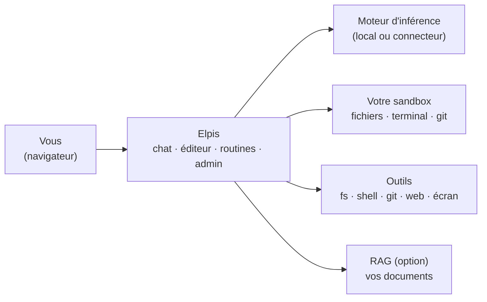
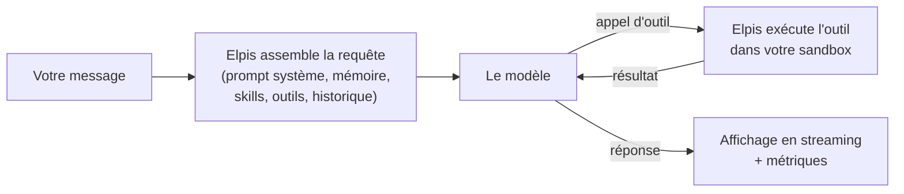
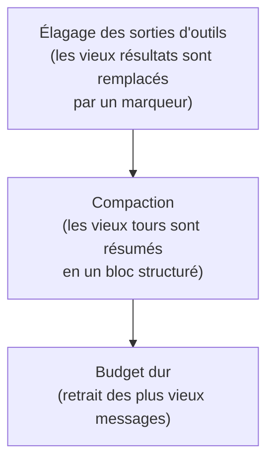
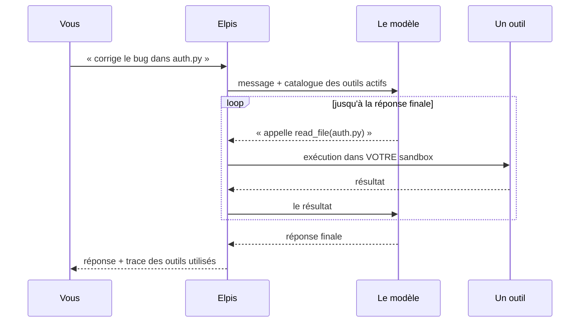

# Elpis — Guide utilisateur

> Assistant LLM **auto-hébergé** : un chat capable d'agir (outils, sous-agents,
> mémoire), un éditeur de code avec sandbox et terminal, des tâches planifiées,
> un moteur RAG et une console d'administration. Tout tourne sur votre réseau.

> **Nom de l'application.** Le nom, le logo et les écrans d'accueil sont
> configurables par votre administrateur (« Elpis » est le nom livré par
> défaut).

---

## Sommaire

### Pour bien démarrer
- [Présentation](#présentation)
- [Se connecter](#se-connecter)
- [Tour de l'interface](#tour-de-linterface)

### Comprendre comment ça marche
- [Le parcours d'un message](#le-parcours-dun-message)
  - [Ce qui est envoyé au modèle](#ce-qui-est-envoyé-au-modèle)
  - [La jauge de contexte](#la-jauge-de-contexte)
  - [La réflexion](#la-réflexion)
- [Compaction et élagage : tenir dans le contexte](#compaction-et-élagage--tenir-dans-le-contexte)
- [Les outils](#les-outils)
- [La sandbox : où l'assistant travaille](#la-sandbox--où-lassistant-travaille)
- [Les sous-agents](#les-sous-agents)
- [Les skills (mémoire procédurale)](#les-skills-mémoire-procédurale)
- [La mémoire long terme](#la-mémoire-long-terme)
- [Le RAG](#le-rag)

### Utiliser l'application au quotidien
- [Le chat](#le-chat)
  - [Envoyer un message](#envoyer-un-message)
  - [Dicter, et se faire lire les réponses](#dicter-et-se-faire-lire-les-réponses)
  - [Mention `@fichier`](#mention-fichier)
  - [Commandes `/`](#commandes-)
  - [Pièces jointes et images](#pièces-jointes-et-images)
  - [Streaming, arrêt, reprise, régénération](#streaming-arrêt-reprise-régénération)
  - [Suivre le travail de l'assistant](#suivre-le-travail-de-lassistant)
  - [Métriques sous chaque réponse](#métriques-sous-chaque-réponse)
  - [Gérer ses conversations](#gérer-ses-conversations)
- [Le panneau Outils](#le-panneau-outils)
- [Le panneau Sampling](#le-panneau-sampling)
- [Modèles et fournisseurs](#modèles-et-fournisseurs)
- [Le mode RAG](#le-mode-rag)
- [L'éditeur de code](#léditeur-de-code)
- [Le terminal](#le-terminal)
- [Les routines (tâches planifiées)](#les-routines-tâches-planifiées)
- [Le Studio (pilotage d'écran)](#le-studio-pilotage-décran)
- [Remote code (sessions OpenCode)](#remote-code-sessions-opencode)
- [Bibliothèque de skills](#bibliothèque-de-skills)
- [Connecteurs Git](#connecteurs-git)
- [Notifications](#notifications)
- [Prompts sauvegardés et partagés](#prompts-sauvegardés-et-partagés)
  - [Templates de prompt](#templates-de-prompt)
- [Paramètres](#paramètres)

### Aide
- [Console d'administration](#console-dadministration)
- [Raccourcis clavier](#raccourcis-clavier)
- [Foire aux questions](#foire-aux-questions)
- [Que faire en cas de problème](#que-faire-en-cas-de-problème)

---

# Pour bien démarrer

## Présentation

Elpis fait dialoguer plusieurs briques pour vous offrir un assistant qui ne se
contente pas de parler — il **agit**, dans un espace de travail qui vous est
propre :

- **Un modèle de langage (LLM)**, servi par un moteur local (`llama.cpp`,
  vLLM…) ou, si votre administrateur l'a autorisé, par un fournisseur externe.
- **Une sandbox personnelle** : un conteneur Docker isolé avec vos fichiers,
  un terminal, Git, une chaîne de build.
- **Des outils** que le modèle peut appeler : lire/écrire des fichiers,
  exécuter des commandes, piloter un navigateur, faire du Git, produire des
  graphiques, tenir une mémoire.
- **Un éditeur de code** intégré (moteur de VS Code) branché sur cette sandbox.
- **Des sous-agents** : l'assistant peut déléguer une sous-mission à un agent
  spécialisé qui travaille dans son propre contexte.
- **Des routines** : la même mécanique, mais planifiée (cron) ou déclenchée par
  un webhook.
- **Un mode RAG** optionnel qui enrichit les réponses avec vos documents.

L'application s'utilise dans un navigateur. Rien à installer côté poste client.



> **Local par défaut.** Le modèle, vos fichiers et vos conversations restent
> sur le serveur de votre organisation. Les seules sorties possibles sont
> celles que l'on ouvre explicitement : un connecteur LLM externe, un outil
> navigateur, ou un profil réseau de sandbox autorisé par l'administrateur.

[↑ Sommaire](#sommaire)

---

## Se connecter

L'écran de connexion demande un nom d'utilisateur et un mot de passe.

**Les comptes sont créés par un administrateur.** Une seule exception : sur une
instance encore vierge, la toute première connexion avec le nom `admin` crée ce
compte et lui donne les droits d'administration. Ensuite, toute tentative avec
un compte inexistant est refusée (`identifiants invalides`).

Si vous êtes administrateur, une icône de bouclier apparaît en bas de la barre
latérale.

> **Bon à savoir.** Votre mot de passe est stocké haché (PBKDF2-SHA256,
> 150 000 itérations, sel aléatoire). Personne — pas même un administrateur —
> ne peut le lire. Un admin peut en revanche vous en attribuer un nouveau ; à
> la connexion suivante l'application vous demandera d'en choisir un.
>
> La politique de mot de passe (longueur minimale, majuscules, chiffres,
> caractères spéciaux) est définie par l'administrateur.

**Durée de session.** Par défaut, une session dure 24 h et le cookie expire à
la fermeture du navigateur. Un administrateur peut révoquer toutes vos sessions
à distance (vous serez déconnecté).

[↑ Sommaire](#sommaire)

---

## Tour de l'interface

L'application est une **surface unique**. On ne change pas de page : on ouvre
et on ferme des panneaux au-dessus du chat.

| Zone | Contenu |
|---|---|
| **Barre latérale (gauche)** | Nouveau chat, recherche, liste des conversations, notifications, accès aux vues (Outils, Éditeur, Routines, Studio, Remote code), Paramètres, Admin |
| **Zone centrale** | La conversation |
| **Panneau droit (optionnel)** | L'éditeur de code + le terminal |
| **Barre de saisie (bas)** | Message, pièces jointes, sélecteur de modèle, réglages de génération, RAG, mode réflexion, chip des tâches en cours |

Les vues **Éditeur**, **Routines**, **Studio** et **Remote code** s'ouvrent en
plein écran par-dessus le chat ; `Échap` revient toujours d'un cran en arrière.

[↑ Sommaire](#sommaire)

---

# Comprendre comment ça marche

Cette section décrit ce que fait l'application autour du modèle : ce qu'elle
lui envoie, comment elle tient la conversation dans son contexte, comment elle
exécute ses outils. Si vous voulez juste utiliser l'outil, sautez à
[Le chat](#le-chat).

## Le parcours d'un message



### Ce qui est envoyé au modèle

À chaque tour, l'application recompose la requête complète, y compris ce que
vous ne voyez pas :

```
prompt système + mémoire + skills + définitions des outils
+ historique de la conversation + résultats d'outils + votre message
```

La tête de la requête (prompt système et consignes des outils actifs) est
assemblée dans un ordre fixe, identique d'un tour à l'autre.

La réponse s'affiche au fil de l'eau (**streaming**). Sous chaque réponse,
`1849 in / 425 out` indique la taille de la requête envoyée et celle de la
réponse, en tokens.

### La jauge de contexte

La requête doit tenir dans la **fenêtre de contexte** du modèle (`n_ctx`, lue
sur le serveur d'inférence). Une jauge dans l'en-tête du chat indique
l'occupation. Quand ça déborde, l'application ne coupe pas au hasard — voir
[Compaction et élagage](#compaction-et-élagage--tenir-dans-le-contexte).

### La réflexion

Avec un modèle qui sait raisonner avant de répondre :

- le raisonnement apparaît dans une section repliable au-dessus de la réponse,
  avec un titre auto-généré qui résume la piste suivie ;
- le **budget de réflexion** (bouton Sampling, 8 192 tokens par défaut) borne cette
  phase ;
- le mode se bascule depuis la barre de saisie ;
- vous pouvez masquer définitivement ces blocs (Paramètres → Chat → *Masquer le
  raisonnement*).

> ⚠ Si vous interrompez le modèle en pleine réflexion, le bouton **Continuer**
> n'est pas proposé : l'application ne reprend pas une réflexion coupée.
> Utilisez **Régénérer**.

[↑ Sommaire](#sommaire)

---

## Compaction et élagage : tenir dans le contexte

Une session agentique longue (l'assistant lit 30 fichiers, lance des tests,
corrige, recommence) sature vite la fenêtre de contexte. Trois mécanismes se
relaient, du plus doux au plus radical :



1. **Élagage.** Les résultats d'outils anciens (une grosse sortie de `grep`
   d'il y a 40 tours) sont remplacés dans l'envoi par un marqueur explicite. Ils
   restent **stockés intégralement** — l'assistant peut les retrouver via la
   recherche de session. Les tours récents sont toujours protégés.
2. **Compaction.** Les vieux tours sont résumés par le modèle en un bloc
   structuré (contexte, faits établis, actions faites, état, pièges) qui
   préserve ce qu'il faut pour reprendre la tâche. Les derniers tours restent
   intacts, mot pour mot.
3. **Budget dur.** En dernier recours, les plus vieux messages sont retirés.

**Vous gardez la main :**

- `/compact` dans la barre de saisie compacte **maintenant**. Un encart apparaît
  dans le fil, dépliable pour lire le résumé produit.
- La compaction **automatique** est un choix personnel : Paramètres →
  Compaction → *Compaction automatique* (désactivée par défaut). Désactivée, seul `/compact`
  compacte, et vous voyez venir la saturation sur la jauge.

[↑ Sommaire](#sommaire)

---

## Les outils

L'application décrit au modèle les outils actifs de la conversation, exécute
ceux qu'il demande et lui renvoie leur résultat. Les outils passent par
**MCP** (*Model Context Protocol*), qu'ils soient intégrés ou fournis par un
serveur externe.

### La boucle agentique



Chaque appel apparaît dans le fil de la conversation : nom de l'outil,
paramètres, résultat — dépliables. Vous voyez exactement ce qui a été fait.

Cette boucle peut s'enchaîner longtemps (200 tours productifs par défaut).
C'est ce qui permet « lis ce fichier, modifie-le, lance les tests, corrige les
erreurs » en une seule demande.

### Les catégories d'outils

Les outils sont regroupés en **catégories** que vous cochez dans le panneau
**Outils**. Cocher une catégorie donne au modèle *tous* ses outils.

| Catégorie | Ce que le modèle peut faire |
|---|---|
| **Fichiers** (`fs`) | Lire, écrire, éditer par remplacement, lister, chercher, naviguer dans le code (définitions, références) |
| **Terminal** (`shell`) | Exécuter n'importe quelle commande dans votre conteneur (pipes, redirections, scripts…) |
| **Git** (`git`) | Cloner, inspecter, brancher, commiter, pousser, ouvrir une pull request |
| **Navigateur** (`browser`) | Piloter un navigateur Chromium : naviguer, cliquer, remplir, capturer, attendre, vérifier |
| **Contrôle d'écran** (`desktop`) | Observer et piloter une machine équipée de l'agent desktop (Windows/Linux) |
| **Graphiques** (`chart`) | Produire des graphiques (tendance, proportion, distribution, financier) et des tableaux |
| **Mémoire** (`memory`) | Écrire/relire sa mémoire long terme, rechercher dans l'historique des sessions |

Deux outils sont **toujours** présents dès qu'une catégorie est active, sans
apparaître comme cases à cocher :

- la **todo-list de session**, que le modèle tient lui-même pour structurer une
  tâche longue (visible via le chip « tâches » dans la barre de saisie) ;
- l'outil **`task`** de délégation, si vous avez activé les
  [sous-agents](#les-sous-agents).

### Serveurs MCP externes

En plus des outils intégrés, on peut brancher des **serveurs MCP tiers** —
n'importe quel service parlant le protocole (Jenkins, une base interne, une API
maison).

- **Vos serveurs** : ajoutés depuis le panneau Outils, bouton *Gérer / ajouter
  un serveur* de la section Externes (HTTP, SSE ou local).
- **La bibliothèque partagée** : l'administrateur publie un serveur une fois,
  et chacun choisit de l'afficher ou non dans son panneau Outils (icône œil).
  Les secrets d'authentification restent côté serveur — ils ne transitent
  jamais par votre navigateur.

Chaque serveur externe se coche indépendamment, comme une catégorie, **pour la
conversation en cours**.

> **Cloisonnement.** Tous les outils sont confinés à votre espace. Vous ne
> pouvez pas atteindre les fichiers d'un autre utilisateur ni le système hôte.
> Voir [La sandbox](#la-sandbox--où-lassistant-travaille).

### Utiliser vos outils depuis une autre plateforme (OpenAPI)

Les outils qui travaillent dans votre sandbox — fichiers (`fs`), terminal
(`shell`), Git (`git`), contrôle d'écran (`desktop`) et scripts de skills
(`skill_run`) — sont aussi exposés en **API OpenAPI 3.1**, pour les
plateformes qui ne parlent pas MCP (par exemple les « serveurs d'outils »
d'Open WebUI).

1. Créez un **jeton d'outils** (`ept_…`) dans **Paramètres › Connexions**, en
   cochant les familles voulues. Il n'est montré qu'une fois ; en cas de perte,
   régénérez-le.
2. Dans la plateforme, déclarez un serveur d'outils par famille :
   - **URL** : `https://<adresse-du-serveur>/api/tools/<famille>` (le schéma
     est lu sur `…/api/tools/<famille>/openapi.json`) ;
   - **Clé** : votre jeton, envoyé en `Authorization: Bearer ept_…`.

Chaque outil devient un `POST /api/tools/<famille>/<outil>` dont le corps est
l'objet d'arguments. Les appels s'exécutent **dans votre sandbox, sous votre
compte** — exactement comme dans le chat. Un échec de l'outil répond `200` avec
`"ok": false` et une piste de correction ; un jeton absent, expiré ou révoqué
répond `401`. Le navigateur piloté (`browser`) n'est pas exposé.

[↑ Sommaire](#sommaire)

---

## La sandbox : où l'assistant travaille

Chaque compte dispose d'un **conteneur Docker persistant** qui contient son
espace de travail, monté sur `/work`.

Ce que ça implique concrètement :

- **Dans le conteneur, vous (et le modèle) avez les pleins pouvoirs** : `sudo`
  sans mot de passe, installation de paquets, compilation. C'est voulu — un
  conteneur par utilisateur est jetable.
- **L'hôte et les autres utilisateurs sont protégés** : pas d'accès au socket
  Docker, capacités dangereuses retirées, limites mémoire / CPU / processus,
  volume cloisonné.
- **Le réseau est coupé par défaut.** L'administrateur définit des **profils
  réseau** (isolé, bridge, liste blanche d'IP/domaines/ports) et vous en
  choisissez un — sauf s'il vous en impose un.
- Un **quota disque** s'applique ; il est visible dans l'éditeur.
- Un conteneur inactif est arrêté automatiquement, et redémarre tout seul à
  votre prochaine action. Vos fichiers ne bougent pas.

Vous pilotez tout ça depuis **Paramètres → Sandbox** : état du conteneur,
profil réseau, redémarrage, purge.

> ⚠ **Un réseau coupé n'est pas une panne.** Si l'assistant rapporte qu'un
> `pip install` ou un `git clone` échoue en connexion refusée, c'est
> probablement le profil réseau. L'assistant le sait : son contexte lui indique
> l'état réel du réseau à chaque tour.

[↑ Sommaire](#sommaire)

---

## Les sous-agents

Sur une mission large, l'assistant principal peut **déléguer** une sous-mission
à un agent enfant. L'enfant déroule sa propre boucle d'outils, dans son
**propre contexte**, et seul son **rapport final** remonte à la conversation.

L'intérêt est direct : lire 30 fichiers pour trouver où vit une fonction brûle
le contexte de *l'enfant*, pas le vôtre. Votre conversation reçoit trois
paragraphes de conclusion au lieu de 40 000 tokens de fouille.

**Le casting livré :**

| Agent | Mission | Outils pré-cochés |
|---|---|---|
| `explore` | Exploration en lecture seule : localiser, lire, juger, remonter l'historique Git | Fichiers, Git |
| `implement` | Écrire le changement dans la sandbox et le vérifier (ne commite pas) | Fichiers, Terminal, Git |
| `verify` | Lancer les tests et les commandes, diagnostiquer les échecs, ne rien modifier | Terminal, Fichiers, Git |
| `web` | Recherche web en pilotant un vrai navigateur | Navigateur, Fichiers |
| `pr` | Brancher, commiter, ouvrir la pull request du travail déjà en place | Git, Fichiers |

Un sous-agent est **un chat dont les cases du panneau Outils sont déjà
cochées** : il reçoit des catégories entières. Sa spécialisation vient de sa
**persona** (« tu es en lecture seule ») et de son **budget d'itérations**, pas
d'une liste d'outils rognée.

**Vos agents personnalisés.** Paramètres → Agents : nom, description, prompt
système, catégories d'outils, serveurs MCP externes. Jusqu'à 10 agents.

**Ce que vous voyez.** Chaque délégation apparaît comme une carte dans le fil,
avec l'agent choisi, sa mission, un compteur de tokens et une **icône œil** qui
ouvre le déroulé complet de l'enfant (ses appels d'outils, son rapport). Une
croix annule *un* sous-agent sans tuer le tour en cours.

> Les sous-agents sont **désactivés par défaut** (Paramètres → Agents). Un
> enfant ne peut pas déléguer à son tour, n'a pas de todo-list propre et ne peut
> pas vous poser de question — il n'a pas d'interface.

[↑ Sommaire](#sommaire)

---

## Les skills (mémoire procédurale)

Un **skill** est une procédure écrite en Markdown : *comment* faire quelque
chose de concret sur vos outils à vous — déployer via Ansible, réinitialiser
une base vectorielle, écrire un test Robot Framework.

C'est la troisième mémoire de l'assistant :

| Mémoire | Contenu |
|---|---|
| Long terme | Des **faits** : votre profil, l'environnement, les décisions |
| De session (todo) | Les **étapes** de la tâche en cours |
| **Skills** | **Comment faire X** |

Un index léger de tous les skills est injecté à chaque tour ; le **corps** des
skills pertinents (au plus 3, sélectionnés par correspondance avec votre
demande) est ajouté au prompt. L'assistant peut aussi en charger un
explicitement, lire ses fichiers annexes et exécuter ses scripts bundlés.

Un skill est un dossier : `SKILL.md` + `scripts/`, `references/`, `assets/`.
Trois portées se superposent, la plus proche gagnant : **vos skills** >
**learned** (brouillons en attente de curation admin) > **globaux**.

Depuis la barre de saisie, `/skills` liste la bibliothèque et **épingle** un
skill dans votre prompt.

[↑ Sommaire](#sommaire)

---

## La mémoire long terme

Indépendante des conversations, elle tient deux fichiers Markdown auto-curés
par l'assistant :

- **MEMORY.md** — faits sur l'environnement, les projets, les décisions.
- **USER.md** — votre profil : rôle, préférences, façon de travailler.

Ces fichiers sont injectés dans le prompt système des conversations suivantes.
Ils ont une **limite de caractères stricte** : au-delà, l'écriture est refusée
avec un message explicite, ce qui force l'assistant à **consolider** au lieu
d'empiler. Une mémoire qui grossit sans fin n'est pas une mémoire.

L'assistant dispose aussi d'une **recherche dans l'historique** de vos sessions
passées (indexation plein texte) — utile pour « qu'est-ce qu'on avait décidé
sur le format des logs ? ».

Paramètres → **Mémoire** : activer/désactiver (désactivée par défaut),
consulter et éditer le profil et les notes, tout effacer.

[↑ Sommaire](#sommaire)

---

## Le RAG

Le mode RAG ajoute à votre question des passages tirés de vos documents :

1. Une **base de connaissances** est préparée en amont : chaque document est
   découpé en morceaux, chaque morceau converti en vecteur qui capture son sens.
2. Votre question est convertie en vecteur à son tour.
3. Une recherche par similarité trouve les passages les plus proches.
4. Ces passages sont **injectés dans le contexte** avant votre question.
5. Le modèle répond en s'appuyant dessus — et les **sources** sont affichées
   sous la réponse.

Trois modes de recherche sont proposés : vectoriel pur, mots-clés (BM25), ou
**hybride** (les deux fusionnés) — le plus robuste dans la plupart des cas.

> Le RAG est **optionnel** : il n'apparaît que si votre administrateur a
> configuré le service. Le service gère aussi l'**OCR** de documents scannés
> avant indexation.

[↑ Sommaire](#sommaire)

---

# Utiliser l'application au quotidien

## Le chat

### Envoyer un message

Saisissez, puis `Entrée` (ou le bouton d'envoi). `Maj+Entrée` insère un saut de
ligne.

Pendant le traitement, un indicateur affiche l'état réel : en file d'attente,
démarrage, appel d'outil en cours, réflexion, compaction…

### Dicter, et se faire lire les réponses

Si votre administrateur a configuré le moteur vocal, deux réglages apparaissent
dans **Paramètres → Chat** :

| Réglage | Effet |
|---|---|
| **Dictée** | Un bouton micro s'ajoute dans la barre de saisie |
| **Réponse vocale** | Les réponses sont lues à voix haute pendant qu'elles s'écrivent |
| **Lire entre les outils** | Lit aussi ce que l'assistant annonce avant chaque appel d'outil |

**Dicter.** Cliquez le micro et parlez normalement. Le texte s'écrit **phrase
après phrase**, à chaque fois que vous marquez une pause — vous pouvez donc
enchaîner sans attendre. Le texte reste modifiable, et **rien n'est envoyé
automatiquement** : vous relisez, puis vous envoyez.

`Échap` coupe la dictée à tout moment sans toucher à ce que vous avez déjà écrit.

Sur une tâche longue, l'assistant annonce ses étapes entre deux appels d'outils
(« Je lance les tests… »). Ce texte n'est lu que si **Lire entre les outils** est
coché : c'est utile quand on regarde ailleurs, pénible quand on attend la
réponse — d'où deux réglages séparés.

**Écouter.** Chaque réponse terminée porte un bouton de lecture (survolez-la).
Il reste disponible même si la lecture automatique est décochée. Un second clic
arrête la lecture, tout comme `Échap`.

Pendant qu'une réponse est lue, le micro est **coupé** : l'assistant ne
s'entend pas lui-même. Il reprend seul à la fin de la phrase.

> Le micro exige une connexion **HTTPS** — c'est une règle des navigateurs, pas
> de l'application. Sur une instance en HTTP simple, le réglage le signale.

### Mention `@fichier`

Tapez `@` pour injecter le **contenu** d'un fichier de votre sandbox dans le
message.

1. Un menu liste vos fichiers ; continuez à taper pour filtrer (`@main`,
   `@src/utils`…). Le filtre porte sur le chemin complet, sans tenir compte de
   la casse.
2. `↑` / `↓` pour naviguer, `Entrée` pour valider, `Échap` pour annuler.
3. Le fichier apparaît comme une puce au-dessus de la saisie ; son contenu part
   avec le message.

Plusieurs fichiers peuvent être mentionnés dans le même message.

### Commandes `/`

Tapez `/` en début de saisie :

| Commande | Effet |
|---|---|
| `/skills` | Parcourir la bibliothèque et **épingler** un skill dans le prompt |
| `/template` | Insérer un [template de prompt](#templates-de-prompt) (variables demandées avant l'insertion) |
| `/compact` | Compacter la conversation maintenant (résume l'historique ancien) |

Si votre saisie ne correspond à aucune commande, le menu bascule
automatiquement sur la recherche de skills.

### Pièces jointes et images

Bouton trombone, ou **glisser-déposer** directement dans la fenêtre.

| Type | Limite | Traitement |
|---|---|---|
| Texte / code | 5 Mo | Contenu inséré dans le message |
| Image | 15 Mo | Envoyée au modèle si celui-ci gère la vision |
| Capture réseau (`.pcap`, `.pcapng`, `.cap`) | 50 Mo | Analysée côté serveur, résumé lisible injecté |

Maximum **10 fichiers** par message. Un fichier trop volumineux est refusé avec
un message clair, sans bloquer les autres.

### Streaming, arrêt, reprise, régénération

- **Arrêt propre** : le bouton `■` stoppe la génération. Tout ce qui a déjà été
  produit est conservé — rien n'est perdu.
- **Continuer** : après un arrêt ou une coupure, un bandeau ambre « Réponse
  interrompue » propose de reprendre. L'historique complet, contenu partiel
  inclus, repart au modèle : il continue là où il s'était arrêté.
  *(Pas proposé après l'arrêt d'un modèle en réflexion — voir plus haut.)*
- **Régénérer** : relance le même message avec une nouvelle génération.
- **Éditer et renvoyer** : modifier un de vos messages relance la conversation
  à partir de là.
- **Reconnexion automatique** : en cas de coupure réseau, l'application
  retente 2 fois avec un délai croissant. La barre d'état affiche
  `Reconnexion (1/2)…`. Si tout échoue, un bouton **Relancer** apparaît.

> Le recyclage périodique d'un processus serveur est **invisible** : le flux se
> termine proprement et le client se rebranche en une seconde. Vous ne voyez
> rien. Seul un vrai redémarrage complet affiche une bannière.

### Suivre le travail de l'assistant

Le fil de conversation entrelace texte et actions dans l'ordre réel :

- **Appels d'outils** : nom, paramètres et résultat, dépliables.
- **Terminal en direct** : la sortie d'une commande longue défile en temps réel
  dans le fil, au lieu d'apparaître d'un bloc à la fin. *(Paramètres → Chat →
  Terminal en direct, activé par défaut.)*
- **Cartes de fichiers** : un fichier écrit ou modifié apparaît en carte avec
  le diff colorisé, cliquable pour l'ouvrir dans l'éditeur.
- **Chip Tâches** : dès que l'assistant tient une todo-list, un compteur `3/7`
  apparaît dans la barre de saisie ; un clic déplie la liste avec l'étape en
  cours mise en avant.
- **Sous-agents** : une carte par délégation, avec l'œil pour voir le déroulé.
- **Graphiques** : rendus directement dans le fil.

### Métriques sous chaque réponse

Sous chaque réponse : tokens d'entrée / sortie, vitesse de lecture du prompt,
vitesse de génération, durée, modèle utilisé. Le survol donne le détail.

Un pouce vers le bas permet de signaler une réponse insatisfaisante.

### Gérer ses conversations

Dans la barre latérale :

- **Nouveau chat** : bouton `+` ou `Ctrl+Maj+O`.
- **Renommer** : double-clic sur le titre, ou clic droit → Renommer.
- **Archiver** : sort la conversation de la liste active sans la supprimer.
- **Supprimer** : définitif.
- **Sélection multiple** : supprimer plusieurs conversations, ou tout effacer.
- **Rechercher** : la loupe cherche dans les titres **et** le contenu.

L'application conserve un nombre borné de conversations **actives** (défini par
l'administrateur) ; au-delà, les plus anciennes sont supprimées. Les
conversations **archivées ne comptent pas** dans cette limite — c'est le moyen
de garder une conversation indéfiniment.

**Exporter** une conversation : menu de la conversation → PDF, Markdown, texte
ou JSON.

[↑ Sommaire](#sommaire)

---

## Le panneau Outils

Accessible par l'icône **Outils** de la barre latérale :

- **Locaux** — les catégories intégrées (Fichiers, Terminal, Git, Navigateur,
  Contrôle d'écran, Graphiques, Mémoire). Une case par catégorie.
- **Déclarés** — les serveurs installés avec l'application, s'il y en a.
- **Externes** — vos serveurs MCP et ceux de la bibliothèque partagée que vous
  avez choisi d'afficher. Le bouton *Gérer / ajouter un serveur* ouvre leur
  gestion.

**Les cases sont propres à chaque conversation** et persistées avec elle :
rouvrir un chat d'hier restitue exactement les outils qui étaient actifs.

Le module **Outils** (Paramètres → Fonctionnalités) coupe *tous* les outils
d'un coup ; seule la mémoire reste.

> **Moins, c'est souvent mieux.** Chaque catégorie active ajoute la
> description de ses outils au contexte. Pour une question de pure rédaction,
> tout décocher accélère la réponse et la rend plus directe.

[↑ Sommaire](#sommaire)

---

## Le panneau Sampling

Bouton **Sampling** à côté du sélecteur de modèle. Il règle les paramètres de
génération pour la conversation en cours : température, top-p, top-k, min-p,
pénalité de répétition, longueur maximale, budget de réflexion, plafond
d'itérations d'outils.

- Les valeurs par défaut du modèle sont affichées en grisé ; un champ vide les
  conserve.
- Un réglage propre à llama.cpp est marqué *sans effet* quand un moteur
  externe est sélectionné : il est retiré de la requête.
- Un **mode debug** en bas du panneau affiche le JSON exact qui partira vers le
  modèle.
- Le panneau Sampling et le panneau Outils sont mutuellement exclusifs.

[↑ Sommaire](#sommaire)

---

## Modèles et fournisseurs

**Le sélecteur de modèle** (barre de saisie) liste les modèles disponibles, s'il
est activé par l'administrateur. Le modèle choisi s'applique au prochain
message ; les anciens messages restent associés au modèle qui les a produits.

L'icône « infos » affiche les propriétés du modèle courant : taille de contexte,
paramètres par défaut, capacités (vision, appels d'outils).

**Vos fournisseurs** (Paramètres → Modèles IA). Si l'administrateur l'autorise,
vous pouvez brancher vos propres fournisseurs — Anthropic, OpenAI, OpenRouter,
Mistral, Moonshot… — avec **votre** clé API :

- La clé est **chiffrée au repos** et n'est jamais renvoyée à votre navigateur.
- Un bouton **Tester** vérifie la connexion et liste les modèles.
- Les modèles du fournisseur apparaissent alors dans le sélecteur.

> Le couple (fournisseur, modèle) est atomique : changer de fournisseur change
> le modèle en conséquence. Impossible de router par erreur un modèle Anthropic
> vers un endpoint OpenAI.

[↑ Sommaire](#sommaire)

---

## Le mode RAG

Le bouton **Sources RAG** de la barre de saisie ouvre le panneau :

- **Collection** — quelle base interroger (ou *Défaut*).
- **Mode de recherche** — hybride (vecteurs + BM25 fusionnés), mots-clés, ou
  similarité vectorielle pure.
- **Nombre de passages** et diversification des résultats.

Une fois activé, chaque question est enrichie avant d'atteindre le modèle. Les
**sources utilisées** s'affichent sous la réponse, dépliables.

Voir [Le RAG](#le-rag) pour le fonctionnement.

[↑ Sommaire](#sommaire)

---

## L'éditeur de code

L'IDE intégré est basé sur **Monaco** (le moteur de VS Code) et travaille
directement dans votre sandbox. Activez-le depuis Paramètres → Fonctionnalités
ou l'icône de la barre latérale.

### Explorateur de fichiers

Arborescence de votre sandbox. Clic gauche pour ouvrir ou déplier, clic droit
pour le menu contextuel : nouveau fichier, nouveau dossier, renommer,
supprimer, télécharger, indexer pour le RAG. Une barre de recherche filtre par
nom ; une recherche de contenu retrouve un texte dans tous les fichiers.

**Import / export** : glisser-déposer de fichiers ou de dossiers entiers
(upload par morceaux pour les gros volumes), téléchargement multiple en
archive. Un indicateur de **quota** montre l'espace consommé.

### Édition

Onglets, coloration syntaxique pour plus de 50 langages (dont un analyseur
dédié Robot Framework), détection automatique par extension. `Ctrl+S` sauve ;
une pastille signale les modifications non enregistrées.

Options dans Paramètres → Fonctionnalités : taille et police, tabulation, retour à la ligne,
minimap, numéros de ligne, sauvegarde automatique, mémorisation des onglets
ouverts, thème sombre.

Un **mode diff** compare votre tampon à la version enregistrée. Une **vue
scindée** affiche deux fichiers côte à côte. Les fichiers écrits par l'assistant
sont surlignés et peuvent s'ouvrir automatiquement.

### Navigation et actions IA

Clic droit dans le code :

- **Navigation** : aller à la définition, trouver les références, renommer le
  symbole, formater le document, commenter/décommenter.
- **Actions IA** : expliquer ce code, chercher des bugs, refactoriser,
  optimiser, générer des tests, ajouter une docstring, commenter.

Si le moteur d'inférence sert un modèle qui gère le **remplissage au milieu**
(FIM), l'éditeur peut compléter du code à l'endroit exact du curseur, en tenant
compte de ce qui précède *et* de ce qui suit.

### Aperçu

Le bouton **Aperçu** rend une page HTML de votre sandbox dans un panneau
intégré, et se rafraîchit après chaque sauvegarde. Les références absolues
(`/style.css`) sont résolues correctement.

Un second mode d'aperçu cible un **serveur qui tourne dans votre sandbox** :
indiquez le port (`localhost:3000`) et l'application proxifie la page. Vous
pouvez saisir une adresse libre pour naviguer dans l'application servie, et
l'ouvrir dans un onglet du navigateur.

> Ce mode exige un profil réseau autorisant le port ; en profil isolé, la
> connexion est refusée avec un message explicite.

### Git intégré

Un panneau Git complet, sur les dépôts de votre sandbox :

| | |
|---|---|
| **État** | Fichiers modifiés / indexés, branche courante, dépôt distant |
| **Historique** | Journal des commits, diff d'un commit, contenu d'un fichier à une révision |
| **Travail** | Indexer, désindexer, annuler, commiter, remiser |
| **Branches** | Locales et distantes, création, bascule |
| **Distant** | Cloner, initialiser, récupérer, tirer, pousser, rebaser |
| **Fusion** | Aperçu avant fusion, résolution de conflits, abandon |
| **Réparation** | Annuler le dernier commit, restaurer un commit |

L'authentification passe par vos [connecteurs Git](#connecteurs-git) : aucun
identifiant n'est écrit dans la sandbox.

### Snapshots

Un **instantané** de votre sandbox, pris à la demande, restaurable en un clic.
Le filet de sécurité avant de laisser un agent travailler en autonomie.

[↑ Sommaire](#sommaire)

---

## Le terminal

Un vrai terminal (PTY) dans votre conteneur, sous l'éditeur.

- **Plusieurs sessions** nommées, renommables par double-clic, comme dans VS
  Code.
- Sortie en temps réel, redimensionnement automatique.
- Les fichiers créés au terminal et ceux créés depuis l'éditeur ou par
  l'assistant appartiennent au **même utilisateur** — pas de fichier
  ineffaçable d'un côté ou de l'autre.
- Une session inactive est fermée automatiquement ; le quota disque est
  surveillé pendant l'exécution.

[↑ Sommaire](#sommaire)

---

## Les routines (tâches planifiées)

Une **routine** est une tâche que l'assistant exécute **sans vous** : même
moteur, mêmes outils, mêmes skills — mais déclenchée par une horloge, un
webhook, ou la fin d'une autre routine.

*« Chaque matin à 7 h : récupérer la branche `main`, lancer la suite de tests,
me résumer les échecs. »*

### Créer une routine

L'édition se fait en plein écran, par onglets :

| Onglet | Contenu |
|---|---|
| **Nom** | Libellé de la routine |
| **Planification** | À la minute, chaque semaine, chaque mois, expression cron avancée — ou *aucune* (manuel / webhook) |
| **Prompt** | Le prompt système et la tâche à exécuter |
| **MCP** | Les outils locaux et serveurs externes disponibles pendant le run |
| **Skills** | Les skills attachés |
| **Agents** | Autoriser (ou non) la délégation à des sous-agents |

Le modèle et le mode réflexion se choisissent également.

> ⚠ Les sous-agents sont un choix **par routine**, jamais hérité de votre
> réglage de chat : un run sans personne devant l'écran qui ouvre des boucles
> agentiques supplémentaires, ça se décide explicitement.

### Déclencheurs

- **Planification cron** — l'expression est validée à la saisie.
- **Webhook** — la routine expose une URL avec un secret généré côté serveur
  (montré une seule fois, rotatif). N'importe quel émetteur peut l'appeler ;
  un filtre optionnel restreint aux événements/branches/dépôts qui vous
  intéressent. Les livraisons répétées sont dédupliquées.
- **Enchaînement** — « après la routine X, si elle réussit / échoue / dans tous
  les cas ». Les chaînes sont bornées en profondeur pour éviter les boucles.
- **Manuel** — bouton ▶ à tout moment.

### Suivre les exécutions

Chaque routine a son **journal** : statut (succès, échec, ignorée, annulée),
horodatage, durée, tokens consommés, **fichiers produits**, et le résumé rédigé
par l'assistant. Un run en cours peut être arrêté.

Un run qui échoue tôt (moteur injoignable) est **repris automatiquement** une
fois. Les runs concurrents sont plafonnés par utilisateur, et un run orphelin
(processus disparu) est réconcilié automatiquement.

Les runs s'exécutent en **priorité basse** : ils cèdent toujours le passage aux
conversations en direct.

[↑ Sommaire](#sommaire)

---

## Le Studio (pilotage d'écran)

Si votre administrateur a déclaré des **machines cibles** (Windows/Linux
équipées de l'agent de contrôle), le Studio sert à les piloter et à écrire des
**automatisations** : des scripts Python qui s'appuient sur le runtime
`elpis_auto`.

- **Scène** : capture de l'écran de la cible, annotée par le modèle de vision
  ou accompagnée de l'**arbre d'éléments** (accessibilité). Mode *Inspecter*
  pour survoler et agir sur un élément, *Zone* pour lire du texte (OCR),
  *Glisser* pour un glisser-déposer.
- **Arbre** : hiérarchie des éléments, recherche, audit des contrôles sans nom
  ni identifiant, export CSV.
- **Script** : le code est le document. *Enregistrer* écrit chaque action dans
  le code, au curseur ; des blocs s'insèrent (si présent / absent, répéter,
  attendre, vérifier, variable…). Le plan en regard liste une ligne par action.
- **Assistant** : décrivez l'objectif, l'assistant agit pas à pas et le script
  s'écrit au fur et à mesure.
- **Exécuter** sur la machine cible, en *vol à blanc* (cibles résolues, aucune
  entrée envoyée), avec trace, ou sur plusieurs machines.

Les scripts sont enregistrés dans votre sandbox (`automations/<nom>.py`) et se
téléchargent seuls ou avec le runtime pour tourner hors d'Elpis.

[↑ Sommaire](#sommaire)

---

## Remote code (sessions OpenCode)

Elpis peut **distribuer et piloter** l'outil en ligne de commande OpenCode.

### Installer le CLI (sans Internet)

Depuis n'importe quel poste du réseau local :

```bash
curl -fsSL http://<adresse-du-serveur>/opencode | bash
```

```powershell
iex(irm http://<adresse-du-serveur>/opencode.ps1)
```

Le script détecte votre système, télécharge le bon binaire depuis le serveur et
l'installe. La commande exacte, jeton personnel pré-rempli, est affichée dans
l'application (menu → **OpenCode**, bouton **Copier**).

> Cette commande d'amorçage reste en `http://` même si l'application est en
> HTTPS : la machine cible ne connaît pas encore le certificat local. Le script
> récupère l'autorité de certification, l'épingle, puis bascule en HTTPS
> vérifié.
>
> La fonctionnalité doit être **activée par votre administrateur**, qui dépose
> au préalable les binaires sur le serveur.

### Piloter les sessions

L'installeur pose aussi un greffon. Dans votre terminal, `opencode` puis
`/remote <jeton>` remonte la session vers la page **Remote code** :

- **Liste des sessions**, groupées connectées / historique, avec aperçu, modèle,
  nombre de messages, renommage en ligne.
- **Transcription plein écran** en parité visuelle avec le chat : markdown,
  blocs de réflexion, appels d'outils dépliables, **diffs colorisés** comme
  dans OpenCode.
- **Composer** : envoyez des prompts depuis le navigateur ; l'écho est immédiat,
  le stop remplace l'envoi pendant la génération.
- **Jauge de contexte** dans l'en-tête.
- **Demandes de permission** : quand OpenCode demande une validation, une
  bannière propose *Autoriser* / *Toujours* / *Refuser* — réponse prise en
  compte aussi bien depuis la page que depuis le terminal.
- **Commandes `/`** : celles du CLI, plus des actions pilotées par la page —
  `/model` (sélection de modèle mémorisée par session), `/session` (reprendre
  une session), `/undo`, `/redo`, `/compact`, `/share`, `/unshare`, `/init`,
  `/new`.

Une pastille signale quand le greffon doit être mis à jour (relancer
l'installeur).

[↑ Sommaire](#sommaire)

---

## Bibliothèque de skills

Paramètres → **Skills** : parcourir, créer, éditer, supprimer vos skills ;
importer un skill (fichier ou dossier complet, y compris ses scripts) ou en
exporter un. Un administrateur peut **promouvoir** un skill personnel vers la
bibliothèque globale.

Un bouton **Assistant** ouvre une conversation pré-configurée pour vous aider à
écrire un skill correct du premier coup.

[↑ Sommaire](#sommaire)

---

## Connecteurs Git

Paramètres → **Connecteurs** : enregistrez vos accès aux forges (GitHub,
GitLab, Bitbucket cloud ou serveur, Gitea, ou un service générique).

- Collez simplement l'URL d'un dépôt : le service et l'hôte sont détectés.
- **Tester** valide le jeton et liste les dépôts accessibles.
- Le jeton est stocké **côté serveur uniquement** — jamais écrit dans votre
  sandbox, jamais renvoyé à votre navigateur.

Ces connecteurs alimentent le panneau Git de l'éditeur et les outils Git de
l'assistant : un `git clone` sur une forge privée fonctionne sans que vous
tapiez d'identifiants.

[↑ Sommaire](#sommaire)

---

## Notifications

Une cloche dans la barre latérale, avec compteur de non-lus. Vous y recevez la
fin des [runs de routines](#les-routines-tâches-planifiées) et — pour les
administrateurs — le digest quotidien d'usage. On peut marquer lu/non-lu,
supprimer une notification, tout marquer lu ou tout effacer.

*(Les prompts partagés reçus ont leur propre compteur, dans la barre de
saisie.)*

Les **notifications système du navigateur** (celles qui apparaissent hors de
l'onglet) sont activables depuis Paramètres → Chat, si votre navigateur les
supporte.

[↑ Sommaire](#sommaire)

---

## Prompts sauvegardés et partagés

**Sauvegarder** un prompt réutilisable (titre + contenu) : modèles d'e-mail,
consignes complexes que vous reprenez souvent, gabarits de spécification.

**Retrouver** : *Paramètres → Prompts* les liste avec leur date de sauvegarde.
Cliquez une ligne pour en déplier le contenu entier, cherchez dans les titres
**et** les contenus (les accents n'ont pas d'importance : « resume » trouve
« résumé »), triez par date ou par titre.

Le contenu s'affiche **tel quel** : un prompt est un texte source, son Markdown
n'est jamais interprété — `#`, `**gras**`, accents graves, blocs de code et
balises littérales restent visibles et récupérables. Le bouton **Copier** met
cette source intacte dans le presse-papier ; **Insérer** l'envoie dans la zone
de saisie du chat.

**Partager** : sélectionnez un prompt, choisissez les destinataires (filtrage
par groupe possible), envoyez. Les prompts reçus arrivent dans une section
dédiée avec un compteur ; ils se suppriment un par un ou en masse.

### Templates de prompt

Un template est un prompt **à trous**, appelé par un raccourci :
`/template resume` dans la barre de saisie. S'il contient des variables, une
petite fenêtre les demande, puis le texte complet est **inséré** dans la zone de
saisie — jamais envoyé : vous relisez avant.

**Créer** : *Paramètres → Prompts → Templates → Nouveau* — un raccourci (minuscules,
chiffres, `-`, `_`), un titre, un contenu. Un prompt sauvegardé devient un template
par le bouton `{ }` de sa ligne. La dernière entrée du menu `/template` ouvre aussi
la création.

| Dans le contenu | Effet |
|---|---|
| `{{texte}}` | Champ à remplir (un même nom répété = une seule saisie) |
| `{{texte \| textarea}}` | Zone multiligne |
| `{{ton \| select:options=["neutre","formel"]}}` | Liste de choix |
| `…:placeholder="…"`, `…:default="…"`, `…:required` | Exemple, valeur proposée, champ obligatoire |
| `{{date}}` `{{heure}}` `{{jour}}` `{{utilisateur}}` | Remplies automatiquement |
| `{{presse_papier}}` | Contenu du presse-papier (à coller s'il est illisible) |

La syntaxe est celle d'Open WebUI et de LibreChat : un template copié depuis ces
outils fonctionne tel quel (`{{CURRENT_DATE}}`, `{{USER_NAME}}`, `{{CLIPBOARD}}`…).

[↑ Sommaire](#sommaire)

---

## Paramètres

| Onglet | Ce qu'on y règle |
|---|---|
| **Profil** | Vos informations, photo, changement de mot de passe |
| **Chat** | Prompt système personnel, largeur de la zone de chat, masquer le raisonnement, terminal en direct, dictée et réponse vocale, notifications système, effacer les conversations |
| **Compaction** | Compaction automatique, seuil, nombre maximal de compactions par conversation |
| **Modèles IA** | Fournisseurs proposés par l'administrateur + vos propres fournisseurs |
| **Apparence** | Mode sombre, habillage (skin : ceux que l'administrateur a activés), nom / icône / avatar de l'assistant |
| **Fonctionnalités** | Les modules **Outils**, **RAG** et **Éditeur**. Quand l'éditeur est activé, ses réglages apparaissent dessous, en deux groupes : *affichage* (thème, police, indentation, retour à la ligne, minimap, numéros de ligne) et *comportement* (ouverture automatique, aperçu, surbrillance des modifications, sauvegarde auto, mémorisation des onglets) |
| **Utilisation** | Vos tokens consommés (entrée / sortie / total) et leur origine, conversations, messages, runs de routines — sur 1, 7, 30 ou 90 jours |
| **Mémoire** | Activer, consulter, **éditer** (corriger ou retirer une entrée) et tout effacer |
| **Agents** | Activer les sous-agents, créer et éditer vos agents personnalisés |
| **Prompts** | Vos prompts sauvegardés (liste datée, dépliage, recherche, tri) et vos templates |
| **Skills** | Votre bibliothèque de procédures |
| **Archives** | Vos conversations archivées : restaurer ou supprimer |
| **Sandbox** | État du conteneur, profil réseau, redémarrage, vidage du dossier de travail |
| **Connecteurs** | Vos accès aux forges Git |

Vos serveurs MCP se gèrent depuis le [panneau Outils](#le-panneau-outils).

Le prompt système personnel est **permanent** (il s'applique à toutes vos
conversations) ; les réglages de sampling, eux, ne valent que pour la
conversation en cours.

[↑ Sommaire](#sommaire)

---

# Aide

## Console d'administration

Réservée aux administrateurs et aux modérateurs (icône bouclier). Elle tourne
dans un **processus séparé** du chat : une faille hypothétique côté application
ne donne pas accès aux fonctions d'administration. La session est partagée — un
clic suffit, vous êtes déjà authentifié.

La barre latérale compte six entrées, chacune dépliée en sous-pages. Les
modérateurs ne voient que *Vue d'ensemble* et *Supervision*.

| Entrée | Sous-pages |
|---|---|
| **Vue d'ensemble** | Page d'arrivée : ce qui demande l'attention (*À traiter*), état des services, dernières 24 h, installation |
| **Supervision** | **Métriques** (widgets au choix, export CSV, collecte Prometheus), **Rapport** (digest quotidien archivé), **Appels d'outils** (taux d'échec, résumés), **Audit**, **Journaux** (300 dernières entrées, puis flux en direct) |
| **Modèles & services** | **Inférence** (moteurs, planification des requêtes), **Compression**, **RAG**, **Vision & machines** (annotation, machines cibles, mémoire d'accessibilité), **Voix**, **Outils MCP**, **Prompts** (prompts système par catégorie, aperçu de l'assemblage) |
| **Utilisateurs & accès** | **Comptes** (rôle, groupes, serveurs et modèles autorisés, quota et profil réseau de sandbox, machines), **Groupes**, **Droits par défaut** (fonctionnalités, fournisseurs autorisés aux utilisateurs), **Mots de passe & sessions** (politique de mot de passe, cookie, révocation des sessions) |
| **Sandbox** | **Limites & politique** (mémoire, CPU, processus, durée d'une commande, arrêt d'inactivité), **Réseau** (profils), **Hôtes d'outils**, **Containers** |
| **Système** | **Instance** (identité, écran d'accueil, page de connexion, exécution), **Apparence** (skins proposés), **Accès HTTPS**, **Données** (sauvegarde locale et distante, base de données, restauration), **Entretien** (entretien périodique, redémarrage, purge des métriques) |

**Se déplacer.** `Ctrl+K` ouvre la recherche : pages, réglages et actions ;
flèches pour choisir, `Entrée` pour ouvrir.

**Enregistrer.** Un écran = un enregistrement. Dès qu'une page a des
modifications, une barre en bas les compte ; *Voir* les détaille,
`Ctrl+S` enregistre. Quitter la page avant propose
d'enregistrer ou d'ignorer.

**Redémarrage nécessaire.** Certains réglages ne sont lus qu'au démarrage. Tant
que le serveur n'a pas redémarré, un bandeau le signale sur toutes les pages,
avec le nombre de réglages en attente, un lien *Détail* et un bouton
**Redémarrer**. La Vue d'ensemble les liste dans *À traiter*.

Quelques actions notables :

- **Accès HTTPS** — bascule l'application derrière le frontal TLS local, avec
  une garde anti-verrouillage qui vérifie que les ports répondent avant de
  couper l'accès direct.
- **Sauvegarde / restauration** — archive de la base, des sandboxes et des
  serveurs MCP ; envoi vers un serveur distant (SFTP, rsync, partage réseau) ;
  restauration complète ou partielle.
- **Apparence** — les skins proposés aux comptes : interrupteur *Actif*,
  *Définir* le skin par défaut (Ardoise et le défaut restent actifs).
  *Importer* un paquet `.zip` (`skin.json`, `skin.css`, `assets/` en png, jpg,
  webp ou gif) : il arrive désactivé. *Créer* part d'un skin existant, avec
  une vingtaine de couleurs en clair et en sombre et un aperçu en direct.
  *Exporter* un intégré en fait un modèle à retoucher.
- **Changer de base de données** — « Simuler » vérifie la base cible et compte
  ce qui serait copié ; « Migrer et basculer » suspend les écritures, copie et
  vérifie les données, puis redémarre l'application sur la nouvelle base.
  Si le serveur de base devient injoignable : `./elpis db use sqlite` sur la
  machine, puis redémarrage.

[↑ Sommaire](#sommaire)

---

## Raccourcis clavier

Les raccourcis `Ctrl+Maj+…` ont été **retirés** : les navigateurs en réservent
la plupart (`Ctrl+Maj+N`, `Ctrl+Maj+T`, `Ctrl+Maj+R`…) et une page web ne peut
pas les récupérer. Restent ceux qui fonctionnent vraiment :

| Raccourci | Action |
|---|---|
| `Ctrl+Maj+O` | Nouvelle conversation |
| `Échap` | Ferme le panneau ouvert le plus haut dans la pile — puis, de proche en proche : modale → menu → panneau → vue plein écran → chat |
| `Entrée` | Envoyer le message |
| `Maj+Entrée` | Saut de ligne dans la saisie |
| `↑` `↓` `Entrée` `Échap` | Naviguer dans les menus `@` et `/` |
| `Ctrl+S` *(éditeur)* | Sauvegarder le fichier actif |
| `Ctrl+K` *(console admin)* | Rechercher une page, un réglage ou une action |
| `Ctrl+S` *(console admin)* | Enregistrer les modifications de l'écran |
| `Ctrl+/` *(éditeur)* | Commenter / décommenter |
| `Tab` *(modale ouverte)* | Navigation clavier confinée à la modale |

Sur macOS, remplacez `Ctrl` par `Cmd`.

[↑ Sommaire](#sommaire)

---

## Foire aux questions

**Mes données quittent-elles mon réseau ?**
Non, pas par défaut. Le modèle tourne sur le serveur de votre organisation.
Trois exceptions possibles, toutes explicites : un **connecteur LLM externe**
que vous avez branché avec votre clé, un outil **navigateur** qui consulte un
site (c'est alors le serveur qui le consulte), et un **profil réseau de
sandbox** ouvert par votre administrateur.

**Puis-je changer de modèle en cours de conversation ?**
Oui, si le sélecteur est activé. Le nouveau modèle s'applique au prochain
message ; les anciens messages restent attribués au modèle qui les a produits.

**Le modèle se trompe ou invente. Que faire ?**
1. Activez le **RAG** si la question porte sur des documents internes.
2. Activez les **outils** : avec l'outil Fichiers, le modèle lit le fichier au
   lieu de supposer son contenu.
3. Passez en **mode réflexion**.

**Pourquoi la première réponse est-elle plus lente ?**
Le premier appel sur un processus serveur peuple plusieurs caches (taille de
contexte, paramètres par défaut, catalogue d'outils). Les suivants sont plus
rapides. Si le modèle doit être chargé en mémoire, comptez aussi son
préchauffage.

**Le bouton « Continuer » n'apparaît pas.**
C'est normal après l'arrêt d'un modèle en réflexion : l'application ne reprend
pas une réflexion coupée. Utilisez **Régénérer**.

**Mes réglages de sampling sont-ils sauvegardés ?**
Ils s'appliquent à la conversation en cours. Le prompt système personnel, lui,
est un réglage permanent.

**Comment savoir ce que je consomme ?**
Sous chaque réponse (tokens d'entrée / sortie), et de façon agrégée dans
Paramètres → Utilisation (1, 7, 30 ou 90 jours).

**L'assistant dit qu'il n'a pas accès au réseau.**
C'est le profil réseau de votre sandbox. Choisissez-en un autre dans
Paramètres → Sandbox, ou demandez à votre administrateur d'ouvrir la destination.

**Je ne vois pas le bouton micro.**
Trois raisons possibles, dans cet ordre : le moteur vocal n'est pas configuré
sur l'instance (voyez votre administrateur), la **Dictée** est décochée dans
Paramètres → Chat, ou la page n'est pas servie en HTTPS — les navigateurs
refusent le micro en clair.

**La dictée écrit des phrases que je n'ai pas dites.**
La reconnaissance invente parfois du texte sur du silence ou du bruit de fond.
Les productions connues sont filtrées, mais un micro trop loin ou une pièce
bruyante augmentent le phénomène : rapprochez le micro, ou utilisez un casque.

**Un outil a échoué. C'est un bug ?**
Pas forcément. Les erreurs d'outils sont conçues pour expliquer comment se
corriger, et l'assistant les lit : il retente souvent tout seul avec le bon
paramètre. Regardez le résultat déplié dans le fil.

**Une conversation a disparu.**
Seules les conversations **actives** sont plafonnées ; les plus anciennes sont
supprimées au-delà de la limite. **Archivez** ce que vous voulez garder — les
archives ne comptent pas dans la limite.

[↑ Sommaire](#sommaire)

---

## Que faire en cas de problème

| Symptôme | Cause probable | Solution |
|---|---|---|
| `Reconnexion (1/2)…` persistant | Coupure réseau | Attendez ; si ça persiste, rechargez la page. Votre conversation est sauvegardée |
| « Service indisponible » au login | Le serveur redémarre | Patientez 5-10 secondes et réessayez |
| Réponse coupée avec « contexte dépassé » | La conversation est plus longue que la fenêtre du modèle | Lancez `/compact`, ou ouvrez une nouvelle conversation |
| L'éditeur reste figé | Tampon Monaco corrompu après une longue inactivité | Fermez puis rouvrez l'éditeur : il se réinitialise |
| Un serveur MCP est en rouge | Le serveur ne démarre pas ou a planté | Vérifiez son URL / sa commande ; pour un serveur partagé, prévenez l'administrateur |
| Réponses très lentes (< 5 t/s) | Beaucoup d'utilisateurs simultanés, ou modèle trop gros | Patientez (la file est affichée) ou contactez l'administrateur |
| Le modèle ignore mon prompt système | Prompt trop long ou contradictoire avec l'historique | Raccourcissez-le ; ouvrez une conversation neuve |
| Le mode RAG répond « service indisponible » | Le service RAG n'est pas démarré | Contactez l'administrateur |
| L'aperçu de serveur affiche une erreur de connexion | Port non autorisé par le profil réseau, ou serveur non démarré | Vérifiez le profil réseau et que le service écoute bien sur ce port |
| Une commande échoue en « connexion refusée » | Profil réseau isolé | Changez de profil, ou demandez l'ouverture de la destination |
| Un fichier créé au terminal ne s'efface pas depuis l'éditeur | Ancien problème de propriété de fichiers | Ne devrait plus se produire ; signalez-le, c'est un bug |

Pour tout problème persistant, contactez votre administrateur : chaque requête
porte un identifiant tracé dans les journaux, ce qui permet de reconstituer
précisément ce qui s'est passé.

[↑ Sommaire](#sommaire)

---

## Pour aller plus loin

Ce document s'adresse aux utilisateurs. Pour **l'architecture technique**,
**l'installation**, **le déploiement** ou **l'extension** de l'application,
voir la **[documentation développeur](architecture.md)** — accessible aussi
depuis la modale d'aide de l'application, onglet *Développeur*.

---

*Guide utilisateur Elpis.*
